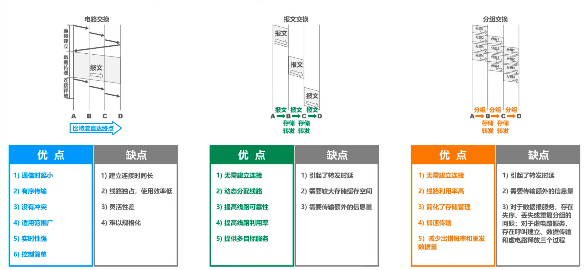
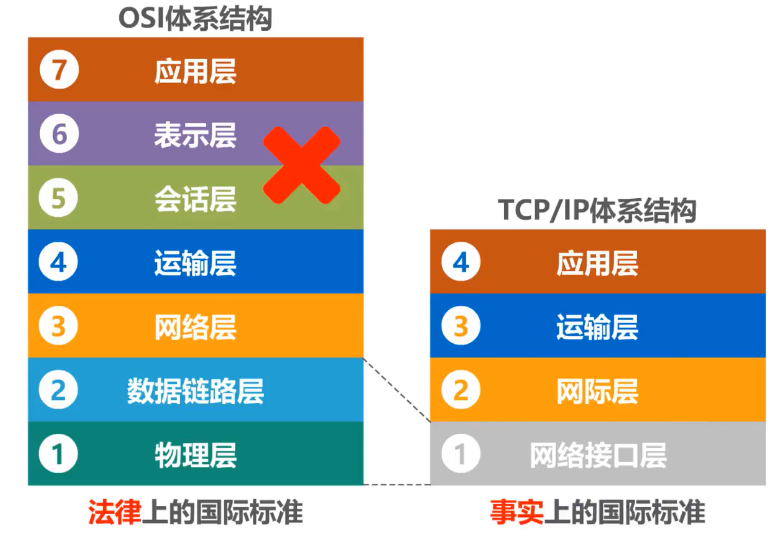
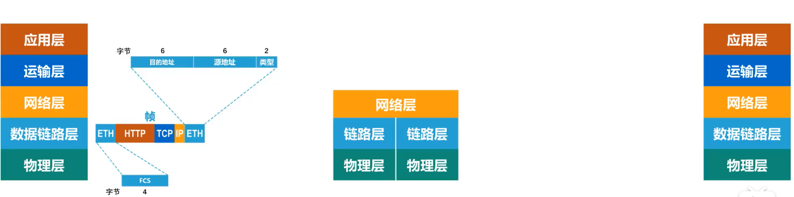
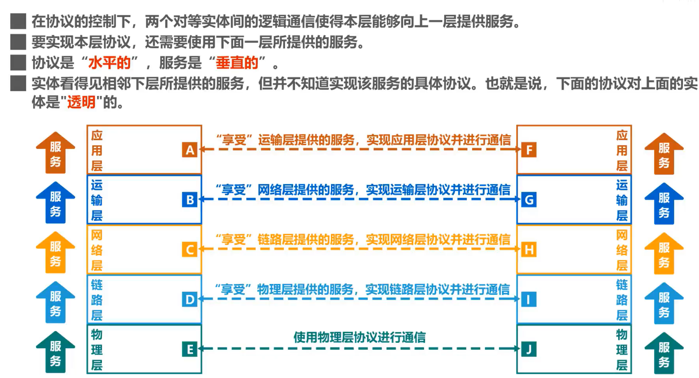
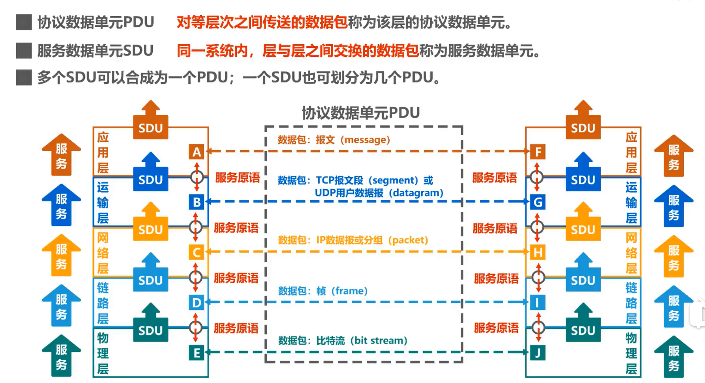

**计网很重要**

## 1.1概述

### **internet与Internet的区别**

- **internet(互联网或互连网)**是一个通用名词，它泛指**多个计算机网络互连而成的网络**。在这些网络之间的通信协议可以是任意的。

- **Internet（因特网）则是一个专用名词**，它指**当前全球最大的、开放的、由众多网络互连而成的特定计算机网络**，它采用TCP/IP协议族作为通信的规则，其前身是美国的ARPANET。

### 普通用户**通过ISP接入因特网**

ISP可以从因特网管理机构申请到成块的IP地址，同时拥有通信线路以及路由器等联网设备。任何机构和个人只需缴纳费用，就可从**ISP的得到所需要的IP地址**。

**因为因特网上的主机都必须有IP地址才能进行通信，这样就可以通过该ISP接入到因特网**

### **端系统之间通信的含义**

“主机 A 和主机 B 进行通信”实际上是指：“运行在主机 A 上的某个程序和运行在主机 B 上的另一个程序进行通信”。**即“主机** **A** **的某个进程和主机** **B** **上的另一个进程进行通信”。简称为“计算机之间通信”。**

端系统之间的通信方式通常可划分为两大类：

**客户-服务器方式：**

- 客户 (client) 和服务器 (server) 都是指通信中所涉及的两个应用进程。

- 客户 - 服务器方式所描述的是进程之间服务和被服务的关系。

- 客户是服务的请求方，服务器是服务的提供方。

> **服务请求方和服务提供方都要使用网络核心部分所提供的服务。**

**对等连接方式：**

- **对等连接** (peer-to-peer，简写为 **P2P** ) 是指两个主机在通信时并不区分哪一个是服务请求方还是服务提供方。

- 只要两个主机都运行了对等连接软件 ( P2P 软件) ，它们就可以进行**平等的、对等连接通信**。

- 双方都可以下载对方已经存储在硬盘中的共享文档。

## 1.2 交换方式

**路由器**是实现**分组交换** (packet switching) 的关键构件，其任务是**转发**收到的分组，这是网络核心部分最重要的功能。

### 电路交换

- 从通信资源的分配角度来看，交换（Switching）就是按照某种方式动态地分配传输线路的资源；

- 电路交换的三个步骤：

    1、建立连接（分配通信资源）

    2、通话（一直占用通信资源）

    3、释放连接（归还通信资源）

    

### 分组交换

> 通常我们把表示**该消息的整块数据**成为一个**报文**。

在发送报文之前，先把较长的报文划分成一个个更小的**等长数据段**，在每一个数据段前面。加上一些由必**要的控制信息组成的首部**后，就构成一个分组，也可简称为“包”，相应地，首部也可称为“包头”。

首部包含了**分组的目的地址**

分组从源主机到目的主机，可走不同的路径。

发送方

- 构造分组

- 发送分组

路由器

- 缓存分组

- 转发分组

- 简称为“分组转发”

路由器处理分组的过程是：

> 在路由器中的输入和输出端口之间没有直接连线。

    1. 把收到的分组先**放入缓存（暂时存储）；**

    2. **查找转发表**，找出到某个目的地址应从哪个端口转发；

    3. 把分组送到适当的端口**转发**出去。

接收方

- 接收分组

- 还原报文

### 报文交换

报文交换中的交换结点也采用存储转发方式，但报文交换对报文的大小没有限制，这就要求交换结点需要较大的缓存空间。报文交换主要用于早期的电报通信网，现在较少使用，**通常被较先进的分组交换方式所取代**。

## 1.3 计算机网络的定义与分类

#### **定义**

- 计算机网络的最简单的定义是：一些**互**相**连**接的、**自治**的计算机的**集合**。

    - 互连：是指计算机之间可以通过有线或无线的方式进行数据通信；

    - 自治：是指独立的计算机，他有自己的硬件和软件，可以单独运行使用；

    - 集合：是指至少需要两台计算机；

- 计算机网络的较好的定义是：计算机网络主要是由一些**通用的，可编程的硬件（一定包含有中央处理机CPU）互连**而成的，而这些硬件并非专门用来实现某一特定目的（例如，传送数据或视频信号）。这些可编程的硬件能够用来**传送多种不同类型的数据**，并能**支持广泛的和日益增长的应用**。

#### 分类

**按交换技术分类：**

- 电路交换网络

- 报文交换网络

- 分组交换网络

**按使用者分类：**

- 公用网

- 专用网

**按传输介质分类：**

- 有线网络

- 无线网络

**按覆盖范围分类：**

- 广域网WAN（Wide Area Network）

作用范围通常为几十到几千公里，因而有时也称为远程网（long haul network）。广域网是互联网的核心部分，其任务是通过长距离（例如，跨越不同的国家）运送主机所发送的数据。

- 城域网MAN

作用范围一般是一个城市，可跨越几个街区甚至整个城市

- 局域网LAN

一般用微型计算机或工作站通过高速通信线路相连（速率通常在 10 Mbit/s 以上），但地理上范围较小（1 km 左右）

- 个域网PAN

就是在个人工作的地方把个人使用的电子设备用无线技术连接起来的网络。

**按拓扑结构分类：**

- 总线型网络

- 星型网络

- 环形网络

- 网状型网络

## 1.4 计算机网络体系结构

TCP/IP体系结构相当于将OSI体系结构的**物理层**和**数据链路层**合并为了**网络接口层**，并去掉了**会话层**和**表示层**。

TCP/IP在网络层使用的协议是IP协议，IP协议的意思是网际协议，因此**TCP/IP体系结构的网络层称为网际层**

> **网络接口层**：并没有规定具体内容，这样做的目的是可以互连全世界各种不同的网络接口，例如：有线的以太网接口，无线局域网的WIFI接口等。

**网际层**：它的核心协议是IP协议。

**运输层**：TCP和UDP是这层的两个重要协议。

**应用层**：这层包含了大量的应用层协议，如 HTTP , DNS 等。

> **IP协议（网际层）**可以将不同的**网络接口（网络接口层）**进行互连，并向其上的**TCP协议和UDP协议（运输层）**提供网络互连服务

而**TCP协议**在享受IP协议提供的网络互连服务的基础上，可向**应用层的相应协议**提供**可靠**的传输服务。

**UDP协议**在享受IP协议提供的网络互连服务的基础上，可向**应用层的相应协议**提供**不可靠**的传输服务。

> TCP/IP体系结构中最重要的是**IP协议**和**TCP协议**，因此用TCP和IP来表示整个协议大家族。

教学时把TCP/IP体系结构的**网络接口层**分成了**物理层**和**数据链路层**

|**OSI参考模型**||
|-|-|
|应用层|解决通过应用进程之间的交互来实现特定网络应用的问题|
|表示层|解决通信双方交换信息的表示问题|
|会话层|解决进程之间进行会话问题|
|运输层|解决进程之间基于网络的通信问题|
|网络层|解决分组在多个网络之间传输(路由)的问题|
|数据链路层|解决分组在一个网络(或一段链路)上传输的问题|
|物理层|解决使用何种信号来传输比特0和1的问题|

|**原理体系结构**||
|-|-|
|应用层|解决通过应用进程的交互来实现特定网络应用的问题|
|运输层|解决进程之间基于网络的通信问题|
|网络层|解决分组在多个网络上传输(路由)的问题|
|数据链路层|解决分组在一个网络(或一段链路)上传输的问题|
|物理层|解决使用何种信号来传输比特的问题|

### 主机浏览器与Web服务器进行通信

**1、发送方发送**

> 第一步：（应用层）

    - **应用层**按照HTTP协议的规定构建一个**HTTP请求报文**

    - 应用层将**HTTP请求报文**交付给**运输层**处理

> 第二步：（运输层）

    - **运输层**给**HTTP请求报文**添加一个**TCP首部**，使之成为**TCP报文段**

    - **TCP报文段的首部格式**作用是区分应用进程以及实现可靠传输

    - **运输层**将T**CP报文段**交付给**网络层**处理

> 第三步：（网络层）

    - **网络层**给**TCP报文段**添加一个**IP首部**，使之成为**IP数据报**

    - **IP数据报的首部格式**作用是使**IP数据报**可以在互联网传输，也就是被路由器转发

    - **网络层**将**IP数据报**交付给**数据链路层**处理

> 第四步：（数据链路层）

    - **数据链路层**给**IP数据报**添加一个**首部**和一个**尾部**，使之成为**帧** 

    - 该**首部**的作用主要是为了让**帧**能够在一段链路上或一个网络上传输，能够被相应的目的主机接收

    - 该**尾部**的作用是让目的主机检查所接收到的**帧**是否有误码

    - **数据链路层**将**帧**交付给**物理层**

> 第五步：（物理层）

    - **物理层**先将**帧**看做是**比特流**，**物理层**还会给该**比特流**前面添加**前导码**

    - **前导码**的作用是为了让目的主机做好接收帧的准备

    - **物理层**将装有**前导码**的**比特流**变换成相应的**信号**发送给传输媒体

> 第六步：

    - **信号**通过**传输媒体**到达**路由器**

**2、路由器转发**

> 在路由器中

    - **物理层**将**信号**变为**比特流**，然后去掉**前导码**后，将其交付给**数据链路层**

    - **数据链路层**将**帧**的**首部**和**尾部**去掉后，将其交付给**网络层**，这实际交付的是**IP数据报**

    - **网络层**解析**IP数据报**的**首部**，从中提取**目的网络地址**

> 在路由器中

    - 提取**目的网络地址**后查找**自身路由表**。确定**转发端口**， 以便进行转发

    - **网络层**将**IP数据报**交付给**数据链路层**

    - **数据链路层**给**IP数据报**添加一个**首部**和一个**尾部**，使之成为**帧**

    - **数据链路层**将帧交付给**物理层**

    - **物理层**先将**帧**看成**比特流**，**物理层**还会给该**比特流**前面添加**前导码**

    - 物理层将装有**前导码**的**比特流**变换成相应的**信号**发送给传输媒体，信号通过传输媒体到达**Web服务器**

**3、接收方接收**

> 和发送方（主机）发送过程的封装正好是反着来

    - **物理层**

    -          将**信号**变换为**比特流**，然后去掉**前导码**后成为**帧**，交付给**数据链路层**

    - **数据链路层**

    -          将**帧**的**首部**和**尾部**去掉后成为**IP数据报**，将其交付给**网络层**

    - **网络层**

    -          将**IP数据报**的**首部**去掉后成为**TCP报文段**，将其交付给**运输层**

    - **运输层**

    -         将**TCP报文段**的**首部**去掉后成为**HTTP请求报文**，将其交付给**应用层**

    - **应用层**

    -         对**HTTP请求报文**进行**解析**，然后给主机发回**响应报文**

在Web 服务器上

**发回响应报文的步骤和之前过程类似**

## 1.5 实体、协议、服务

### 实体

实体是任何发送或接受信息的硬件或软件进程

对等实体是收发双方相同层次中的实体

### 协议

协议：控制两个对等实体进行逻辑通信的规则的集合

协议三要素：

- 语法：定义所交换信息的格式

- 语义：定义收发双方所要完成的操作

- 同步：定义收发双发的时序关系

### 服务

**协议是水平的  服务是垂直的**

