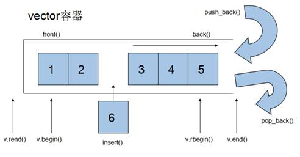
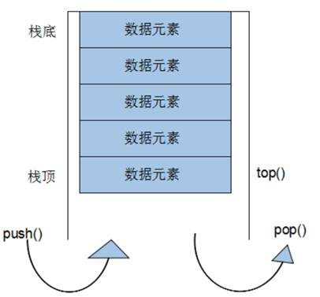
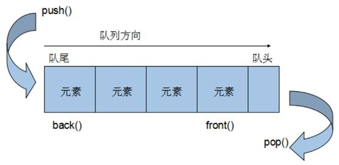

STL**容器**就是将运用**最广泛的一些数据结构**实现出来

常用的数据结构：数组, 链表,树, 栈, 队列, 集合, 映射表 等

这些容器分为**序列式容器**和**关联式容器**两种:

- **序列式容器**:强调值的排序，序列式容器中的每个元素均有固定的位置。

- **关联式容器**:二叉树结构，各元素之间没有严格的物理上的顺序关系

# string容器（字符串类）

## string和char* 区别

- string是一个类，类内部封装了char*，管理这个字符串，是一个char*型的容器

- char* 是一个指针

## string构造函数

```C++
string();  //创建一个空的字符串
string s1;

string(const char* s);  //使用字符串s初始化
string s2(str);

string(const string& string);   //使用一个string对象初始化另一个string 对象
string s3(s2);

string(int n, char c);    //使用n个字符c初始化
string(10, 'a');
```

## string赋值操作

```C++
string& operator=(const char* s);             //char*类型字符串 赋值给当前的字符串
str1 = "hello world";

string& operator=(const string &s);           //把字符串s赋给当前的字符串
str2 = str1;

string& operator=(char c);                    //字符赋值给当前的字符串
str3 = 'a';

string& assign(const char *s);                //把字符串s赋给当前的字符串
str4.assign("hello c++");

string& assign(const char *s, int n);         //把字符串s的前n个字符赋给当前的字符串
str5.assign("hello c++", 5);

string& assign(const string &s);              //把字符串s赋给当前字符串
str6.assign(str5);

string& assign(int n, char c);                //用n个字符c赋给当前字符串
str7.assign(5, 'x');

```

## string字符串拼接

```C++
string& operator+=(const char* str);              //重载+=操作符
string str1 = "I";
str1 += "love you";

string& operator+=(const char c);                 //重载+=操作符
str1 += ':';

string& operator+=(const string& str);            //重载+=操作符
str2 = " LOL ";
str2 += str1;

string& append(const char *s);                    //把字符串s连接到当前字符串结尾
str1.append(" love ");

string& append(const char *s, int n);             //把字符串s的前n个字符 连接到当前字符串结尾
str1.append( "game abcde", 4);

string& append(const string &s);                  //同   +=(const string& str)
str1.append(str2);

string& append(const string &s, int pos, int n);  //字符串s中从pos开始的n个字符连接到字符串结尾
str3.append(str2, 2, 3);

```

## string查找和替换

find从左往右查找， refind从右往左查找

find查找到字符串后返回第一个字符的位置，找不到返回-1

replace在替换时需要指定替换初始位置，多少个字符， 替换成什么样的字符串

```C++
//-----------find函数查找第一次出现位置(find函数总是从左往后)------------
int find(const string& str, int pos = 0) const;  //查找str第一次出现位置，从pos开始查找
string str1 = "abcdefgde";
pos = str1.find("de");   //返回3

int find(const char* s, int pos = 0) const;  //查找s第一次出现位置，从pos开始查找


int find(const char* s, int pos = 0) const;  //从pos开始查找s的前n个字符第一次出现的位置


int find(const char c, int pos = 0) const;  //查找字符c第一次出现位置


//-----------rfind函数查找最后一次出现位置（rfind从右往左）---------
int rfind(const string& str, int pos = npos) const;  //查找str最后一次出现位置，从pos开始查找
pos = str1.rfind("de");   //返回7

int rfind(const char* s, int pos = npos) const;  //查找s最后一次出现位置，从pos开始查找


int rfind(const char* s, int pos， int n) const;  //从pos开始查找s的前n个字符最后一次出现的位置


int rfind(const char c, int pos = 0) const;  //查找字符c最后一次出现位置


//-------------replace函数替换操作---------------
string & replace (int pos, int n, const string& str); //替换从pos开始的n个字符为字符串str
str1.replace(1, 3, "1111");

string & replace (int pos, int n, const string* s); //替换从pos开始的n个字符为字符串s


```

## string字符串比较

字符串比较是按照字符的ASCII码进行对比,主要用于比较字符串是否相等， 大小无意义

= 返回  0

< 返回  1

> 返回 -1

```C++
int compare(const string &s) const;   //与字符串进行比较
ret = s1.compare(s2);

int compare(const char *s) const;     //与字符串进行比较

```

## string字符存取

```C++
//通过[]方式取字符
char& operator[](int n);   
cout << str1[i] << endl;   //取第i个位置的字符

//通过at方式获取字符
char& at(int n);  
cout << str1.at(i) << endl;   //取第i个位置的字符

```

## string插入和删除

插入和删除下标都是从0开始的

```C++
string& insert(int pos, const char* s);   //在pos位置插入字符串s
str.insert(1, "world");  

string& insert(int pos, const string& str);  //插入字符串
str.insert(1, str2);  

string& insert(int pos, int n, char c);  //在指定位置插入n个字符c
str.insert(3, 5, 'a');  

string& erase(int pos, int n = npos);   //删除从pos开始的n个字符
str.erase(1, 3);

```

## string子串

灵活运用求子串功能，可在实际开发中获取有效信息

```C++
string substr(int pos = 0, int n = npos)const;   //返回pos开始的n个字符组成的字符串
string subStr = str.substr(1, 3);

string email = "hello@sina.com";
int pos = email.find("@");
string username = email.substr(0, pos);  //获取用户名
```

# vector容器（单端数组）



## vector与数组区别

vector和数组非常相似，也称为**单端数组**

数组是静态空间，而vector可以**动态扩展**

**动态扩展：**不是在原空间后面接续新空间，而是找更大的内存空间，将数据拷贝到新空间，释放原空间

vector迭代器支持随机访问

## vector构造函数

```C++
vector<T> v;   //采用模板实现，默认构造函数
vector<int> v1;  //无参构造

vector(v.begin(), v.end());   //将v[begin(),end()]区间的元素拷贝给本身
vector<int> v2(v1.begin(), v1.end());

vector(n, elem);   //构造函数将n个elem拷贝给本身
vector<int> v3(10,100);

vector(const vector &vec); //拷贝构造函数
vector<int> v4(v3);

```

## vector赋值操作

```C++
vector& operator = (const vector &vec);   //重载等号运算符
v2 = v1;

assign(beg, end);    //将[beg, end]区间中的数据拷贝赋值给本身
v3.assign(v1.begin(), v1.end());

assign(n, elem);     //将n个elem拷贝赋值给本身
v4.assign(10, 100);

```

## vector容量和大小

```C++
empty();           //判断容器是否为空
if(v1.empty())

capacity();        //容器容量
v1.capacity();    

size();            //返回容器中元素个数
v1.size();

resize(int num);   //重新指定容器的长度为num，若容器变长，则以默认值 0 填充新位
                   //如果容器变短，则末尾超出容器长度的元素被删除
v1.resize(6);

resize(int num, elem);  //重新指定容器的长度为num，若容器变长，则以elem值填充新位
                        //如果容器变短，则末尾超出容器长度的元素被删除
v1.resize(15,10);

```

## vector插入和删除

```C++
push_back(elem);    //尾部插入元素elem
v1.push_back(10);

pop_back();         //尾部删除最后一个元素
v1.pop_back();

insert(const_iterator pos, elem);  //迭代器指向位置pos插入元素elem
v1.insert(v1.begin(), 100);

insert(const_iterator pos, int cout, elem);  //迭代器指向位置pos插入cout个元素elem
v1.insert(v1.begin(), 2, 100);

erase(const_iterator pos); //删除迭代器指向的元素
v1.erase(v1.begin());

erase(const_iterator start, const_iterator end); //删除迭代器从start到end之间的元素
v1.erase(v1.begin(), v1.end());

clear();   //删除容器中所有元素
v1.clear();

```

## vector数据存取

```C++
at(int idx);   //返回索引idx所指向的数据
v1.at(i);

operator[];    //返回索引idx所指向的数据
v1[i];

front();       //返回容器中第一个数据元素
v1.front();

back();        //返回容器中最后一个数据元素
v1.back();

```

## vector互换容器

实现两个容器内元素的互换

swap函数可以实现收缩内存的效果

```C++
swap(vec);     //将vec与本身的元素互换
v1.swap(v2);

//收缩内存
v.resize(3);              //将vector进行resize变短后，大小改变，容量不变
vector<int> (v).swap(v);  //匿名对象   容量变小
```

## vector预留空间

减少vector在动态扩展容量时的扩展次数

如果数据量比较大，可以一开始利用reverse预留空间

```C++
reverse(int len);   //容器预留len个元素长度， 预留位置不初始化， 元素不可访问
v.reverse(1000);
```

# deque容器（**双端数组**）

- deque是**双端数组**，可以对头端进行插入删除操作

- deque内部工作原理：

    - deque内部有一个**中控器，**维护每段缓冲区中的内容，缓冲区中存放真实数据

    - 中控器维护的是每个缓冲区的地址，使得使用deque就像一片连续的内存空间


## deque和vector区别

vector对于头部的插入删除效率低，数据量越大，效率越低

deque相对而言，对头部的插入删除速度比vector快

vector访问元素时的速度比deque快，这和两者内部实现有关

**deque容器的迭代器支持随机访问**

## deque构造函数

----deque容器和vector容器的构造方式几乎一致，灵活使用即可----

```C++
deque<T> deqT;    //默认构造
deque<int> d1;

deque(beg, end);  //将[beg, end)区间中的元素拷贝给本身
deque<int> d2(d1.begin(), d1.end());

deque(n, elem);   //构造函数将n个elem拷贝给本身
deque<int> d3(10, 100);

deque(const deque &deq); //拷贝构造函数
deque<int> d4 = d3;

```

## deque赋值操作

deque赋值操作也与vector相同，需熟练掌握

```C++
deque& operator=(const deque &deq);   //重载等号运算符
d2 = d1;

assign(beg, end);   //将[beg, end)区间中的数据拷贝赋值给本身
d3.assign(d1.begin(), d1.end());

assign(n, elem);    //将n个elem拷贝赋值给本身
d4.assign(10, 1000);

```

## deque大小操作

deque没有容量的概念

```C++
deque.empty();               //判断容器是否为空
if(d.empty())

deque.size();                //返回容器中元素的个数
d.size();

deque.resize(num);           //重新指定容器的长度为num，若容易变长，则以默认值填充新位置
                             //如果容器变短，则末尾超出容器长度的元素被删除
d1.resize(10);

deque.resize(num, elem);     //重新指定容器的长度为num，若容易变长，则以elem值填充新位置
                             //如果容器变短，则末尾超出容器长度的元素被删除
d1.resize(13,5);

```

## deque插入和删除

```C++
//----------------两端插入操作-----------------
push_back(elem);    //在容器 尾部 添加一个数据
d.push_back(10);

push_front(elem);   //在容器 头部 插入一个数据
d.push_front(20);

pop_back();         //删除容器最后一个数据
d.pop_back();

pop_front();        //删除容器中第一个数据
d.pop_front();

//---------------指定位置操作----------------
insert(pos, elem);  //在pos位置插入一个elem元素的拷贝，返回新数据的位置
d.insert(d.begin(), 1000);

insert(pos, n, elem);  //在pos位置插入n个elem元素的拷贝，无返回值
d.insert(d.begin(), 2, 1000);

insert(pos, beg, end); //在pos位置插入[beg, end)区间的数据，无返回值
d.insert(d.begin(), d2.begin(), d2.end());

//--------------------删除操作-----------------------
clear();      //清空容器中的所有数据
d.clear();

erase(beg, end);  //删除[beg, end)区间的数据，返回下一个数据的位置
d.erase(d.begin(), d.end());

erase(pos);  //删除pos位置的数据，返回下一个数据的位置
d.erase(d.begin());

```

## deque数据存取

```C++
at(int idx);   //返回索引idx所指的数据
d.at(i)

operator[];    //返回索引idx所指的数据
d[i]

front();       //返回容器中第一个数据元素
d.front();

back();       //返回容器中最后一个数据元素
d.back();

```

## deque排序

sort默认进行升序排序，降序可使用reverse反转

```C++
#include <algorithm>
#include <deque>

sort(iterator beg, iterator end);    // 对beg和end区间内元素进行排序

//sort进行顺序排序
    sort(d.begin(),d.end());

    //逆序排序   先进行sort升序， 再使用reverse进行反转
    reverse(d.begin(),d.end());
```

# stack容器（栈）



- stack是一种**先进后出（First In Last Out, FILO）**的数据结构,他只有一个出口

- **栈**中只有顶层的元素才可以被外界使用  因此栈不允许有遍历行为

## stack常用接口

- 入栈   --- push

- 出栈   --- pop

- 返回栈顶   --- top

- 判断栈是否为空   --- empty

- 返回栈大小   --- size

```C++
//------------stack常用接口-----------------

//构造函数
stack<T> stk;             //stack采用模板类实现，stack对象有默认构造函数
stack<int> s;

stack(const stack &stk);  //拷贝构造函数
stack<int> s2(s1);

//赋值操作
stack& operator=(const stack &stk);    //重载等号运算符
stack<int> s2 = s1;

//数据存取
push(elem);   //向栈顶添加元素
s1.push(10);

pop();        //从栈顶移除第一个元素
s1.pop();

top();        //返回栈顶元素
s1.top();

//大小操作
empty();      //判断堆栈是否为空
if(s.empty())

size();       //返回栈的大小
s.size();

```

# queue容器（队列）



- queue是一种先进先出（First In First Out,FIFO）数据结构  他有两个出口

- 队列容器允许从一端新增元素 从另一端移除元素

- 队列中元素只有队头和队尾可以被外界使用 因此队列不允许有遍历行为

## queue常用接口

- 入队   --- push

- 出队   --- pop

- 返回队头元素   --- front

- 返回队尾元素   --- back

- 判断队是否为空   --- empty

- 返回队列大小   --- size

```C++
//-----------------------queue常用接口------------------------

//构造函数
queue<T> que;   //queue采用模板类实现 queue对象的默认构造形式
queue<Person> q;

queue(const queue &que);  //拷贝构造函数
queue<int> q2(q1);

//赋值操作
queue& operator=(const queue &que);   //重载等号运算符
queue<int> q2 = q1;

//数据存取
push(elem);   //往队尾添加元素
q.push(p1);

pop();        //从队头移除第一个元素
q.pop();

back();       //返回最后一个元素
q.back();

front();      //返回第一个元素
q.front();

//大小操作
empty();   //判断堆栈是否为空
q.empty();

size();    //返回栈的大小
q.size();

```

# list容器（链表）


- 链表（list）是一种物理存储单元上非连续的存储结构 ，数据元素的逻辑顺序是通过链表中的指针链接实现的

- 链表组成：链表是由一系列结点组成的

- 结点的组成：一是存储数据元素的数据域， 另一个是存储下一个结点地址的指针域

- STL中的链表是一个**双向循环链表**

- 由于链表的存储方式并不是连续的内存空间 因此链表list中的迭代器只支持前移和后移 属于**双向迭代器**

- -------------------list的优点---------------------

    - 采用**动态存储分配**，不会造成内存浪费和溢出

    - 链表执行**插入和删除操作十分方便**，修改指针即可，不需要大量移动元素

- -------------------list的缺点---------------------

    - 链表灵活，但是空间（指针域）和时间（遍历）**额外耗费较大**

    - list有一个重要的性质，插入和删除操作都**不会造成原有list迭代器的失效**，这是vector不具有的

- 总结：STL中list和vector是两个最常用的容器 各有优缺点

## list构造函数

```C++
//--------------------list构造函数------------------

list<T> lst;       //list采用模板类实现，对象的默认构造形式
list<int> L1;

list(beg, end);    //构造函数将[beg, end)区间中的元素拷贝给本身
list<int> L2(L1.begin(), L1.end());

list(n, elem);     //构造函数将n个elem拷贝给本身
list<int> L3(L2);

list(const list &lst); //拷贝构造函数
list<int> L4(10, 1000);

```

## list赋值和交换

```C++
assign(beg, end);   //将[beg, end)区间中的数据拷贝赋值给本身
L2.assign(L1.begin(),L1.end());

assign(n, elem);    //将n个elem拷贝赋值给本身
L3.assign(10, 100);

list& operator=(cosnt list & lst);  //重载等号运算符
L4 = L3;

swap(lst);          //将lst与本身的元素互换
L1.swap(L2);

```

## list大小操作

- 判断是否为空   --- empty

- 返回元素个数   --- size

- 重新指定个数   --- resize

```C++
size();    //返回容器中元素个数
L1.size();

empty();   //判断容器是否为空
if(L1.empty())

resize(num); //重新指定容器长度为num，若变长以默认值填充  变短 则超出长度部分被删除
L1.resize(10);

resize(num, elem); //重新指定容器长度为num，若变长以elem值填充  变短 则超出长度部分被删除
L1.resize(12, 5);

```

## list插入和删除

- 尾插   --- push_back

- 尾删   --- pop_back

- 头插   --- push_front

- 头删   --- pop_front

- 插入   --- insert

- 删除   --- erase

- 移除   --- remove

- 清空   --- clear

```C++
push_back(elem);     //在链表尾部添加一个元素
L.push_back(10);

pop_back();          //删除链表中最后一个元素
L.pop_back();

push_front(elem);    //在链表开头插入一个元素
L.push_front(20);

pop_front();         //在链表开头删除第一个元素
L.pop_front();

insert(pos, elem);   //在pos位置插入elem元素的拷贝，返回新数据的位置
list<int>::iterator it = L.begin();
L.insert(++it, 1000);    //在位置1插入元素1000

insert(pos, n, elem );  //在pos位置插入n个elem数据， 无返回值
L.insert(3, 2, 1000);

insert(pos, beg, end);  //在pos位置插入[beg, end)区间的数据，无返回值
L.insert(3, L1.begin(), L1.end());

clear();             //移除链表中所有数据
L.clear();

erase(beg, end);     //删除[beg, end)区间的数据，并返回下一个数据的位置
L.erase(L.begin(), L.end());

erase(pos);          //删除pos位置的数据，返回下一个数据的位置
L.erase(3);

remove(elem);        //删除容器中所有与elem值匹配的元素
L.remove(1000);

```

## list数据存取

- 链表不可以使用 .at()  &  [ ]方式访问数据    也不支持随机访问

- 返回第一个元素   --- front

- 返回最后一个元素   --- back

```C++
front();   //返回第一个元素
L.front();

back();    //返回最后一个元素
L.back();

```

## list反转和排序

```C++
reverse();    //反转链表
L.reverse();


sort();       //链表排序
L.sort();  //默认排序规则


//按照指定规则，从大到小
bool myCompare(int val1, int val2)
{
  return val1 > val2;
}
L.sort(myCompare);   

```

**list自定义类排序**

- 对于自定义数据类型，必须要指定排序规则，否则编译器不知道如何进行排序

-  高级排序只是在排序规则上再进行一次逻辑规则制定，并不复杂

```C++
class Person
{
public:
    Person(string name, int age, int height)
    {
        m_name = name;
        m_age = age;
        m_height = height;
    }
public:
    string m_name;
    int m_age;
    int m_height;
};

// 排序规则：按照年龄进行升序  如果年龄相同则按照身高进行降序
bool ComparePerson(Person& p1, Person& p2)
{
    if(p1.m_age == p2.m_age)
    {
        return p1.m_height > p2.m_height;
    }
    else
    {
        return p1.m_age < p2.m_age;
    }
}

L.sort(ComparePerson); //自定义数据类型排序
```

# set/multiset容器（集合）

- set 所有元素在插入时会被自动排序

- **本质：**  set/mutilset属于关联式容器，底层实现结构时用二叉树实现

## set和mutilset区别

- set容器不允许有重复元素

- mutilset容器允许容器中有重复元素

## set构造和赋值

