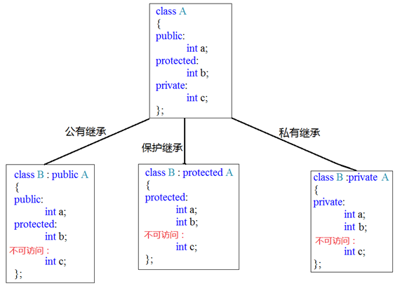

- 语法： class 子类（派生类） ： （继承方式）public 父类（基类）

```C++
class Son:public Base{ };  //public  protected  private
```

### 继承方式

 默认继承方式是private继承
- 公共继承 (public) -当一个类派生自公有基类时，基类的公有成员也是派生类的公有成员，
               -基类的保护成员也是派生类的保护成员，基类的私有成员不能直接被派生类访问，
               -但是可以通过调用基类的公有和保护成员函数来间接访问private成员
- 保护继承 (protected) -当一个类派生自保护基类时，基类的公有和保护成员将成为派生类的保护成员。
- 私有继承 (private)   -当一个类派生自私有基类时，基类的公有和保护成员将成为派生类的私有成员。

- 父类中private成员在子类以任何访问方式中都不能直接访问

- 父类中的私有成员也被子类继承  但是被编译器隐藏了

   （父类中所有非静态成员属性都会被子类继承下去）



- 继承中 先调用父类构造函数，再调用子类构造函数，析构顺序与构造相反

### 继承中同名成员的处理方式

1. 子类对象可以直接访问到子类中同名成员

2. 子类对象加作用域可以访问到父类同名成员

3. 当子类与父类拥有同名的成员函数，子类会隐藏父类中所有版本的同名成员函数，

   （包括重载版本）   加作用域可以访问到父类中同名函数

```C++
class Base
{
public:
  int m_A;
  void func(){};
};
class Son :public Base
{
public:
  int m_A;
  void func(){};
}
s.m_A;         //访问子类属性
s.Base::m_A;   //访问父类属性
s.func();      //访问子类成员函数
s.Base::func();//访问父类成员函数
```

#### 继承中静态成员处理方式

静态成员和非静态成员出现同名  处理方式一致
静态成员有两种访问方式 通过 类名、对象

```C++
Son::Base::m_A;    
Son::Base::func();   //第一个::代表通过类名访问   第二个:: 代表通过父类作用域访问
```

```C++
s.Base::m_A;       
s.Base::func();
```

## 多继承

语法： `class 子类 ：继承方式 父类1 ， 继承方式 父类2...`

多继承可能会引发父类中有同名成员出现，需要加作用域区分

```C++
class Son : public Base2, public Base1 {};
```

### 菱形继承

​	两个派生类继承同一个基类

​	又有某个类同时继承者两个派生类

菱形继承导致资源浪费的问题：

继承前加virtual关键字后，变为虚继承
此时公共的父类Animal称为虚基类

```C++
class Animal {};
class Sheep : virtual public Animal {};
class Tuo   : virtual public Animal {};
class SheepTuo : public Sheep, public Tuo {};

```


