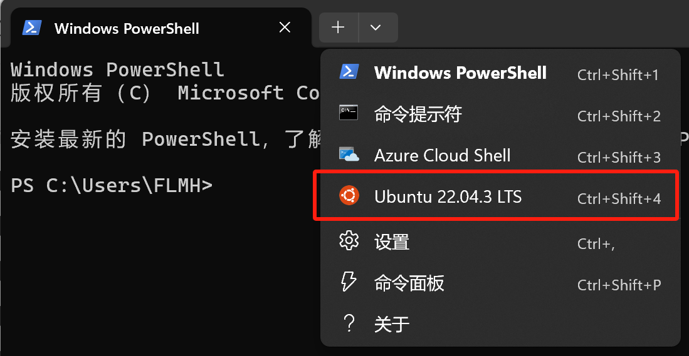

**WSL(Windows Subsystem for Linux)可用于在 Windows 计算机上运行 Linux 环境，而无需单独的虚拟机或双引导**

# WSL安装过程

**可参考微软官方文档**： [https://learn.microsoft.com/zh-cn/windows/wsl/](https://learn.microsoft.com/zh-cn/windows/wsl/)

1. 设置——应用——可选功能——**更多Windows功能勾选**“`适用于windows的linux子系统`”，“`虚拟机平台`”，“`Hyper-v`”

    如果没有“Hyper-v”选项，新建文本文档，输入以下内容，修改文件扩展名为bat或者cmd，并将文件命名为“`Hyper-v.cmd`“

```PowerShell
pushd "%~dp0"

dir /b %SystemRoot%\servicing\Packages\*Hyper-V*.mum >hyper-v.txt

for /f %%i in ('findstr /i . hyper-v.txt 2^>nul') do dism /online /norestart /add-package:"%SystemRoot%\servicing\Packages\%%i"

del hyper-v.txt

Dism /online /enable-feature /featurename:Microsoft-Hyper-V-All /LimitAccess /ALL
```

1. **右键以管理员身份运行**，自动跳出Hyper-V的安装界面。组件数量很多，安装过程需要几分钟时间，不要强行中断。在看到“操作成功完成，重新启动Windows以完成该操作”的提示之后，我们在光标处输入字母“Y”，然后回车，**重启电脑**。

    在搜索框中输入“Hyper-V”，点击“Hyper-V管理器”，就可以启动了


1. 在Microsoft Store中搜索Linux发行版，进行安装，安装完成后打开即可运行。

在安装过程中报错如下：

```PowerShell
Installing, this may take a few minutes...
WslRegisterDistribution failed with error: 0x800701bc
Error: 0x800701bc WSL 2 ????????????? https://aka.ms/wsl2kernel
Press any key to continue...
```

因为wsl1升级到wsl2后，没有安装wsl2的内核升级包，解决办法也很简单，升级wsl的内核搭配wsl2

`wsl --set-default-version 2`

如果输入`wsl`相关命令，出现`无法解析的域名服务器`相关错误，需要科学上网手段


1. **打开Microsoft Terminal**面板，在顶部选择Ubuntu则可以打开，在文件管理器中可以看到Linux相关文件夹



（注：在高版本中，VMware可以和WSL共存）

# SSH远程连接

在同一个局域网中不同设备中进行ssh远程连接WSL或VMware虚拟机参考

1. **安装 SSH服务**

卸载现有的SSH服务（如果有）

`apt remove openssh-server`

重新安装SSH服务

`apt install openssh-server`

1. **编辑SSH配置文件** 

使用`vim`打开`/etc/ssh/sshd_config`文件，并进行以下修改：

设置SSH服务的监听端口，例如：`Port 2222`

允许使用用户名和密码登录，设置：`PasswordAuthentication yes`

如果需要，允许远程root用户登录，设置：`PermitRootLogin yes`

保存并退出编辑器

重启SSH服务

`service ssh restart`

可设置ssh开机自启动 

在 `/etc/init.wsl` 文件中添加：

`service ssh start`

1. **设置转发端口 配置防火墙**

在Windows上配置端口转发和防火墙

查看WSL的IP地址 首先，安装 net-tools：

`apt install net-tools`

然后，运行 `ifconfig` 查看WSL的IP地址。

**设置端口转发 打开PowerShell**并运行以下命令：

`netsh interface portproxy add v4tov4 listenaddress=0.0.0.0 listenport=2222 connectaddress=WSL_IP connectport=2222`

将 WSL_IP 替换为你从 ifconfig 获取的WSL IP地址。

**配置Windows防火墙 在PowerShell**中运行：

`netsh advfirewall firewall add rule name=WSL2 dir=in action=allow protocol=TCP localport=2222`

1. **测试连接**

本地连接测试 在PowerShell中运行：

`ssh root@localhost -p 2222`

这应该允许你通过SSH连接到本地WSL实例。

远程连接测试 使用另一台机器（例如，你的Windows电脑）尝试**SSH连接到     Windows机器的IP地址    和指定端口**：

`ssh username@Windows_IP -p 2222`

# 相关命令


