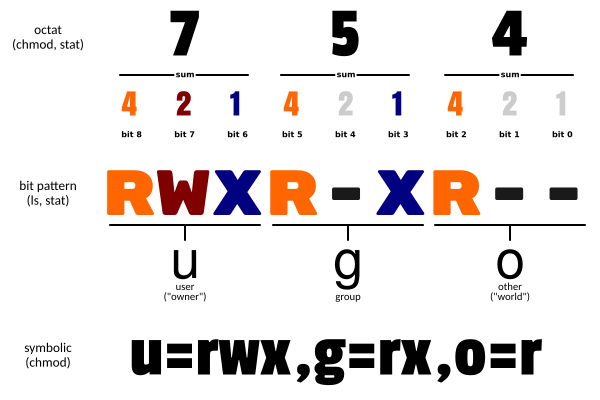

**如果想要查看命令的详细手册，可以通过man（manual， 手册）命令查看**

man命令

**Linux命令查询工具**     [https://www.lzltool.com/LinuxCommand](https://www.lzltool.com/LinuxCommand)     

 [https://www.linuxcool.com](https://www.linuxcool.com)

**Linux命令一般格式**

```PowerShell
command [-options] [parameter]    指令名称 [-选项] [传递给命令的参数]
```

- 中括号是可选配置参数

    - 一个短横线，如 `-h`，这是选项的简写

    - 两个短横线，是选项的完整名称，如 `--help`

|命令常用参数|意义|
|-|-|
|command --help|获取帮助|
|command --version|查看版本 |

# 终端快捷键

|快捷键|功能描述|
|-|-|
|Ctrl +  A|光标快速跳至行首|
|Ctrl +  E|光标快速跳至行尾|
|Ctrl +  U|删除光标至行首的所有内容|
|Ctrl +  K|删除光标至行尾的所有内容|
|Ctrl + W|删除光标前的一个单词|
|Ctrl +  L |清空整个终端屏幕（clear）|
|**Ctrl + C** |**强制中断正在执行的进程或命令**|
|Ctrl + D|注销或退出终端(等价于exit)|
|Ctrl + Z|暂停正在执行的进程（之后可恢复执行）|
|Ctrl + R|在命令历史中进行逆向搜索，利用关键词|
|Alt  +  . |引用上一个命令的最后一个参数，等价于!$|
|ESC +  . |引用上一个命令的最后一个参数，等价于!$|
|Tab|自动补全命令|
|Tab+Tab|显示所有相关开头的命令|
|！！|重复执行上一条命令|
|↑(PgUp)  /  ↓(PgDown)|向上/向下回溯历史命令|

# 一些命令

## 帮助命令

`man` ，`whatis`， `info`等命令用于显示其他命令帮助信息

```PowerShell
man命令
**如果想要查看命令的详细手册，可以通过man（manual， 手册）命令查看**

man ls，就是查看ls命令的详细手册
man cd，就是查看cd命令的详细手册
man ls > ls-man.txt  通过重定向符，可以输出手册到文件

whatis  [指令或者是数据] 相当于 man -f
apropos [指令或则是数据] 相当于 man -k

whatis命令

leo@LAPTOP-OTF01ATG:~$ whatis ls
ls (1)               - list directory contents
leo@LAPTOP-OTF01ATG:~$ whatis cp
cp (1)               - copy files and directories
leo@LAPTOP-OTF01ATG:~$ whatis tcp
tcp (7)              - TCP protocol

info命令
基本上 info 与 man 的用途其实差不多，但是是一个输出显示比较好的排版， info page 将文件数据拆成一个一个的段落，每个段落用一个页面展示，各个页面中还有类似网页的超链接来跳转到不同的页面中，每个独立的页面也称为一个节点（node）。可以想象成 info page 是文本模式的网页显示数据
```

man手册第一行命令大写后括号中数字代表含义如下

|代号|含义|
|-|-|
|1|**用户在 shell 环境中可以操作的指令或可执行文件**|
|2|系统核心可呼叫的函数与工具等|
|3|一些常用的函数（function）与函式库（library）大部分为 C 的函数库（libc）|
|4|装置文件说明，通常在 /dev 下的文件|
|5|**配置文件或则是某些文件的格式**|
|6|游戏（games）|
|7|惯例与协议等，例如 linux 文件系统、网络协议、ASCII code 等等的说明|
|8|**系统管理员可用的管理指令**|
|9|跟 kernel 有关的文件|

### **管道符  |**   

**将管道符左边命令的结果，作为右边命令的输入**

```PowerShell
leo@leo-virtual-machine:~/桌面/youknow$ cat test2.txt
this is a test file for you to learn Linux
good good study
day day up
thank you!
leo@leo-virtual-machine:~/桌面/youknow$ cat test2.txt | grep "this"
this is a test file for you to learn Linux
leo@leo-virtual-machine:~/桌面/youknow$ cat test2.txt | grep "this" | wc -w
10
```

### history命令

**查看历史命令**

```PowerShell
history    # 查看已经执行过的历史命令

history -c # 清空历史记录
```

### echo命令

**echo命令在命令行内输出指定内容**

无需选项，只有一个参数，表示要输出的内容，复杂内容可以用””包围

通过将命令用反引号  `  `（通常也称之为飘号），包围的内容，会被作为命令执行，而非普通字符

```PowerShell
leo@leo-virtual-machine:~/桌面/youknow$ echo hello linux
hello linux

leo@leo-virtual-machine:~/桌面/youknow$ echo pwd
pwd
leo@leo-virtual-machine:~/桌面/youknow$ pwd
/home/leo/桌面/youknow
leo@leo-virtual-machine:~/桌面/youknow$ echo 'pwd'    # 使用引号  不起作用
pwd
leo@leo-virtual-machine:~/桌面/youknow$ echo `pwd`    # 使用反引号
/home/leo/桌面/youknow
```

### 重定向符

|符号|作用|
|-|-|
|>|将左侧命令的结果，**覆盖写入**到符号右侧指定的文件中|
|>>|将左侧命令的结果，**追加写入**到符号右侧指定的文件中|

```PowerShell
leo@leo-virtual-machine:~/桌面/youknow$ echo "hello linuuuuux" >> test2.txt
leo@leo-virtual-machine:~/桌面/youknow$ cat test2.txt
this is a test file for you to learn Linux
good good study
day day up
thank you!
hello linuuuuux
```

### bc计算器

```PowerShell
leo@LAPTOP-OTF01ATG:~$ bc
bc 1.07.1
Copyright 1991-1994, 1997, 1998, 2000, 2004, 2006, 2008, 2012-2017 Free Software Foundation, Inc.
This is free software with ABSOLUTELY NO WARRANTY.
For details type `warranty'.

1 + 1
2

10/100    # 直接10/100输出0
0

scale = 3 # 使用 scale = ，表示结果保留几位小数
10/100
.100

quit      # 退出
```

### type命令

查看命令是外部命令还是内建命令

```PowerShell
-t：    输出“file”、“alias”或者“builtin”，分别表示给定的指令为“外部指令”、“命令别名”或者“内部指令”
-p：    如果给出的指令为外部指令，则显示其绝对路径
-a：    在环境变量“PATH”指定的路径中，显示给定指令的信息，包括命令别名


leo@LAPTOP-OTF01ATG:~$ type echo
echo is a shell builtin
leo@LAPTOP-OTF01ATG:~$ type ls
ls is aliased to `ls --color=auto'
leo@LAPTOP-OTF01ATG:~$ type if
if is a shell keyword
leo@LAPTOP-OTF01ATG:~$ type date
date is hashed (/usr/bin/date)
```

### alias命令

alias 命令用于设置指令的别名，用户可利用 alias，自定指令的别名

```PowerShell
alias   查看命令别名
unalias 删除用户别名
alias ll='ls -alF'  创建命令别名

leo@LAPTOP-OTF01ATG:~$ alias ls
alias ls='ls --color=auto'
```

### 任务栏设置

```PowerShell
gsettings set org.gnome.shell.extensions.dash-to-dock dash-max-icon-size 72    # 设置任务栏大小
```

# 用户管理

## 添加删除用户

```PowerShell
添加用户
sudo useradd new_username      系统会为该用户分配一个唯一的用户ID（UID）和组ID（GID）
sudo passwd new_username       设置用户密码

删除用户
sudo userdel username          该命令将删除用户账户及其相关文件，但不会删除用户的主目录
sudo userdel -r username       同时删除用户的主目录
```

## 用户属性管理

### usermod命令

**`usermod`命令修改用户的属性**，例如用户名、用户ID、主组ID、家目录等

```PowerShell
usermod常用参数
-c ：<备注>:修改用户账号的备注文字。
-d ： <登录目录>:修改用户登录时的目录。
-e ：<有效期限>:修改账号的有效期限。
-f ：<缓冲天数>:修改在密码过期后多少天即关闭该账号。
-g ：<群组>:修改用户所属的群组。
-G ：<群组>:修改用户所属的附加群组。
-l ：<账号名称>:修改用户账号名称。
-L: ：锁定用户密码，使密码无效。
-s: ：修改用户登录后所使用的Shell。
-u ：修改用户ID。
-U ：:解除密码锁定。

常用操作

修改用户名：
sudo usermod -l new_username(新用户名) old_username(要修改的用户名)

修改用户ID（UID）：
sudo usermod -u new_uid(新用户ID) username(要修改ID的用户名)

修改用户的主组ID（GID）：
sudo usermod -g new_gid(新用户的主组ID) username(要修改主组ID的用户名)

修改用户的家目录：
sudo usermod -d /new/home/directory username
```

### who命令

**who命令用于查看当前用户名**

### last命令

**显示用户或终端的登录情况**

## 访问控制

Linux使用访问控制列表（Access Control Lists，ACL）来管理用户对文件和目录的访问权限。通过ACL，管理员可以精确控制每个用户对特定文件和目录的权限

## 用户切换

### su命令

`su` 命令可以用于 **切换到其他用户的身份**，默认情况下会切换到 `root` 用户身份。在使用 `su` 命令时需要输入 **目标用户的密码** 进行身份验证            **(Switch User)**

`su root`切换到root超级用户

`su leo` 切换到名为leo的普通用户中

```PowerShell
leo@leo-virtual-machine:/$ su 
密码： 
root@leo-virtual-machine:/# 
```

**用户@主机名 组成， ~号代表当前目录位置，#号代表管理员用户，普通用户都是$号**

```PowerShell
su [选项] [用户名]

su -                # 切换到 root 用户身份并启动新的 shell 会话
su - username       # 切换到 username 用户身份并启动新的 shell 会话
```

|选项|说明|
|-|-|
|-c|执行完指定的指令后，即恢复原来的身份|
|-f|适用于csh与tsch，使shell不用去读取启动文件|
|-l|改变身份时，也同时变更工作目录，以及HOME,SHELL,USER,logname,此外，也会变更PATH变量|
|-m,-p或--preserve-environment|变更身份时，不要变更环境变量|
|-s|指定要执行的shell|
|--help|显示帮助信息|
|--version|显示版本信息|

**切换用户后，可以通过`exit`命令退回上一个用户，也可以使用快捷键：  ctrl + d**

### sudo命令

`sudo` 是 Linux 系统管理指令，是允许系统管理员让普通用户执行一些或者全部的 root 命令的一个工具，如 `halt，reboot，su` 等等。这样不仅减少了 root 用户的登录和管理时间，同样也提高了安全性。sudo 不是对 shell 的一个代替，它是面向每个命令的。

`sudo` 能够授权指定用户在指定主机上运行某些命令。 如果未授权用户尝试使用 sudo，会提示联系管理员。

`sudo` 可以提供日志，记录每个用户使用 sudo 操作，以便于日后审计。

`sudo` 为系统管理员提供配置文件，允许系统管理员集中地管理用户的使用权限和使用的主机。

`sudo` 默认存活期为 5 分钟。

**`sudo -i`** 命令可以启动一个新的 shell 会话，并将环境变量设置为 root 用户的环境变量。在使用该命令时同样需要输入 当前用户的密码 进行身份验证。

```PowerShell
sudo -i             # 输入当前用户密码切换到 root 用户身份并启动新的 shell 会话

sudo su -           # 输入当前用户密码切换到 root 用户身份并启动新的 shell 会话
```

`sudo -i`、`sudo -i root`、`sudo -`、`sudo - root`、`sudo root` 效果相同，提示输入密码时，该密码为当前账户的密码，并且要求执行该命令的用户必须在 sudoers 中才可以。

**`sudo su -`** 命令可以用于直接切换到 root 用户的身份，并启动一个新的 shell 会话。在使用该命令时同样需要输入 当前用户的密码 进行身份验证。

执行`visudo`命令，会自动通过vi编辑器打开：`/etc/sudoers`

添加第三行设置leo用户sudo权限 ，不需要输入密码

```Shell
root    ALL=(ALL:ALL) ALL

leo     ALL=(ALL) NOPASSWD:ALL
```

# 文件操作

## 查看目录文件

### ls命令

**ls  可以显示当前目录下的所有文件（List）**

输入ls命令和-a参数可以显示当前文件夹下的所有文件

输入ls命令和-a参数再加上/home可查看/home下的隐藏文件

在linux中以 . 开头的文件都是隐藏文件

```PowerShell
ls -a         查看所有文件列表（可查看隐藏文件）
ls -l         以列表方式显示文件的详细信息
ls -h         配合-l以易于阅读的方式显示文件大小
ls -l -h      显示文件大小更加直观
ls -lh 
ls -hl
ls -lha 
```

```PowerShell
*         代表任意数个字符
?         代表任意一个字符，至少1个
[]        表示可以匹配字符组中的任一一个
[abc]     匹配a、b、c中的任意一个
[a-f]     匹配从a到f范围内的任意一个
```

### cd命令

当Linux终端（命令行）打开的时候，会默认以当前用户的HOME目录作为当前的工作目录


**我们可以通过cd命令，更改当前所在的工作目录（Change Directory）**

- cd命令无需选项，只有参数，表示要切换到哪个目录下

- cd命令直接执行，不写参数，表示回到用户的HOME目录

```PowerShell
.     代表当前目录
..    代表上一级目录
 
cd        默认切换到家目录
cd $HOME  切换到家目录
cd ~      切换到当前用户的主目录（家目录~）
cd .      保持在当前目录不变
cd ..     切换到上级目录
cd ../..  切换到上二级的目录
cd -      可以在最近两次工作目录之间来回切换
```

- 相对路径：在输入路径时，**最前面不是/或~，表示相对当前目录所在的目录位置**

- 绝对路径：在输入路径时，**最前面是/或~，表示从根目录/家目录开始的具体目录位置**

### pwd命令

**通过pwd命令，来查看当前所在的工作目录（Print Work Directory）**

pwd命令，无选项，无参数，直接输入pwd即可

**pwd**指令是查看当前所在目录，**ls**指令是列出该目录下所有文件和子目录

## 创建文件

### touch命令

1. 将已存在的文件的时间标签改修改为系统当前的时间(默认)，也可以通过参数指定时间，但是数据原封不动。

2. 用来创建新的空文件，这个应该是最常用的一种方法。

`touch 文件名`    如果文件不存在，可以创建一个空白文件；如果文件已存在，可以修改文件的末次修改日期

```PowerShell
touch [选项] [参数]
-a：或--time=atime或--time=access或--time=use  只更改存取时间；
-c: 或--no-create  不建立新文件
-f：此参数将忽略不予处理，仅负责解决BSD版本touch指令的兼容性问题；
-m：或--time=mtime或--time=modify  只更该变动时间；
-r：<参考文件或目录>  把指定文件或目录的日期时间，统统设成和参考文件或目录的日期时间相同；
-t：<日期时间>  使用指定的日期时间，而非现在的时间；
--help：在线帮助；
--version：显示版本信息。
```

linux下对于标识时间有三种：

1. access：最后一次访问文件的时间

2. modify：最后一次对文件内容进行修改的时间

3. change：最后一次对文件属性或状态进行修改的时间

## 创建文件夹

### mkdir命令

**通过mkdir命令可以创建新的目录（Make Directory）**

```PowerShell
mkdir [选项] 目录
参数：
-p         可以递归递归创建出具有嵌套叠层关系的文件目录
 
mkdir 文件夹名           创建一个新的目录
例如：
mkdir -p a/b/c/d        递归创建多个目录
```

## 查看文件内容

### cat命令

用于查看文件内容

```PowerShell
cat 文件名
```

### more命令

more命令同样可以查看文件内容

```PowerShell
more 文件名
```

- 同cat不同的是：

    - cat是直接将内容全部显示出来

    - 
more支持翻页，如果文件内容过多，可以一页页的展示

- 
  语法：
  同样没有选项，只有必填参数，参数表示：被查看的文件路径，相对、绝对、特殊路径符都可以使用

    - 在查看的过程中，通过  空格  翻页

    - 通过   q   退出查看

### tac命令

主要功能：倒序输出文件的内容

### head命令

```PowerShell
head -n 文件名    # 查看一个文件的前n 行，如果不指定n，则默认显示前10 行
```

### tail命令

```PowerShell
tail -n 文件名    # 查看一个文件的最后n 行，如果不指定n，则默认显示最后10 行
```

## 复制移动操作

### cp命令

**cp命令可以用于复制文件\文件夹（copy）**


语法：
-r选项，可选，用于复制文件夹使用，表示递归
参数1，Linux路径，表示被复制的文件或文件夹
参数2，Linux路径，表示要复制去的地方

```PowerShell
cp -r 参数1 参数2

-r  可选，用于复制文件夹使用，表示递归（复制文件夹必须使用 -r ）
参数1，Linux路径，表示被复制的文件或文件夹
参数2，Linux路径，表示要复制去的地方

leo@leo-virtual-machine:~/桌面/youknow$ cp test1.txt test2.txt
```

### mv命令

**mv命令可以用于移动文件\文件夹（move）**

```PowerShell
mv 参数1 参数2

参数1，Linux路径，表示被移动的文件或文件夹
参数2，Linux路径，表示要移动去的地方，如果目标不存在，则进行改名，确保目标存在

leo@leo-virtual-machine:~/桌面/youknow$ mv test2.txt ../   # 将txt文件移动到上一级目录
```

## 删除操作

### rm命令

**rm命令可用于删除文件、文件夹
（remove）**

```PowerShell
rm -r xxx        删除文件或递归删除目录

rm -f xxx        删除目录，无提示，不建议用
                 -f表示force，强制删除（不会弹出提示确认信息）
rm -rf xxx        不带提示删除文件，是由-f和-r合并的

rm -rf /*            很危险，删库跑路，无提示递归删除该路径下所有文件目录
                      rm ：删除
                      -r ：递归删除（无论文件夹是否为空）
                      -f ：强制删除不提示
                      /  ：代表根分区
                      *  ：所有
```

rm命令支持通配符 *，用来做模糊匹配
符号* 表示通配符，即匹配任意内容（包含空）

- 
`test*`，表示匹配任何以test开头的内容

- 
`*test`，表示匹配任何以test结尾的内容

- `*test*`，表示匹配任何包含test的内容

### rmdir命令

**rmdir 命令的功能是删除空目录，一个目录被删除之前必须是空的（remove directory）**

（注意：rm - r dir 命令可代替rmdir，但是有很大危险性）

删除某目录时也必须具有对父目录的写权限

```PowerShell
rmdir [选项] 目录名称

-p或--parents   删除指定目录后，若该目录的上层目录已变成空目录，则将其一并删除。
--ignore-fail-on-non-empty   忽略非空目录的错误信息。
-v或--verbose   显示指令执行过程。
--help   在线帮助。查看该命令功能和可带参数等。

```

## 查找命令

### find命令

**find命令用于按照指定条件来查找文件**

在 Linux系统中，搜索工作一般都是通过 find命令来完成的，它可以使用不同的文件特性作为寻找条件（如文件名、大小、修改时间、权限等信息），一旦匹配成功则默认将信息显示到屏幕上

```PowerShell
find [查找路径] 寻找条件 操作
常用用法：
find / -name 'xxxx'   按名称查找文件
find / -size +10k
查找小于10KB的文件： find / -size -10k
查找大于100MB的文件：find / -size +100M
查找大于1GB的文件：find / -size +1G

参数：
-name                     匹配名称
-perm                     匹配权限（mode为完全匹配，-mode为包含即可）
-user                     匹配所有者
-group                    匹配所有组
-mtime -n +n              匹配修改内容的时间（-n指n天以内，+n指n天以前）
-atime -n +n              匹配访问文件的时间（-n指n天以内，+n指n天以前）
-ctime -n +n              匹配修改文件权限的时间（-n指n天以内，+n指n天以前）
-nouser                   匹配无所有者的文件
-nogroup                  匹配无所有组的文件
-newer f1 !f2             匹配比文件f1新但比f2旧的文件
--type b/d/c/p/l/f        匹配文件类型（后面的字母参数依次表示块设备、目录、字符设备、管道、链接文件、文本文件）

-size                     匹配文件的大小（+50KB为查找超过50KB的文件，而-50KB为查找小于50KB的文件）

-prune                    忽略某个目录
-exec ...... { }\;        后面可跟用于进一步处理搜索结果的命令（下文会有演示）
-exec参数用于把find命令搜索到的结果交由紧随其后的命令作进一步处理，它十分类似于管道符技术，并且由于 find命令对参数的特殊要求，因此虽然 exec是长格式形式，但依然只需要一个减号（-）。
find [路径] -name "*.py"           查找指定路径下扩展名是.py的文件，包括子目录
如果省略路径，表示在当前文件夹下查找
例如：
find Desktop/ -name "*1*"          搜索桌面目录下，文件名包含1的文件
find Desktop/ -name "*.txt"        搜索桌面目录下，所有以.txt为扩展名的文件
find Desktop/ -name "1*"           搜索桌面目录下，以数字1开头的文件
find / -perm -4000 -print          查询整个系统中搜索权限包括SUID权限的所有文件
```

### which命令

**可以通过which命令，查看命令的程序文件存放在哪里**

```PowerShell
leo@leo-virtual-machine:~$ which which
/usr/bin/which
leo@leo-virtual-machine:~$ which cp
/usr/bin/cp
```

**find、locate、which和whereis的差异：**

1、find可以查找文件和命令、可以模糊和精确查找、查找的范围是整个Linux系统

2、locate是从整个Linux系统里找，  模糊查找。能查找文件和命令，但是有缺点：查找新的文件有时候找不到，需要更新数据库。   到mlocae.db里查找。

locate的优点：查找速度特别快，因为到数据库里查找（索引）。

3、which和whereis是查找Linux命令的工具，精确查找。只能到PATH变量定义的路径下查找。只能查找到命令，知道PATH变量目录下找

## 过滤

### grep命令

**grep命令 用于从文件中通过关键字过滤文件行**

**(Global search Regular expression and Print out the line）**

```PowerShell
grep [选项] "要查找的字符串" 文件名/目录

参数:
-i	忽略大小写
-v	查找不包含匹配文本的所有行
-w	只匹配完整单词
-n	显示行号
-r/–recursive	在目录及其子目录下搜索
```

```PowerShell
1.# 普通模式
grep "Hello world" textfile.txt
此模式只查找指定文本文件中的字符串，并输出相应行的内容。
leo@leo-virtual-machine:~/桌面/youknow$ grep "up" test2.txt
day day up

2.# 正则表达式模式
grep "^This.*line$" myfile.txt
此模式根据正则表达式语法来查找文件中的字符串。上例查找以"This"开头和"line"结尾的行。该模式可以使用更多的模式匹配方式来搜索复杂的模式。
leo@leo-virtual-machine:~/桌面/youknow$ grep "^this" test2.txt
this is a test file for you to learn Linux

3.# 递归模式
grep -r "Hello world" /home/user/
此模式会在整个目录树下查找包含指定字符串的所有文件（包括子目录中的文件）。这个方法特别适用于大型项目，可以快速查找到符合条件的文件
leo@leo-virtual-machine:~/桌面/youknow$ grep -r "oo" ./
./test1.txt:good good study
./test2.txt:good good study
```

### wc命令

**可以通过wc命令统计文件的行数、单词数量等（word count）**

```PowerShell
wc [-c -m -l -w] 文件路径
选项，-c，统计bytes数量
选项，-m，统计字符数量
选项，-l，统计行数
选项，-w，统计单词数量
参数，文件路径，被统计的文件，可作为内容输入端口
```

## 权限管理




**八进制权限语法表示**

|#|权限|rwx|二进制|
|-|-|-|-|
|7|读 + 写 + 执行|rwx|111|
|6|读 + 写|rw-|110|
|5|读 + 执行|r-x|101|
|4|只读|r--|100|
|3|写 + 执行|-wx|011|
|2|只写|-w-|010|
|1|只执行|--x|001|
|0|无|---|000|

```PowerShell
-rw------- (600)    只有拥有者有读写权限。
-rw-r--r-- (644)    只有拥有者有读写权限；而属组用户和其他用户只有读权限。
-rwx------ (700)    只有拥有者有读、写、执行权限。
-rwxr-xr-x (755)    拥有者有读、写、执行权限；而属组用户和其他用户只有读、执行权限。
-rwx--x--x (711)    拥有者有读、写、执行权限；而属组用户和其他用户只有执行权限。
-rw-rw-rw- (666)    所有用户都有文件读、写权限。
-rwxrwxrwx (777)    所有用户都有读、写、执行权限。
```

### chmod命令

**chmod设置文件的访问权限（change mode）**

常用操作`chmod u=rwx,g=rx,o=x test.c`，`chmod 751 test.c`

```PowerShell
chmod [-cfvR] [--help] [--version] mode file...

mode : 权限设定字串，格式如下 : [ugoa...][[+-=][rwxX]...][,...]，其中
u 表示该档案的拥有者，g 表示与该档案的拥有者属于同一个群体(group)者，o 表示其他以外的人，a 表示这三者皆是。
+ 表示增加权限、- 表示取消权限、= 表示唯一设定权限。
r 表示可读取，w 表示可写入，x 表示可执行，X 表示只有当该档案是个子目录或者该档案已经被设定过为可执行。
-c : 若该档案权限确实已经更改，才显示其更改动作
-f : 若该档案权限无法被更改也不要显示错误讯息
-v : 显示权限变更的详细资料
-R : 对目前目录下的所有档案与子目录进行相同的权限变更(即以递回的方式逐个变更)

示例：
# 查看文件权限
leo@leo-virtual-machine:~/桌面$ ls -l
-rw-rw-r-- 1 leo leo    0  5月  3 13:06 test.c
# 其中第一位 d 代表是文件夹  -代表是文件
d代表的是目录(directroy)
-代表的是文件(regular file)
s代表的是套字文件(socket)
p代表的管道文件(pipe)或命名管道文件(named pipe)
l代表的是符号链接文件(symbolic link)
b代表的是该文件是面向块的设备文件(block-oriented device file)
c代表的是该文件是面向字符的设备文件(charcter-oriented device file)
# 后面九位，每三位分别代表user，group，other的read，write，execute权限

leo@leo-virtual-machine:~/桌面$ chmod u=rwx,g=rx,o=x test.c
leo@leo-virtual-machine:~/桌面$ ls -l
-rwxr-x--x 1 leo leo    0  5月  3 13:06 test.c

leo@leo-virtual-machine:~/桌面$ chmod 751 test.c
leo@leo-virtual-machine:~/桌面$ ls -l
-rwxr-x--x 1 leo leo    0  5月  3 13:06 test.c

```

### chown命令

**chown命令，可以修改文件、文件夹的所属用户和用户组（change owner）**

```PowerShell
chown [-cfhvR] [--help] [--version] user[:group] file...
user : 新的文件拥有者的使用者 ID
group : 新的文件拥有者的使用者组(group)
-c : 显示更改的部分的信息
-f : 忽略错误信息
-h :修复符号链接
-v : 显示详细的处理信息
-R : 处理指定目录以及其子目录下的所有文件

# ：后表示用户组

示例：
chown root hello.txt，将hello.txt所属用户修改为root
chown :root hello.txt，将hello.txt所属用户组修改为root
chown root:leo hello.txt，将hello.txt所属用户修改为root，用户组修改为leo
chown -R root test，将文件夹test的所属用户修改为root并对文件夹内全部内容应用同样规则
```


## 打包与压缩

### tar命令

**tar命令用于打包备份文件（tape archive ）**

**打包跟压缩的区别**

- 打包是指将多个文件或者目录放在一起，形成一个总的包，这样便于保存和传输，但是大小是没有变化的

- 压缩是指将一个或者多个大文件或者目录通过压缩算法使文件的体积变小以达到压缩的目的，可以节省存储空间，在压缩的时候通常是先打包再压缩

|**打包选项**|含义|
|-|-|
|-c|将多个文件或目录进行打包。|
|-A|追加 tar 文件到归档文件。|
|-f 包名|指定包的文件名。包的扩展名是用来给管理员识别格式的，所以一定要正确指定扩展名；|
|-v|显示打包文件过程；|
|**解打包选项**|含义|
|-x|对 tar 包做解打包操作。|
|-f|指定要解压的 tar 包的包名。|
|-t|只查看 tar 包中有哪些文件或目录，不对 tar 包做解打包操作。|
|-C 目录|指定解打包位置。|
|-v|显示解打包的具体过程。|
|**(解)打包+(解)压缩**|含义|
|-z|压缩和解压缩 ".tar.gz" 格式|
|-j|压缩和解压缩 ".tar.bz2"格式|

**选项 "-cvf" 一般是打包习惯用法，解打包一般用"-xvf"，可以忽略“-”，打包时需要指定打包之后的文件名，而且要用 ".tar" 作为扩展名**

**如果只想查看文件包中有哪些文件，则可以把解打包选项 "-x" 更换为测试选项 "-t"**

### zip命令

**zip 压缩命令需要手工指定压缩之后的压缩包名，注意写清楚扩展名，以便解压缩时使用**

```PowerShell
zip [选项] 压缩包名 源文件或源目录列表
```

|选项|含义|
|-|-|
|-r|递归压缩目录，及将制定目录下的所有文件以及子目录全部压缩。|
|-m|将文件压缩之后，删除原始文件，相当于把文件移到压缩文件中。|
|-v|显示详细的压缩过程信息。|
|-q|在压缩的时候不显示命令的执行过程。|
|-压缩级别|压缩级别是从 1~9 的数字，-1 代表压缩速度更快，-9 代表压缩效果更好。|
|-u|更新压缩文件，即往压缩文件中添加新文件。|

### unzip命令

**unzip 命令可以查看和解压缩 zip 文件**

```PowerShell
unzip [选项] 压缩包名
```

|选项|含义|
|-|-|
|-d 目录名|将压缩文件解压到指定目录下。|
|-n|解压时并不覆盖已经存在的文件。|
|-o|解压时覆盖已经存在的文件，并且无需用户确认。|
|-v|查看压缩文件的详细信息，包括压缩文件中包含的文件大小、文件名以及压缩比等，但并不做解压操作。|
|-t|测试压缩文件有无损坏，但并不解压。|
|-x 文件列表|解压文件，但不包含文件列表中指定的文件。|

### gzip命令

gzip 是 Linux 系统中经常用来对文件进行压缩和解压缩的命令，通过此命令压缩得到的新文件，其扩展名通常标记为“.gz”。注意：gzip 命令只能用来压缩文件，不能压缩目录，即便指定了目录，也只能压缩目录内的所有文件。

```PowerShell
[root@localhost ~]# gzip [选项] 源文件
```

命令中的源文件，当进行压缩操作时，指的是普通文件；当进行解压缩操作时，指的是压缩文件。该命令常用的选项及含义如下表 所示。

|选项|含义|
|-|-|
|-c|将压缩数据输出到标准输出中，并保留源文件。|
|-d|对压缩文件进行解压缩。|
|-r|递归压缩指定目录下以及子目录下的所有文件。|
|-v|对于每个压缩和解压缩的文件，显示相应的文件名和压缩比。|
|-l|对每一个压缩文件，显示以下字段：
 - 压缩文件的大小；
 - 未压缩文件的大小；
 - 压缩比；
 - 未压缩文件的名称。|
|-数字|用于指定压缩等级，-1 压缩等级最低，压缩比最差；-9 压缩比最高。默认压缩比是 -6。|

**gzip命令不会打包目录，而是把目录下所有的子文件分别压缩，在 Linux 中，打包和压缩是分开处理的。而 gzip 命令只会压缩，不能打包，所以才会出现没有打包目录，而只把目录下的文件进行压缩的情况**

### gunzip命令

gunzip 是一个使用广泛的解压缩命令，它用于解压被 gzip 压缩过的文件（**扩展名为 .gz**）。

对于解压被 gzip 压缩过的文件，还可以使用 gzip 自己，即 gzip -d 压缩包。

```PowerShell
[root@localhost ~]# gunzip [选项] 文件
```

选项：

|选项|含义|
|-|-|
|-r|递归处理，解压缩指定目录下以及子目录下的所有文件。|
|-c|把解压缩后的文件输出到标准输出设备。|
|-f|强制解压缩文件，不理会文件是否已存在等情况。|
|-l|列出压缩文件内容。|
|-v|显示命令执行过程。|
|-t|测试压缩文件是否正常，但不对其做解压缩操作。|

### bzip2命令

bzip2 命令同 gzip 命令类似，只能对文件进行压缩（或解压缩），对于目录只能压缩（或解压缩）该目录及子目录下的所有文件。当执行压缩任务完成后，会生成一个以“.bz2”为后缀的压缩包。".bz2"格式是 Linux 的另一种压缩格式，从理论上来讲，".bz2"格式的算法更先进、压缩比更好；而 ".gz"格式相对来讲的时间更快。

```PowerShell
[root@localhost ~]# bzip2 [选项] 源文件
```

选项：

|选项|含义|
|-|-|
|-d|执行解压缩，此时该选项后的源文件应为标记有 .bz2 后缀的压缩包文件。|
|-k|bzip2 在压缩或解压缩任务完成后，会删除原始文件，若要保留原始文件，可使用此选项。|
|-f|bzip2 在压缩或解压缩时，若输出文件与现有文件同名，默认不会覆盖现有文件，若使用此选项，则会强制覆盖现有文件。|
|-t|测试压缩包文件的完整性。|
|-v|压缩或解压缩文件时，显示详细信息。|
|-数字|这个参数和 gzip 命令的作用一样，用于指定压缩等级，-1 压缩等级最低，压缩比最差；-9 压缩比最高|

注意，gzip 只是不会打包目录，但是如果使用“-r”选项，则可以分别压缩目录下的每个文件；而 bzip2 命令则根本不支持压缩目录，也没有“-r”选项。

### **bunzip2命令**

要解压“.bz2”格式的压缩包文件，除了使用“bzip2 -d 压缩包名”命令外，还可以使用 bunzip2 命令。bunzip2 命令的使用和 gunzip 命令大致相同，bunzip2 命令只能用于解压文件，即便解压目录，也是解压该目录以及所含子目录下的所有文件。

```PowerShell
[root@localhost ~]# bunzip2 [选项] 源文件
```

|选项|含义|
|-|-|
|-k|解压缩后，默认会删除原来的压缩文件。若要保留压缩文件，需使用此参数。|
|-f|解压缩时，若输出的文件与现有文件同名时，默认不会覆盖现有的文件。若要覆盖，可使用此选项。|
|-v|显示命令执行过程。|
|-L|列出压缩文件内容。|

# 软件包管理

## apt命令

**apt 是Linux操作系统上的一种软件包管理工具(Advanced Package Tool)** 

它可以帮助用户在Linux系统上安装、更新和删除软件包。apt是Debian、Ubuntu等Linux发行版中默认的软件包管理工具

**apt的特点包括**

- 支持自动依赖解决：当安装一个软件包时，apt会自动安装该软件包所依赖的其他软件包。

- 提供简洁的命令行界面和一系列易于使用的命令：用户可以通过简单的命令进行软件包的管理，如安装、更新、删除等。

- 提供源代码和二进制软件包的管理：用户可以通过apt来管理源代码软件包，也可以管理预编译的二进制软件包。

**apt-get子命令**

```PowerShell
update：下载更新软件包列表信息
upgrade：将系统中所有软件包升级到最新的版本
install：下载所需软件包并进行安装配置
remove：卸载软件包
autoremove：将不满足依赖关系的软件包自动卸载
source：下载源码包
build-dep：为源码包构建所需的编译环境
dist-upgrade：发布版升级
dselect-upgrade：根据dselect的选择来进行软件包升级
clean：删除缓存区中所有已下载的包文件
autoclean：删除缓存区中老版本的已下载包文件
check：检查系统中依赖关系的完整性
```

**apt-get子选项**

```PowerShell
-d：仅下载软件包，而不安装或解压
-f：修复系统中存在的软件包依赖性问题
-m：当发现缺少关联软件包时，仍试图继续执行
-q：将输出作为日志保留，不获取命令执行进度
-purge：与remove子命令一起使用，完全卸载软件包
-reinstall：与install子命令一起使用，重新安装软件包
-b：在下载完源码包后，编译生成相应的软件包
-s：不做实际操做，只是模拟命令执行结果
-y：对所有询问都做肯定的回答，apt-get 不再进行任何提示
-u：获取已升级的软件包列表
-h：获取帮助信息
-v：获取apt-get版本号
```


```PowerShell
刷新软件源
sudo apt-get update

更新软件包
sudo apt-get upgrade

安装软件包
sudo apt-get install package_name

重新安装软件包
sudo apt-get install --reinstall package_name

卸载软件包
sudo apt-get remove package_name
这将卸载软件包但保留其配置文件。如果你想连同配置文件一起卸载，可以使用purge命令。运行以下命令：
sudo apt-get purge package_name

修复软件包依赖关系
sudo apt-get -f install
apt-get将尝试解决所有的依赖关系问题并安装缺失的软件包。

清理软件包缓冲区
apt-get会将下载的软件包存储在缓冲区中。为了释放磁盘空间，可以使用apt-get的autoclean命令清理软件包缓冲区。运行以下命令：
sudo apt-get autoclean
apt-get将删除已经过期的软件包，但保留仍然可用的软件包。

```

# 系统操作

## 关机重启

在 linux 下由于支持多终端机，还有就是程序或服务都是后台运行，如果直接采取按下电源来关机时， 则其他的人的数据可能就此中断。若不正常关机，则可能造成文件系统的损坏（因为来不及将数据回写到文件中，所以有些服务的文件就会有问题）

所以正常情况下，要关机时需要注意：

- `who`：            查看目前有谁在线

- `netstat -a`： 查看网络的联机状态

- `ps -aux`：     查看后台运行的程序

一些关机相关命令

- `halt` ：         系统停止，屏幕显示一句话，假死的样子

- `poweroff`：    进入关机模式

- `reboot`：       直接重新启动

- `suspend`：      进入休眠模式

### shutdown命令

**shutdown 命令允许在预定的时间将系统关机，并向所有用户发送通知**

```PowerShell
shutdown [-t seconds] [-rkhncfF] time [message]

-t seconds	送出警告信息和删除信息之间要延迟多少秒
-k	并不会真的关机，只是将警告讯息传送给所有使用者
-r	重启，相当于 reboot
-h	关机后停机
-n	不采用正常程序来关机，用强迫的方式杀掉所有执行中的程序后自行关机
-c	取消关机
-f	重启时不执行 fsck， CentOS 系统没有而 Ubuntu 系统有
-F	重启时执行 fsck， CentOS 系统没有而 Ubuntu 系统有

sudo shutdown -h now     # 立即关机
shutdown -r now          # 立即重启
shutdown -h 小时:分钟     # 指定时间关机
shutdown -h 22:30        # 晚上十点半自动关机
shutdown -c              #取消关机任务
shutdown +5 "System will shutdown after 5 minutes"  # 5min后关机并发送警告信息

```

### reboot命令

```PowerShell
reboot [选项]

-d：重新开机时不把数据写入记录文件/var/tmp/wtmp。本参数具有“-n”参数效果；
-f：强制重新开机，不调用shutdown指令的功能；
-i：在重开机之前，先关闭所有网络界面；
-n：重开机之前不检查是否有未结束的程序；
-w：仅做测试，并不真正将系统重新开机，只会把重开机的数据写入/var/log目录下的wtmp记录文件。
```

## 显示时间

### date命令

**date 命令用于 显示 或 设置系统的时间或日期**。

```PowerShell
date [参数] [+日期格式]

%t      跳格[Tab键]
%H      小时（00~23）
%I      小时（00~12）
%M      分钟（00~59）
%S      秒（00~59）
%j      今年中的第几天
%d       日
%m       月
%Y       年

leo@leo-virtual-machine:~/桌面/youknow$ date
2024年 05月 03日 星期五 16:07:28 CST
leo@leo-virtual-machine:~/桌面/youknow$ date +"%Y-%m-%d %H:%M:%S"
2024-05-03 16:09:28
```

### cal命令

**cal命令命令用来显示当前日历，或者指定日期的公历（Calendar）**

```PowerShell
cal [参数] [月份][年份]

-1 显示一个月的月历
-3 显示系统前一个月，当前月，下一个月的月历
-s  显示星期天为一个星期的第一天，默认的格式
-m 显示星期一为一个星期的第一天
-j  显示在当年中的第几天（一年日期按天算，从1月1号算起，默认显示当前月在一年中的天数）
-y  显示当前年份的日历

leo@LAPTOP-OTF01ATG:~$ cal 2 2024
   February 2024
Su Mo Tu We Th Fr Sa
             1  2  3
 4  5  6  7  8  9 10
11 12 13 14 15 16 17
18 19 20 21 22 23 24
25 26 27 28 29
```

## 查看系统信息

### 系统内核信息

```PowerShell
cat /proc/version        Linux查看系统内核和编译信息

leo@leo-virtual-machine:~$ cat /proc/version
Linux version 6.5.0-28-generic (buildd@lcy02-amd64-098) (x86_64-linux-gnu-gcc-12 (Ubuntu 12.3.0-1ubuntu1~22.04) 12.3.0, GNU ld (GNU Binutils for Ubuntu) 2.38) #29~22.04.1-Ubuntu SMP PREEMPT_DYNAMIC Thu Apr  4 14:39:20 UTC 2


uname -a                  Linux查看系统内核和系统位数信息

leo@leo-virtual-machine:~$ uname -a
Linux leo-virtual-machine 6.5.0-28-generic #29~22.04.1-Ubuntu SMP PREEMPT_DYNAMIC Thu Apr  4 14:39:20 UTC 2 x86_64 x86_64 x86_64 GNU/Linux


lsb_release -a            查看发行版本信息

leo@leo-virtual-machine:/etc$ lsb_release -a
No LSB modules are available.
Distributor ID:	Ubuntu
Description:	Ubuntu 22.04.4 LTS
Release:	22.04
Codename:	jammy


```

### CPU信息

```PowerShell
cat /proc/cpuinfo         查看cpu相关信息，包括型号、主频、内核信息等

leo@leo-virtual-machine:/etc$ cat /proc/cpuinfo
processor	: 0
vendor_id	: GenuineIntel
cpu family	: 6
model		: 170
model name	: Intel(R) Core(TM) Ultra 5 125H
stepping	: 4
microcode	: 0xffffffff
cpu MHz		: 2995.199
cache size	: 18432 KB


lscpu                    查看cpu信息   

leo@leo-virtual-machine:/etc$ lscpu
架构：                 x86_64
CPU 运行模式：         32-bit, 64-bit
Address sizes:        45 bits physical, 48 bits virtual
字节序：               Little Endian
CPU:                   8
在线 CPU 列表：         0-7
厂商 ID：              GenuineIntel
型号名称：             Intel(R) Core(TM) Ultra 5 125H
CPU 系列：             6
型号：                 170


getconf LONG_BIT         当前CPU运行在64bit模式下， 但不代表CPU不支持32bit

leo@leo-virtual-machine:/etc$ getconf LONG_BIT
64

```

### 查看主机名

```PowerShell
hostname               查看服务器名称
leo@leo-virtual-machine:/etc$ hostname
leo-virtual-machine

```

### 磁盘信息

```PowerShell
lsblk  查看磁盘信息， 列出所有可用块设备的信息，而且还能显示他们之间的依赖关系，但是它不会列出RAM盘的信息

leo@leo-virtual-machine:/etc$ lsblk
NAME   MAJ:MIN RM   SIZE RO TYPE MOUNTPOINTS
loop0    7:0    0     4K  1 loop /snap/bare/5
loop1    7:1    0  74.2M  1 loop /snap/core22/1122
loop2    7:2    0  74.2M  1 loop /snap/core22/1380
loop3    7:3    0 266.6M  1 loop /snap/firefox/3836
loop4    7:4    0   497M  1 loop /snap/gnome-42-2204/141
loop5    7:5    0 505.1M  1 loop /snap/gnome-42-2204/176
loop6    7:6    0  91.7M  1 loop /snap/gtk-common-themes/1535
loop7    7:7    0  12.3M  1 loop /snap/snap-store/959
loop8    7:8    0  40.4M  1 loop /snap/snapd/20671
loop9    7:9    0  38.7M  1 loop /snap/snapd/21465
loop10   7:10   0   452K  1 loop /snap/snapd-desktop-integration/83
sda      8:0    0    40G  0 disk 
├─sda1   8:1    0     1M  0 part 
├─sda2   8:2    0   513M  0 part /boot/efi
└─sda3   8:3    0  39.5G  0 part /var/snap/firefox/common/host-hunspell
                                 /
sr0     11:0    1   4.7G  0 rom  /media/leo/Ubuntu 22.04.4 LTS amd64


fdisk -l   观察硬盘实体使用情况，也可对硬盘分区

leo@leo-virtual-machine:/etc$ sudo fdisk -l
Disk /dev/loop0：4 KiB，4096 字节，8 个扇区
单元：扇区 / 1 * 512 = 512 字节
扇区大小(逻辑/物理)：512 字节 / 512 字节
I/O 大小(最小/最佳)：512 字节 / 512 字节
Disk /dev/loop1：74.21 MiB，77819904 字节，151992 个扇区
单元：扇区 / 1 * 512 = 512 字节
扇区大小(逻辑/物理)：512 字节 / 512 字节
I/O 大小(最小/最佳)：512 字节 / 512 字节


df -k  用于显示磁盘分区上的可使用的磁盘空间

leo@leo-virtual-machine:/etc$ df -k
文件系统         1K的块     已用     可用 已用% 挂载点
tmpfs            396352     2160   394192    1% /run
/dev/sda3      40453376 20528624 17837636   54% /
tmpfs           1981748        0  1981748    0% /dev/shm
tmpfs              5120        4     5116    1% /run/lock
/dev/sda2        524252     6220   518032    2% /boot/efi
tmpfs            396348      160   396188    1% /run/user/1000
/dev/sr0        4899762  4899762        0  100% /media/leo/Ubuntu 22.04.4 LTS amd64
```

### 内核加载模块

**`lsmod`命令用于显示已加载的Linux内核模块的信息**

`lsmod`命令的基本语法非常简单，它不接受任何选项或参数。

这个命令会读取`/proc/modules`文件，并将文件内容以易读的列表形式显示出来

```powershell
leo@leo-virtual-machine:~$ lsmod
Module                  Size  Used by
mptcp_diag             12288  0
vsock_diag             12288  0
tcp_diag               12288  0
udp_diag               12288  0
raw_diag               12288  0
inet_diag              28672  4 tcp_diag,mptcp_diag,raw_diag,udp_diag
unix_diag              12288  0
```

### env命令

**env命令用于查看系统环境变量**

## 设备挂载

### mount命令


### umount命令


