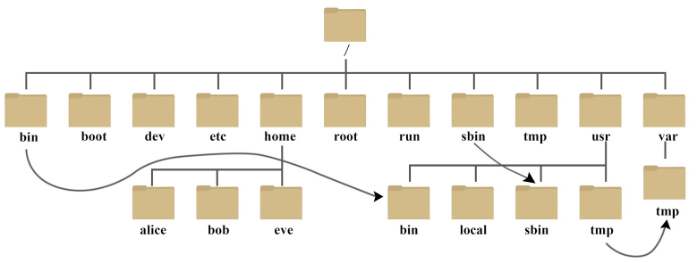

# 1. Linux目录结构

|**项次**|**目录**|**说明**|
|-|-|-|
|**1**|boot|启动文件。所有与系统启动有关的文件都保存在这里|
|1.2|boot/grub|系统引导管理器|
|**2**|dev|存放Linux下的设备文件，访问该目录相当于访问某个设备，通常用于挂载|
|**3**|etc|系统程序和大部分应用程序的全局配置文件|
|3.1|etc/init.d|SystemV风格的启动脚本，一般启动一些古老的服务|
|3.2|etc/rcX.d|启动脚本的链接，定义运行级别|
|3.3|etc/network|网络配置文件|
|3.4|etc/X11|图形界面配置文件|
|**4**|usr|应用程序存放目录，包括自行安装的软件|
|4.1|usr/bin|存放应用程序执行指令|
|4.2|usr/share|存放共享数据|
|4.3|usr/share/doc|系统说明文件存放目录|
|4.4|usr/share/man|程序说明文件存放目录|
|4.5|usr/lib|函数库文件，不能直接运行|
|4.6|usr/local|存放软件升级包|
|**5**|var|动态数据：放置系统执行过程中经常变化的文件|
|5.1|var/log|动态日志|
|5.2|var/spool/mail|邮件存放的目录|
|5.3|var/run|程序或服务启动后，其PID存放在该目录下|
|**6**|temp|临时文件：一般用户或正在执行的程序临时存放文件的目录，任何人都可以访问，重要数据不可放置在此目录下|
|**7**|mnt|临时挂载，一般使用mount|
|**8**|media|挂载媒体设备，U盘硬盘之类的|
|**9**|root|系统管理员的根目录|
|**10**|home|系统账户目录，当新增账号时，就会存在于此目录下|
|**11**|proc|此目录的数据都在内存中，如系统核心，外部设备，网络状态，由于数据都存放于内存中，所以不占用磁盘空间，比较重要的文件|
|**12**|srv|服务启动之后需要访问的数据目录，如 www 服务需要访问的网页数据存放在 /srv/www 内|
|13|opt|给第三方协力软体放置的目录|
|14|bin|可执行二进制文件的目录，如常用的命令 ls、tar、mv、cat 等|
|15|lib|系统使用函数库目录|

以下颜色代表的内容\
 **蓝色**：表示文件夹\
**红色**：压缩文件\
**红色闪烁**：错误的符号链接\
**绿色**：可执行文件\
**淡蓝色**：表示链接\
**黄色**：设备文件\
**白色**：表示文本文件\
**灰色**：其他文件

# 2. Linux各目录作用

## /

Linux 系统根目录，包含整个文件系统的所有文件和子目录

### /bin

是binary的缩写，这个目录存放着最经常使用的命令，通过上方桌面可以看到bin文件夹有个箭头，是链接到 /usr/bin下，相当于快捷方式，进入/bin和/usr/bin下是一模一样的。

- 通常包含了可执行的二进制文件。这些二进制文件是基本的系统管理工具和普通用户可用的基本命令行工具。`/bin`目录被包含在$PATH环境变量中，所以用户可以轻松地以命令行方式使用这些工具。

- 在Linux中，`/bin`目录中的工具通常是非常基本的，例如`ls`、`cp`、`mv`等。

### /sbin

s就是super User的意思，这里存放的是系统管理员使用的系统管理程序。

- 在 `/sbin`目录中，你可以找到一些常见的系统管理工具和命令，比如 `shutdown`、`reboot`、`ifconfig`、`route` 等等。这些工具和命令通常被用于对系统进行配置、管理和维护，只有系统管理员或者具有特殊权限的用户才能够调用这些命令。

### /home

存放普通用户的主目录，在Linux中每个用户都有一个自己的目录，一般该目录名是以用户的账号命名的。

- 用户可以在自己的家目录中创建自己的文件夹，存放自己的文件和数据，并根据需要设置相应的权限，以便掌握对文件的访问和修改控制权。此外，程序也可以使用用户家目录下的某些文件来存储一些配置信息，以备在下次登录时或程序启动时使用。

### /root

该目录为系统管理员，也称为超级权限者的用户主目录。

- `/root` 目录包含了 root 用户的个人文件和配置文件，包括一些重要的配置文件、SSH 私钥和其他系统管理工具。和普通用户的家目录 `/home` 不同，`/root` 目录是一个系统级别的目录，在一般情况下普通用户是无法访问和修改该目录下的任何文件的。

- `/root` 目录包含了许多常见的文件和目录，包括 `.bashrc` 表示 Bash shell 的配置文件、`.profile` 表示系统环境变量的配置文件以及一些其他的系统配置文件。当系统需要读取 root 用户的个人文件或者目录时，通常会直接引用 `/root`

### /lib

系统开机所需要最基本的动态链接共享库，其作用类似于windows里的DLL文件。几乎所有的应用程序都需要用到这些共享库。

- 在`/lib`目录中，我们可以看到很多以类似`lib*.so*`的命名方式的文件。这些文件通常是共享库（动态链接库）文件，即多个程序共享使用的某种固定的代码逻辑。它们包括各种常用的代码库，如数学库、I/O库、网络库等，不同的编程语言也有它们自己的库文件，比如 `Python` 的库文件就会被放在`/lib/python/`下面。

- 此外，在`/lib`目录下还包含了一些内核模块（drivers）的可执行二进制文件，这些模块是 Linux 内核中某些设备的驱动程序模块，可以被动态地链接到内核中。

### /etc

所有的系统管理所需要的配置文件和子目录。

该目录存储了各种系统级别的配置文件，是Linux系统中所有的常用应用程序和服务所需的重要配置文件的存储位置。该目录在系统级别和全局范围内定义了很多关键性的值。

- `/etc/network`：存储**网络相关**的设置，包括IP地址、网关、DNS、DHCP等

- `/etc/passwd`：存储系统中所有的**用户账户信息**，包括用户名、用户ID、主目录等等。

- `/etc/group`：存储系统中的所有**用户组信息**，包括组名、组ID、组成员等等。

- `/etc/fstab`：存储系统中**所有文件系统的挂载点信息和属性**，包括磁盘分区、NFS、CD-ROM等。

- `/etc/sudoers`：存储 **`sudo` 命令的相关配置信息**，包括哪些用户可以通过 `sudo` 执行哪些命令等。

- `/etc/ssh/sshd_config`：**存储 `sshd` 服务的配置信息**，包括SSH连接的安全设置、监听端口等。

- `/etc/crontab`：存储**定时任务配置信息**，包括需要执行的命令、执行的时间等。

### /usr

这是一个非常重要的目录，用户的很多应用程序和文件都放在这个目录下，类似于windows下的program fies目录。

- `/usr` 目录包含了系统的许多应用程序、库文件、文档和资源文件。与 `/`（根目录）不同，`/usr` 目录包含的大多数文件和目录都不是系统必需的，它们都是可选的、用户安装的软件和应用程序。

- 在 `/usr` 目录中，你可以找到以下一些常见的目录：

    - `/usr/bin`: 存放系统管理员和用户使用的二进制可执行文件；

    - `/usr/sbin`: 存放系统管理员使用的二进制可执行文件，需要 root 权限才能访问；

    - `/usr/lib`: 存放共享库文件，即许多程序共用的代码库；

    - `/usr/share`: 存放应用程序的资源文件、文档等共用数据文件；

    - `/usr/local`: 存放本地安装的软件及其相关的资源文件、文档等共用数据文件；

    - `/usr/include`: 存放头文件，包含了开发应用程序所需的一些标准 C/C++ 头文件

### /boot

这里存放的是启动linux时使用的一些核心文件，包括一些启动加载文件以及镜像文件，自己的安装别放这里。

这个目录的内容很少改变，一般只有在启动系统时才需要被读取。

### /proc

这个目录是一个虚拟目录，它是系统内存的映射，我们可以通过直接访问这个目录来获取系统信息。

- 在 `/proc` 目录下，你可以看到以数字命名的很多子目录，这些数字实际上是系统中每个进程的唯一标识符（PID）。每个 PID 目录下都有一个 `status` 文件，该文件包含了该进程的状态信息，如进程 ID、进程状态、内存占用情况等。

- 此外，在 `/proc` 目录下还有许多其他有用的文件和目录，比如：

    - `cpuinfo`：记录了系统当前 CPU 信息；

    - `meminfo`：记录了系统当前内存使用情况；

    - `loadavg`：记录了系统的负载情况；

    - `filesystems`：记录了系统当前支持的文件系统；

    - `uptime`：记录了系统的运行时间等。

### /srv

service缩写，该目录存放一些服务启动之后需要提取的数据。

### /sys

这是linux2.6内核的一个很大的变化。该目录下安装了2.6内核中新出现的一个文件系统sysfs。

### /tmp

这个目录是用来存放一些临时文件的。

- 在 `/tmp` 目录中，你可以存储各种临时文件，包括日志文件、缓存文件、临时副本等等。有些应用程序可能也会将它们的一些临时文件存储在 `/tmp` 目录中。因此，`/tmp` 目录是一个非常活跃且需要定期清理的目录。

- 需要注意的是，`/tmp` 目录是一个公共目录，任何用户都可以在其中存储临时文件。这也意味着，`/tmp` 目录的权限通常设置为 777，任何人都可以读取、写入和执行其中的文件。出于安全考虑，一些 Linux 系统管理员会根据自己的需求和策略对 `/tmp` 目录进行限制和保护。

### /dev

类似于windows的设备管理器，把所有的硬件用文件的形式存储。管理着所有设备，例如CPU、硬盘等等

在Linux中，所有的设备文件都被认为是文件，你可以像读/写普通文件一样读/写设备文件。设备文件通常是Linux下应用程序与硬件之间的桥梁，应用程序通过读写设备文件，实现与硬件的交互。

### /media

linux系统会自动识别一些设备，例如U盘、光驱等等，当识别后，linux会把识别的设备挂载到这个目录下。

- 插入一个可移动设备时，通常会自动在`/media`目录下创建一个与设备名称相对应的子目录，并将设备挂载到该目录下，以便用户可以访问设备中的内容。当设备被拔出时，该目录会被卸载并删除。

- 举个例子，假如你将一个 USB 闪存插入 Linux 系统中，现在该设备名为 `/dev/sdb`，Linux 会自动将该设备挂载到`/media/usb0`（或其他以设备名称为名的目录中），你就可以通过浏览 `/media/usb0` 目录来访问该设备中的文件。

- 需要注意的是，当你使用 `mount` 命令手动挂载设备时，如果设备挂载在 `/media` 目录下，你需要手动创建一个子目录，并将设备挂载在该目录下。否则，你可能会覆盖系统自动在 `/media` 目录下创建的设备目录，导致数据不可访问。

### /mnt

系统提供该目录是为了让用户临时挂载别的文件系统的，我们可以将外部的存储挂载在/mnt上，然后进入该目录就可以查看里面的内容了。和media差不多

### /opt

这是给主机额外安装软件所摆放的目录。用于安装和存储第三方应用程序、组件和依赖库，它是一些大型的独立软件包的默认安装位置。比如你安装一个mysql数据库则就可以放在这个目录下。默认是空的。

- `/opt`目录通常只用于存储独立软件包的主要二进制和库文件，而配置文件和其他资源文件则存储到 `/etc`、`/usr/share`和 `/var`等目录下。

### /var

这个目录中存放着在不断扩充的东西，我们习惯将那些经常被修改的目录放在这个目录下。用于存储变化的文件数据，包括日志文件、邮件、打印机队列、缓存、临时文件、数据库文件等等。

- `/var` 目录下包含了一些常见的目录：

    - `/var/log`：存放日志文件，包括系统日志、安全日志、应用程序日志等；

    - `/var/spool`：存放打印机队列、邮件队列等；

    - `/var/cache`：存放缓存文件，包括软件包缓存文件和其他应用程序的缓存文件等；

    - `/var/run`：存放运行时数据，如 PID 文件（记录运行中进程的 ID 号）等；

    - `/var/tmp`：存放临时文件，与 `/tmp` 目录相似，但该目录下的文件较为持久

### /lost+found

这个目录一般情况下是空的，当系统非法关机后，这里就存放了一些文件。

### /www

/www目录可以用于存储Web应用程序或网站文件，/www目录没有特别的用途，它只是一个常规目录，可以根据需要进行使用和管理。

# 3. 文件权限

Linux系统上对文件的权限有着严格的控制，如果想对某个文件执行某种操作，必须具有对应的权限方可执行成功。

- Linux下文件的权限类型一般包括**读，写，执行**。对应字母为 **r、w、x**

- Linux下权限的粒度有 拥有者 、群组 、其它组 三种。每个文件都可以针对三个粒度，设置不同的rwx(读写执行)权限。通常情况下，一个文件只能归属于一个用户和组， 如果其它的用户想有这个文件的权限，则可以将该用户加入具备权限的群组，一个用户可以同时归属于多个组。

- Linux上通常使用[chmod命令](https://flowus.cn/share/38c2c950-0710-4e77-80ea-e627299a3d2f?code=DXTE9E&embed=true)对文件的权限进行设置和更改。

## 归属（所有权）

- 属主（owener）：拥有该文件或目录的用户 --user --- u

- 群组（group）：拥有改文件或目录的组账号 --group --- g

- 其他（others）：除了属主和数组的其他用户 ----others --- o

## 访问权限

- 可读（read）;允许查看文件内容，显示目录列表 -r ---4

- 可写（write）：允许修改文件内容，-w ---2

- 可执行（execute）：允许运行程序，切换目录 -x ---1

可以使用数字表示权限：

**r->4**

**w->2**

**x->1**

**当文件权限为“rwxrwxrwx”时，权限数字是：777**

owner->4+2+1=7

group->4+2+1=7

others->4+2+1=7

