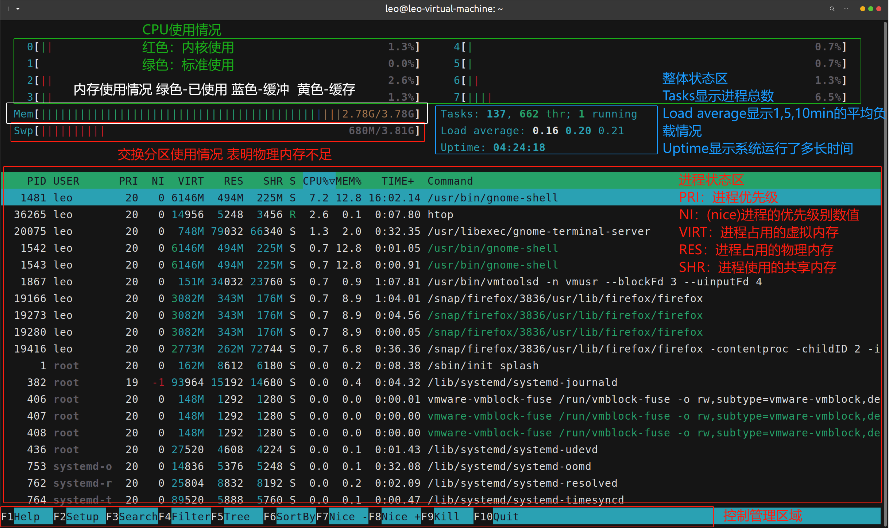

# 进程的概念

## 程序 进程 线程

**程序**：二进制文件，文件存储在磁盘中，例如/usr/bin/目录下

**进程**：当运行可执行文件后，会被装载到内存中，接着CPU会执行程序中的每一条指令，这时这个运行中的程序，就被称为进程(进程是已启动的可执行程序的运行实例）。**进程是计算机中正在运行的程序的实例**。每个进程都有自己的内存空间、寄存器和文件描述符等资源。进程可以独立执行，与其他进程并发运行。

**线程**：是操作系统能够进行运算调度的最小单位。

- 它被包含在进程之中，是进程中的实际运作单位。

- 一条线程指的是进程中一个单一顺序的控制流（线程是进程当中的一条执行流程），一个进程中可以并发多个线程，每条线程并行执行不同的任务。

## 进程的状态

- 运行（Running）：进程正在执行或等待CPU资源。

- 睡眠（Sleeping）：进程等待某个事件的发生，例如等待用户输入或等待I/O操作完成。

- 停止（Stopped）：进程被暂停执行，等待被其他进程唤醒。

- 僵尸（Zombie）：进程已经结束，但其父进程还未调用wait()系统调用来获取其终止状态。

## 进程ID

每个进程在系统中都有一个唯一的进程ID（PID），用于标识该进程。PID是一个非负整数，可以通过`getpid()`函数获取当前进程的PID。

# 进程相关命令

## 显示进程

### ps命令

**ps命令用于显示当前系统中正在执行的进程（Process Status）**

```PowerShell
常用参数：
-e：显示所有进程，包括其他用户的进程。
-f：显示进程的详细信息，包括进程的PID、父进程的PID、进程状态等。
-u <username>：显示指定用户的进程。

# -----------------示例------------------
leo@leo-virtual-machine:~$ ps -ef
UID          PID    PPID  C STIME TTY          TIME CMD
root           1       0  0 09:53 ?        00:00:07 /sbin/init splash
root           2       0  0 09:53 ?        00:00:00 [kthreadd]
root           3       2  0 09:53 ?        00:00:00 [rcu_gp]
root           4       2  0 09:53 ?        00:00:00 [rcu_par_gp]

- UID  ：进程的用户ID，表示进程属于哪个用户。
- PID  ：进程的ID，是唯一标识一个进程的数字。
- PPID ：父进程的ID，表示该进程是由哪个进程创建的。
- C    ：进程的CPU使用率，表示进程在CPU上占用的时间片。
- STIME：进程的启动时间，表示进程开始运行的时间。
- TTY  ：进程所在的终端，表示该进程与哪个终端设备关联。
- TIME ：进程的运行时间，表示该进程已经运行了多长时间。
- CMD  ：进程的命令行，表示进程是通过哪个命令启动的。

```

### top命令

**`top`命令用于实时监控系统的进程和系统资源使用情况**

它以交互方式显示进程列表，并按照CPU使用率或内存使用率进行排序。

```PowerShell
top [-] [d delay] [q] [c] [S] [s] [i] [n] [b]

参数：
-d <秒数>：指定 top 命令的刷新时间间隔，单位为秒。
-n <次数>：指定 top 命令运行的次数后自动退出。
-p <进程ID>：仅显示指定进程ID的信息。
-u <用户名>：仅显示指定用户名的进程信息。
-H：在进程信息中显示线程详细信息。
-i：不显示闲置（idle）或无用的进程。
-b：以批处理（batch）模式运行，直接将结果输出到文件。
-c：显示完整的命令行而不截断。
-S：累计显示进程的 CPU 使用时间

# -----------------示例------------------
leo@leo-virtual-machine:~$ top
top - 13:45:10 up  3:52,  1 user,  load average: 0.30, 0.22, 0.19
任务: 389 total,   1 running, 388 sleeping,   0 stopped,   0 zombie
%Cpu(s):  3.4 us,  3.4 sy,  0.0 ni, 93.2 id,  0.0 wa,  0.0 hi,  0.0 si,  0.0 st
MiB Mem :   3870.6 total,    181.8 free,   2773.4 used,    915.3 buff/cache
MiB Swap:   3898.0 total,   3352.8 free,    545.2 used.    690.2 avail Mem 

进程号 USER      PR  NI    VIRT    RES    SHR    %CPU  %MEM     TIME+ COMMAND 
33129  leo       20   0   16488   4224   3200 R  11.8   0.1   0:00.04 top
753    systemd+  20   0   14836   5376   5248 S   5.9   0.1   0:27.98 systemd-oomd
1481   leo       20   0 6265556 530416 249212 S   5.9  13.4  14:33.33 gnome-shell
20075  leo       20   0  766236  79672  61732 S   5.9   2.0   0:12.64 gnome-terminal
20330  root      20   0       0      0      0 I   5.9   0.0   0:00.75 kworker/7:2-events
1      root      20   0  166620   8612   6180 S   0.0   0.2   0:07.83 systemd

# 总体系统信息
uptime：系统的运行时间和平均负载。
tasks：当前运行的进程和线程数目。
CPU：总体 CPU 使用率和各个核心的使用情况。
内存（Memory）：总体内存使用情况、可用内存和缓存
# 进程信息
PID：进程的ID，是唯一标识一个进程的数字。
USER：进程的所属用户，表示进程属于哪个用户。
PR：进程的优先级，数值越小优先级越高。
NI：进程的优先级调整值，负数表示较高优先级，正数表示较低优先级。
VIRT：进程使用的虚拟内存大小，包括进程的代码、数据和堆栈等。
RES：进程使用的物理内存大小，表示进程实际占用的物理内存。
SHR：进程使用的共享内存大小，表示进程与其他进程共享的内存。
S：进程的状态，包括R（运行）、S（睡眠）、D（不可中断的睡眠）、Z（僵尸）等。
%CPU：进程使用的CPU占比，表示进程在当前时间片内使用CPU的时间比例。
%MEM：进程使用的内存占比，表示进程占用系统总内存的比例。
TIME+：进程的累计CPU使用时间，表示进程已经使用CPU的总时间。
COMMAND：进程的命令行，表示进程是通过哪个命令启动的。
```

**top命令交互操作**

- `k`：杀死选中的进程。

- `r`：改变选中进程的优先级。

- `1`：切换CPU核心的显示。

- `f`：显示或隐藏列字段。

- `o`：根据指定的列字段进行排序。

- `s`：改变刷新时间间隔。

- `q`：退出top命令。

    - 例如，按下k键，然后输入要杀死的进程的PID，即可杀死该进程

    - 按下o键，然后输入要排序的列字段，即可按照指定的字段对进程列表进行排序

## 查看进程树

### pstree命令

**`pstree`命令用于以树状结构显示进程及其子进程**

它可以帮助我们更直观地理解进程之间的关系。

```PowerShell
pstree [OPTIONS] [PID]

# pstree命令的参数说明
OPTIONS：可选参数，用于指定输出格式和其他选项。
-a：显示进程的命令行参数。
-c：显示进程的完整命令行。
-h：高亮显示当前进程。
-l：使用长格式输出。
-n：以数字排序进程。
-p：显示进程的PID。
-u：显示进程的所属用户。
PID：可选参数，用于指定要显示的进程的PID。如果不指定PID，则默认显示当前进程及其子进程的关系
```

### htop命令

**htop是一个交互式的进程查看器，它提供了比top更加强大和直观的功能**

htop可以实时监控系统的进程、系统资源和系统状态，并以直观的方式展示给用户。

需要执行`sudo apt install htop`命令进行安装

```PowerShell
htop [OPTIONS]

htop命令的参数说明如下：

OPTIONS：可选参数，用于指定输出格式和其他选项。
-d, --delay=DELAY：设置刷新间隔的延迟时间（单位：秒）。
-u, --user=USERNAME：只显示指定用户的进程。
-p, --pid=PID：只显示指定PID的进程。
-s, --sort-key=COLUMN：按指定的列进行排序，可选的列包括PID、USER、CPU、MEM等。
-t, --tree：以树状图的形式显示进程关系。
-h, --help：显示帮助信息。
```

`htop`命令运行界面说明



## 终止进程

### kill命令

**`kill`命令用于终止指定进程**

它向指定进程发送一个信号，可以是终止进程的信号（默认为`SIGTERM`）或其他自定义信号

```PowerShell
kill [-s <信息名称或编号>][程序]　或　kill [-l <信息编号>]

参数
-l <信息编号> 　若不加<信息编号>选项，则 -l 参数会列出全部的信息名称。
-s <信息名称或编号> 　指定要送出的信息。
[程序] 　[程序]可以是程序的PID或是PGID，也可以是工作编号。

使用 kill -l 命令列出所有可用信号。
最常用的信号是：
1 (HUP)：重新加载进程。
9 (KILL)：杀死一个进程。
15 (TERM)：正常停止一个进程
```

### killall命令

**`killall`命令用于终止指定进程名对应的所有进程**

它与`kill`命令不同的是，不需要指定进程的PID，只需指定进程名即可。

## 服务管理

### systemctl命令

**`systemctl`命令是用于管理systemd系统和服务的命令行工具**

systemd是现代Linux系统中常用的系统和服务管理器，`systemctl`命令可以帮助我们启动、停止、重启、管理和监控系统服务

```PowerShell
systemctl start <service_name>         # 启动系统服务
systemctl stop <service_name>          # 停止系统服务
systemctl restart <service_name>       # 重启系统服务
systemctl status <service_name>        # 显示系统服务状态

systemctl命令的参数说明如下：

OPTIONS：可选参数，用于指定额外的选项。
-a, --all：显示所有的单位（服务）。
-p, --property=NAME：显示指定属性的值。
-H, --host=HOST：在远程主机上执行命令。

COMMAND：必选参数，用于指定要执行的命令

start：启动指定的单位。
stop：停止指定的单位。
restart：重启指定的单位。
reload：重新加载指定的单位。
enable：设置指定的单位在系统启动时自动启动。
disable：设置指定的单位在系统启动时不自动启动。
status：显示指定的单位的状态。
list-units：列出所有的单位。
list-unit-files：列出所有的单位文件。
UNIT：可选参数，用于指定要操作的单位（服务）
```

## 监控网络状态

### netstat命令

**netstat命令可以监控系统的网络状态和性能，用于显示网络连接、路由表和网络接口等信息(network statistics)**

```PowerShell
# 参数：
-a  或–all                          显示所有连线中的Socket。
-A                                  <网络类型>或–<网络类型> 列出该网络类型连线中的相关地址。
-c  或–continuous                   持续列出网络状态。
-C  或–cache                        显示路由器配置的快取信息。
-e  或–extend                       显示网络其他相关信息。
-F  或 –fib                         显示FIB。
-g  或–groups                       显示多重广播功能群组组员名单。
-h  或–help                         在线帮助。
-i  或–interfaces                   显示网络界面信息表单。
-l  或–listening                    显示监控中的服务器的Socket。
-M  或–masquerade                   显示伪装的网络连线。
-n  或–numeric                      直接使用IP地址，而不通过域名服务器。
-N  或–netlink或–symbolic           显示网络硬件外围设备的符号连接名称。
-o  或–timers                       显示计时器。
-p  或–programs                     显示正在使用Socket的程序识别码和程序名称。
-r  或–route                        显示 Routing Table。
-s  或–statistice                   显示网络工作信息统计表。
-t  或–tcp                          显示TCP 传输协议的连线状况。
-u  或–udp                          显示UDP传输协议的连线状况。
-v  或–verbose                      显示指令执行过程。
-V  或–version                      显示版本信息。
-w  或–raw                          显示RAW传输协议的连线状况。
-x  或–unix                         此参数的效果和指定”-A unix”参数相同。
–ip 或–inet                         此参数的效果和指定”-A inet”参数相同。


#  示例
leo@leo-virtual-machine:~$ netstat
激活Internet连接 (w/o 服务器)
Proto Recv-Q Send-Q Local Address           Foreign Address         State      
tcp        0      0 leo-virtual-machi:52590 198.1.broad.ha.dy:https ESTABLISHED
tcp        0      0 leo-virtual-machi:51850 93.243.107.34.bc.:https ESTABLISHED
tcp        0      0 leo-virtual-machi:34346 178.128.122.9:https     TIME_WAIT  
udp        0      0 leo-virtual-mach:bootpc 192.168.30.254:bootps   ESTABLISHED
活跃的UNIX域套接字 (w/o 服务器)
Proto RefCnt Flags       Type       State    I-Node      路径
unix  3      [ ]         流        已连接     36249    /run/user/1000/bus
unix  3      [ ]         流        已连接     70247    /run/dbus/system_bus_socket
unix  3      [ ]         流        已连接     52183    
unix  3      [ ]         流        已连接     37447    
unix  3      [ ]         数据报    已连接     27297    

# Active Internet connections   有源TCP连接
Proto:连接协议    Recv-Q:接收队列中的字节数 Send-Q:发送队列中的字节数   Local Address:本地地址和端口
Foreign Address:远程地址和端口             State:连接状态（LISTEN（监听）   ESTABLISHED（已建立））

# Active UNIX domain sockets    有源Unix域套接口
# (和网络套接字一样，但是只能用于本机通信，性能可以提高一倍)
Proto:连接协议     RefCnt:连接到本套接口的进程号     Types:套接口类型
State:套接口当前的状态         Path:连接到套接口的其它进程使用的路径名


# 常用命令
netstat -t/-u/-l/-r/-n  显示网络相关信息,-t:TCP协议,-u:UDP协议,-l:监听,-r:路由,-n:显示IP地址和端口号
netstat -tlun   查看本机监听的端口 
netstat -an     查看本机所有的网络 
netstat -rn     查看本机路由表 
netstat -a      列出所有端口
netstat -at     列出所有的TCP端口
netstat -au     列出所有的UDP端口
netstat -l      列出所有处于监听状态的socket
netstat -lt     列出所有监听TCP端口的socket
netstat -lu     列出所有监听UDP端口的socket
netstat -ap | grep ssh   找出程序运行的端口
netstat -an | grep ‘:80’ 找出运行在指定端口的进程
```

### ss命令

**ss命令是一个强大的工具，用于显示当前系统的套接字（socket）统计信息（Socket Statistics）**

它可以提供比netstat更详细和更快速的套接字信息

```PowerShell
ss命令参数

ss -t         显示TCP套接字统计信息。
ss -u         显示UDP套接字统计信息。
ss -l         显示所有监听套接字的统计信息。
ss -p         显示与套接字关联的进程信息。
ss -n         以数字格式显示IP地址和端口号。
ss -a         显示所有套接字（包括监听和非监听套接字）的统计信息。
ss -o         显示计时器信息。
```


