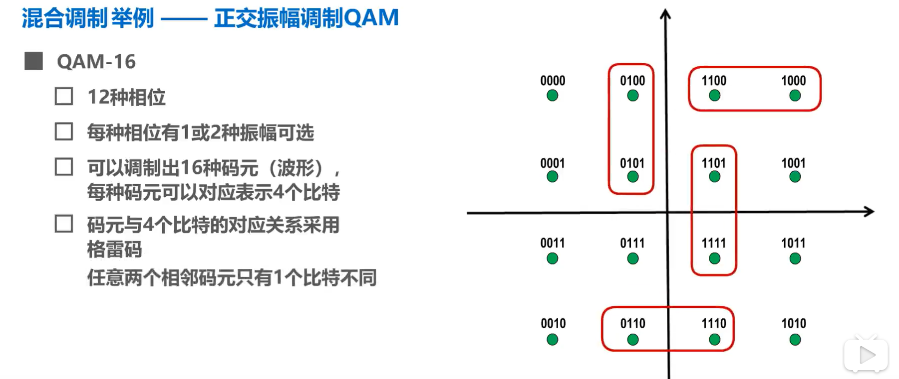

**物理层解决使用何种信号来传输比特的问题**

## **2.1 物理层基础**

直接面向实际承担数据传输的物理介质，主要功能是实现比特（Bit）流的传输，为上一层（数据链路层）提供数据传输服务。

物理层不是指具体的物理设备或物理介质，而是指使用物理介质为数据链路层提供传输比特流的物理连接。

### 主要功能

- 构建数据通路
可以是一段或多段物理介质构造一条完整的数据传输通道。

- 透明传输
让进行网络通信的各方不用管数据通路中具体的传输介质类型、相关标准以及通信协议的功能。

- 传输数据
把数据按比特流的顺序从发送端通过物理层接口传送到接收端的物理层。

- 数据编码
为了确保数据比特流能在对应的信道中正常通过，需要对数据编码。不同的传输介质所支持的数据编码类型不一样(如归零码、非归零码、曼彻斯特码、差分曼彻斯特码等)。

- 数据传输管理
物理层具有一定的数据传输管理功能，如基于比特流的数据传输流量控制、差错控制、物理线路的激活和释放等。

###  主要特性

物理层的主要任务描述为确定与传输媒体的接口有关的一些特定。

- **机械特性**
指明接口所用接线器的形状和尺寸，引脚数目和排列，固定和锁定装置等。平时常见的各种规格的接插件都有严格的标准化的规定。

- **电气特性**
指明在接口电缆的各条线上出现的电压的范围。

- **功能特性**
指明某条线上出现的某一电平的电压的意义。

- **过程特性**
指明对于不同功能的各种可能事件的出现顺序。

## 2.2 物理层下传输媒体

### **传输媒体**

也称为传输介质或传输媒介，他就是数据传输系统中在发送器和接收器之间的物理通路。**传输媒体**课分为两大类，即**导引型传输媒体**和**非导引型传输媒体**

传输媒体不属于计算机网络体系结构的任何一层。如果非要将它添加到体系结构中，那只能将其放置到物理层之下

#### 导引型传输媒体

在导引型传输媒体中，电磁波被导引沿着固体媒体传播。

**双绞线**

**光纤**

光纤的优点：

- 通信容量大（25000到30000GHz的带宽）

- 传输损耗小，远距离传输时更加经济

- 抗雷电和电磁干扰性能好，这在大电流脉冲干扰的环境下尤为重要

- 无串音干扰，保密性好，不易被窃听

- 体积小，重量轻

**同轴电缆**

#### 非导引型传输媒体

非导引型传输媒体是指自由空间。

**无线电波    微波    红外线   可见光（LIFI）**

## 2.3传输方式

### 串/并行通信

**串行传输**：

- 数据是一个比特一个比特依次发送的，因此在发送端与接收端之间，只需要一条数据传输线路即可

**并行传输**：

- 一次发送n个比特，因此，在发送端和接收端之间需要有n条传输线路

- 并行传输的优点是比串行传输的速度n倍，但成本高

数据在传输线路上的传输采用是**串行传输**，计算机内部的数据传输常用**并行传输**

### 同/异步传输

**同步传输**：

- 数据块以稳定的比特流的形式传输。字节之间没有间隔

- 接收端在每个比特信号的中间时刻进行检测，以判别接收到的是比特0还是比特1

- 由于不同设备的时钟频率存在一定差异，不可能做到完全相同，在传输大量数据的过程中，所产生的判别时刻的累计误差，会导致接收端对比特信号的判别错位

所以要使收发双发时钟保持同步

**异步传输**：

- 以字节为独立的传输单位，字节之间的时间间隔不是固定

- 接收端仅在每个字节的起始处对字节内的比特实现同步

- 通常在每个字节前后分别加上起始位和结束位

### 单/双工通信

- **单向通信（单工通信）**——只能有一个方向的通信而没有反方向的交互。

- **双向交替通信（半双工通信）**——通信的双方都可以发送信息，但不能双方同时发送(当然也就不能同时接收)。

- **双向同时通信（全双工通信）**——通信的双方可以同时发送和接收信息。

对于半双工和全双工，传输媒体中要包含两个信道，一个发送信道，另一个是接收信道

## 2.4编码与调制

- **数据 (data)** —— 运送消息的实体。

- **信号 (signal)** —— 数据的电气的或电磁的表现。

- **模拟信号 (analogous signal)** —— 代表消息的参数的取值是连续的。

- **数字信号 (digital signal)** —— 代表消息的参数的取值是离散的。

- **码元 (code)** —— 在使用时间域（或简称为时域）的波形表示数字信号时，代表不同离散数值的基本波形。

- **基带信号**（即基本频带信号）—— 来自信源的信号。像计算机输出的代表各种文字或图像文件的数据信号都属于基带信号。

- 基带信号往往包含有较多的低频成分，甚至有直流成分，而许多信道并不能传输这种低频分量或直流分量。因此必须对基带信号进行**调制** (modulation)。

- **信道** —— 一般用来表示向某一个方向传送信息的媒体。

**曼彻斯特编码**

> 在每个码元时间的中间时刻，信号都会发生跳变
>    - 负跳变表示比特1/0
>
>    - 正跳变表示比特0/1
>    - 码元中间时刻的跳变即表示时钟，又表示数据

**实际比特1和比特0的表示要看现实怎么规定**

传统以太网使用的就是曼切斯特编码

## 2.5 信道容量

**奈氏准则**

理想**低**通信道的最高码元传输速率 = 2W Baud =  2W(单位:码元/秒)

理想**带**通信道的最高码元传输速率 = W Baud   =   W(单位:码元/秒)

**香农公式**

$c  =   W  \times  \log_{2}{( 1 +\frac{S}{N} )}          (单位:bit/s)$

在**信道带宽一定**的情况下，根据奈氏准则和香农公式，要想提高信息的传输速率就必须**采用多元制**(更好的调制方法)和努力提高信道中的信噪比。
自从香农公式发表后，各种新的信号处理和调制方法就不断出现，其目的都是为了尽可能地接近香农公式给出的传输速率极限。

**信号失真的原因**

- 码元传输的速率越高

- 信号传输的距离越远

- 噪声干扰越大

- 传输媒体质量越差

