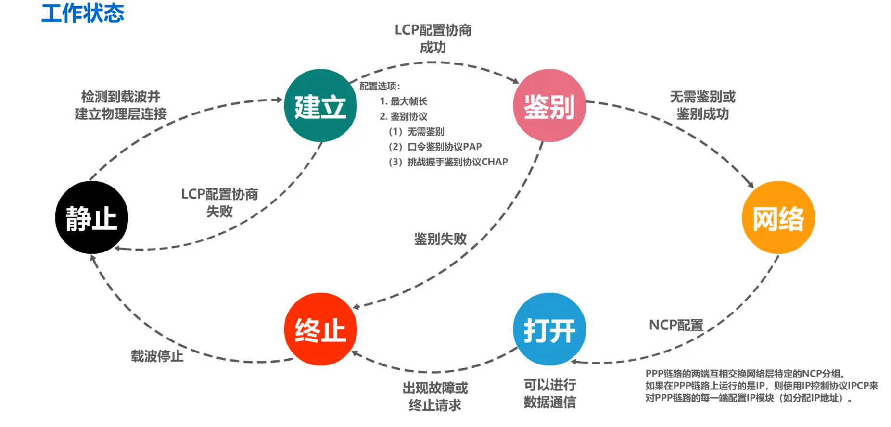

**数据链路层解决分组在一个网络（或一段链路）上传输的问题**

# 3.1数据链路层概述

**链路**\(**Link**\)就是从一个结点到相邻结点的一段物理线路，而中间没有任何其他的交换结点。

**数据链路**(**Data Link**)是指把实现通信协议的硬件（如网络适配器）和软件（如协议的实现）加到链路上，就构成了数据链路

数据链路层以 **帧** 为 协议数据单元 传输和处理数据。

局域网属于数据链路层

### 三个重要问题

**封装成帧**

- **封装成帧** (framing) 就是在一段数据的前后分别添加首部和尾部，然后就构成了一个帧。

- 首部和尾部的一个重要作用就是进行**帧定界**。

**差错控制**

- 在传输过程中可能会产生**比特差错**：1 可能会变成 0， 而 0 也可能变成 1。

**可靠传输**

- 接收方主机收到有误码的帧后，是不会接受该帧的，会将它丢弃

- 如果数据链路层向其上层提供的是不可靠服务，那么丢弃就丢弃了，不会再有更多措施

- **如果数据链路层向其上层提供的是可靠服务，那就还需要其他措施，来确保接收方主机还可以重新收到被丢弃的这个帧的正确副本**

# 3.2 封装成帧

### **封装成帧**

是指数据链路层给上层交付的协议数据单元添加帧头和帧尾(帧定界帮助从物理层比特流中提取帧)使之成为帧

帧头和帧尾包含重要的控制信息

> 前导码
>    - 前同步码：作用是使接收方的时钟同步
>
>    - 帧开始定界符：表明其后面紧跟着的就是MAC帧

另外以太网还规定了帧间间隔为96比特时间，因此，MAC帧不需要帧结束定界符

### **透明传输**

是指**数据链路层对上层交付的传输数据没有任何限制**，好像数据链路层不存在一样

解决透明传输问题，数据链路层应该对上层交付的数据有限制，其内容不能包含帧定界符的值

- **解决方法**：

- 面向字节的物理链路使用**字节填充** (byte stuffing) 或**字符填充** (character stuffing)

- 面向比特的物理链路使用比特填充的方法实现透明传输

- 发送端的数据链路层在数据中出现控制字符“SOH”或“EOT”的前面**插入一个转义字符“ESC”**(其十六进制编码是1B)。

- 接收端的数据链路层在将数据送往网络层之前删除插入的转义字符。

- 如果转义字符也出现在数据当中，那么应在转义字符前面插入一个转义字符 ESC。当接收端收到连续的两个转义字符时，就删除其中前面的一个。

# 3.3 差错检测

**奇偶校验**
### 循环冗余校验CRC

收发双方约定好一个生成多项式G(x);

将其添加到待传输数据的后面一起传输发送方基于待发送的数据和生成多项式计算出差错检测码(冗余码)

接收方通过生成多项式来计算收到的数据是否产生了误码;

循环冗余校验CRC有很好的检错能力(检率非常低)虽然计算比较复杂，但非常易于用硬件实现，因此被广泛应用于数据链路层。

在计算机网络中通常采用我们后续课程中将要讨论的检错重传方式来纠正传输中的差错或者仅仅是丢弃检测到差错的帧，这取决于数据链路层向其上层提供的是可靠传输服务还是不可靠传输服务。

# 3.4 可靠传输

数据链路层向上层提供的**服务类型**

不可靠传输服务: 仅仅丢弃有误码的帧，其他什么也不做，

可靠传输服务: 想办法实现发送端发送什么，接收端就收到什么可靠传输服务:

有线链路的误码率比较低，为了减小开销，数据链路层向上提供不可靠传输服务。即使出现了误码，可靠传输的问题由其上层处理。

无线链路易受干扰，误码率比较高，因此要求数据链路层必须向上层提供可靠传输服务。

## 传输差错

- 分组丢失

路由器输入队列快满了，主动丢弃收到的分组

- 分组失序

数据并未按照发送顺序依次到达接收端

- 分组重复

由于某些原因，有些分组在网络中滞留了，没有及时到达接收端，这可能会造成发送端对该分组的重发，重发的分组到达接收端，但一段时间后，滞留在网络的分组也到达了接收端，这就造成**分组重复**的传输差错

## 三种可靠协议

### 1.停止-等待协议SW

#### **解决的问题**

- **可靠传输 :** 解决 由于 物理线路 , 设备故障 , 路由错误 等各种问题导致的 丢包问题 

- **流量控制 :** 实现 发送端 与 接收端 的 流量控制 

**协议内容：**发送方 每 发送完一个 数据帧 ( 分组 / 数据报 ) , 就停止发送 , 等待接收端确认 , 接收到 接收端 确认信息后 , 再发送下一个分组数据

#### **四种情况**

**确认与否认：**每发送一帧数据DATA需要等待接收方回传确认帧ACK   如果DATA误码    则丢弃帧并回传NAK

**超时重传：**接收方收不到数据分组，就不会发送ACK或NAK。可以在发送方发送完一个数据分组时启动一个**超时计时器**。若到了超时计时器所设置的重传时间而发送方仍收不到接收方的任何ACK或NAK，则重传原来的数据分组，这就叫做超时重传。

一般可将重传时间选为略大于“从发送方到接收方的平均往返时间”

**确认丢失：**为**避免分组重复**这种传输错误，必须给每个分组带上序号，由于每发送一个数据分组就停止等待只要保证每发送一个新的数据分组，其发送序号与上次发送的数据分组的序号不同就可以了，因此用一个比特来编号就够了。

**确认迟到：**发送方收到迟到的确认帧就丢弃

#### 信道利用率

假设收发双方之间是一条直通的信道

- **TD**：是发送方发送数据分组所耗费的发送时延

- **RTT**：是收发双方之间的往返时间

- **TA**：是接收方发送确认分组所耗费的发送时延

TA一般都远小于TD，可以忽略，当RTT远大于TD时，信道利用率会非常低

$信道利用率  U = \frac{T_{D}}{T_{D}+RTT+T_{A}}$

性能分析：**简单，但是信道利用率太低。**

像停止-等待协议这样通过确认和重传机制实现的可靠传输协议，常称为**自动请求重传协议ARQ(A**utomatic **R**epeat re**Q**uest)，意思是重传的请求是自动进行，因为不需要接收方显式地请求，发送方重传某个发送的分组

### 2.回退N帧协议GBN

在相同的时间内，使用停止-等待协议的发送方只能发送一个数据分组，而采用流水线传输的发送方，可以按序发送多个数据分组。利用发送窗口来限制发送方可连续发送数据分组的个数

#### 无差错情况流程

发送方将序号落在发送窗口内的0~4号数据分组，依次连续发送出去

他们经过互联网传输正确到达接收方，就是没有乱序和误码，接收方按序接收它们，每接收一个，接收窗口就向前滑动一个位置，并给发送方发送针对所接收分组的确认分组，在通过互联网的传输正确到达了发送方

发送方每接收一个、发送窗口就向前滑动一个位置，这样就有新的序号落入发送窗口，发送方可以将收到确认的数据分组从缓存中删除了，而接收方可以择机将已接收的数据分组交付上层处理

> **累计确认：**
>
>   接收方对按序到达的最后一个数据分组发送确认
>
>    优点:
>    - 即使确认分组丢失，发送方也可能不必重传
>
>    - 减小接收方的开销
>    - 减小对网络资源的占用
>    缺点
>    - 不能向发送方及时反映出接收方已经正确接收的数据分组信息

**发送方**

- 发送窗口尺寸WT的1< WT≤ 2“-1
     其中，n是构成分组序号的比特数量。
      WT = 1     停止-等待协议
      WT > 2”-1 接收方无法分辨新、旧数据分组

- 发送方可在未收到接收方确认分组的情况下，将序号落在发送窗口内的多个数据分组全部发送出去;

- 发送方只有收到对已发送数据分组的确认时，发送窗口才能向前相应滑动;

- 发送方收到多个重复确认时，可在重传计时器超时前尽早开始重传，由具体实现决定。

- 发送方发送窗口内某个已发送的数据分组产生超时重发时，其后续在发送窗口内且己发送的数据分组也必须全部重传，这就是回退N帧协议名称的由来。

**接收方**

- 接收方的接收窗口尺寸WR的取值范围是WR=1因此接收方只能按序接收数据分组。

- 接收方只接收序号落在接收窗口内且无误码的数据分组，并且将接收窗口向前滑动一个位置，与此同时给发送方发回相应的确认分组。为了减少开销，接收方不一定每收到一个按序到达且无误码的数据分组就给发送方发回一个确认分组，

- 而是可以在连续收到好几个按序到达且无误码的数据分组后，才针对最后一个数据分组发送确认分组，这称为累积确认;
或者可以在自己有数据分组要发送时才对之前按序接收且无误码的数据分组进行捎带确认;

- 接收方收到未按序到达的数据分组，除丢弃外，还要对最近按序接收的数据分组进行确认;

- 回退N帧协议在流水线传输的基础上利用发送窗口来限制发送方连续发送数据分组的数量，是一种连续ARQ协议

- 在协议的工作过程中发送窗口和接收窗口不断向前滑动，因此这类协议又称为滑动窗口协议

### 3.选择重传协议SR

**选择重传协议**:为了进一步提高性能，可设法只重传出现误码的数据分组。因此，接收窗口的尺寸W不应再等于1(而应大于1)，以便接收方先收下失序到达但无误码并且序号落在接收窗口内的那些数据分组，等到所缺分组收齐后再一并送交上层。

- 选择重传协议为了使发送方仅重传出现差错的分组，接收方不能再采用累积确认，而需要对每个正确接收到的数据分组进行**逐一确认**!

# 3.5 点对点协议PPP

数据链路层使用的一种协议，它的特点是：简单；只检测差错，而不是纠正差错；不使用序号，也不进行流量控制；可同时支持多种网络层协议

主要包含三部分：

对各种协议数据包的封装方法

链路控制协议LCP   （用于建立  配置  测试 数据链路的连接）

一套网络控制协议NCPs   

## 帧格式

必须规定特殊的字符作为帧定界符

- 标志(Flag)字段:PPP帧的定界符，取值为0x7E

- 地址(Address)字段:取值为0xFF，预留(目前没有什么作用)

- 控制(Control)字段:取值为0x03，预留(目前没有什么作用)

- 协议(Protocol)字段:指明帧的数据部分送交哪个协议处理

    取值0x0021表示:帧的数据部分为IP数据报\
    取值0xC021表示:帧的数据部分为LCP分组\
    取值0x8021表示:帧的数据部分为NCP分组

- 帧检验序列(Frame Check Sequence)字段:CRC计算出的校验位

## 透明传输

必须保证数据传输的透明性

实现透明传输的方法

- 面向字节的异步链路：字节填充法（插入“转义字符”）

    出现的每一个7E(PPP帧的定界符)字节转变成2字节序列(7D,5E)\
    出现的每一个7D(转义字符)字节转变成2字节序列(7D,5D)\
    出现的每一个ASCII码控制字符(数值小于0x20的字符)，则在该字符前面插入一个7D字节，同时将该字符的编码加上0x20。\
接收方的处理:进行反变换即可恢复出原来的帧的数据部分。

- 面向比特的同步链路：比特填充法（插入“比特0”）  

发送端：发现每五个连续的1随即插入一个0

接收方：只要发现5个连续的1 将其后的一个比特的0删除

## 差错检测

能够对接收端收到的帧进行检测，并立即丢弃有差错的帧。使用CRC循环冗余校验

## 工作状态

- 当用户拨号接入 ISP 时，路由器的调制解调器对拨号做出确认，并建立一条物理连接。

- PC 机向路由器发送一系列的 LCP 分组（封装成多个 PPP 帧）。

- 这些分组及其响应选择一些 PPP 参数，并进行网络层配置，NCP 给新接入的 PC 机

- 分配一个临时的 IP 地址，使 PC 机成为因特网上的一个主机。

- 通信完毕时，NCP 释放网络层连接，收回原来分配出去的 IP 地址。接着，LCP 释放数据链路层连接。最后释放的是物理层的连接。

可见，PPP 协议已不是纯粹的数据链路层的协议，它还包含了物理层和网络层的内容。

# 3.6  媒体接入控制——广播信道

**使用一对多的广播通信方式**

- 局域网具有如下**主要优点**：

    - 具有广播功能，从一个站点可很方便地访问全网。局域网上的主机可共享连接在局域网上的各种硬件和软件资源。

    - 便于系统的扩展和逐渐地演变，各设备的位置可灵活调整和改变。

    - 提高了系统的可靠性、可用性和残存性。

**数据链路层的两个子层**

为了使数据链路层能更好地适应多种局域网标准，IEEE 802 委员会就将局域网的数据链路层拆成**两个子层**：

1. **逻辑链路控制** LLC (Logical Link Control)子层；

2. **媒体接入控制** MAC (Medium Access Control)子层。

与接入到传输媒体有关的内容都放在 MAC子层，而 LLC 子层则与传输媒体无关。 **不管采用何种协议的局域网，对 LLC 子层来说都是透明的。**

## 基本概念

为什么要媒体接入控制（介质访问控制）？

**共享信道带来的问题**

若多个设备在共享信道上同时发送数据，则会造成彼此干扰，导致发送失败。

具有更高性能的使用点对点链路和链路层交换机的交换式局域网在有线领域已完全取代了共享式局域网，但由于无线信道的广播天性，无线局域网仍然使用的是共享媒体技术

## 静态划分信道

信道复用：

**频分复用FDM**   **时分复用TDM    波分复用 WDM    码分复用 CDM**

**复用**是将单一媒体的频带资源划分成很多子信道，这些子信道之间相互独立，互不干扰。从媒体的整体频带资源上看，每个子信道只占用该媒体频带资源的一部分。

**多址**(更确切地应该称为多点接入)处理的是**动态分配信道**给用户。这在用户仅仅暂时性地占用信道的应用中是必须的，而所有的移动通信系统基本上都属于这种情况。相反，在信道永久性地分配给用户的应用中，多址是不需要的(对于无线广播或电视广播站就是这样)。

## 动态接入控制

### 随机接入（CSMA/CD协议）

**总线局域网使用协议：CSMA/CD**

#### 基本概念

**最初**的**以太网**是将许多计算机都连接到一根总线上。易于实现广播通信。当初认为这样的连接方法既简单又可靠，因为总线上没有有源器件。

**以太网（Ethernet）**是一种计算机**局域网技术**。IEEE组织的IEEE 802.3标准制定了**以太网（Ethernet）**的技术标准

以太网采用无连接的工作方式，对发送的数据帧不进行编号，也不要求对方发回确认。目的站收到有差错帧就把它丢弃，其他什么也不做

#### 多址接入MA

表示许多主机以多点接入的方式连接在一根总线上。

#### 载波监听CS

是指每一个站在发送数据之前先要检测一下总线上是否有其他计算机在发送数据，如果有，则暂时不要发送数据，以免发生碰撞。

#### 碰撞检测CD

**“碰撞检测”**就是计算机**边发送数据边检测**信道上的信号电压大小。

当几个站同时在总线上发送数据时，总线上的信号电压摆动值将会增大（互相叠加）。

**所谓“碰撞”就是发生了冲突。因此“碰撞检测”也称为“冲突检测”。**

在发生碰撞时，总线上传输的信号产生了严重的失真，无法从中恢复出有用的信息来。

**每一个正在发送数据的站，一旦发现总线上出现了碰撞，就要立即停止发送，然后等待一段随机时间后再次发送。**

为什么要进行碰撞检测？ 因为信号传播时延对载波监听产生了影响

#### 争用期  （碰撞窗口）

以太网单程端到端传播时延τ

主机最多经过2τ的时长就可检测到本次发送是否遭受了碰撞因此，以太网的端到端往返传播时延   **2τ**  称为争用期或碰撞窗口。经过争用期这段时间还没有检测到碰撞，才能肯定这次发送不会发生碰撞。

在以太网中发送帧的主机越多，端到端往返传播时延越大，发生碰撞的概率就越大。因此，共享式以太网不能连接太多的主机，使用的总线也不能太长。

10Mb/s以大网把争用期定为512比特发送时间，即51.2us，因此其总线长度不能超过5120m，但考虑到其他一些因素，如信号衰减等，以太网规定总线长度不能超过2500m。

#### 最小帧长

以太网规定**最小帧长为64字节**，即512比特(512比特时间即为争用期)

以太网的最小帧长确保了主机可在帧发送完成之前就检测到该帧的发送过程中是否遭遇了碰撞

因此凡长度小于64字节的帧都是由于碰撞而异常中止的无效帧。

**最大帧长**

 以太网V2的MAC帧为1518字节

 插入VLAN标记的802.1Q帧为1522字节

#### 截断二进制指数退避算法

#### 重要特性

使用 CSMA/CD 协议的以太网不能进行全双工通信而**只能进行双向交替通信（半双工通信）。**

每个站在发送数据之后的一小段时间内，存在着遭遇碰撞的可能性。

这种**发送的不确定性**使整个以太网的平均通信量远小于以太网的最高数据率。

CSMA/CD协议曾经用于各种总线结构以太网和双绞线以太网的早起版本中。

**现在的以太网基于交换机和全双工连接，不会有碰撞，因此没有必要使用CSMA/CS协议**

### 随机接入（CSMA/CA协议）

**无线局域网使用的协议：CSMA/CA**

在无线局域网中，不能使用碰撞检测CD，原因如下:

- 由于无线信道的传输条件特殊，其信号强度的动态范围非常大，无线网卡上接收到的信号强度往往会远远小于发送信号的强度(可能相差百万倍)。

- 即使能够在硬件上实现无线局域网的碰撞检测功能，但由于无线电波传播的特殊性(存在隐蔽站问题)，进行碰撞检测的意义也不大。

802.11无线局域网使用CSMA/CA协议，在CSMA的基础上增加了一个**碰撞避免CA**功能而不再实现碰撞检测功能

由于不可能避免所有的碰撞，并且无线信道误码率较高，802.11标准还使用了数据链路层确认机制(停止-等待协议)来保证数据被正确接收。

#### 帧间间隔

802.11标准规定，所有的站点必须在持续检测到信道空闲一段指定时间后才能发送帧，这段时间称为帧间间隔IFS。

**常用的帧间间隔**

短帧间间隔SIFS(28us)，是最短的帧间间隔，用来分隔开属于一次对话的各帧。一个站点应当能够在这段时间内从发送方式切换到接收方式。使用SIFS的帧类型有ACK帧、CTS帧、由过长的MAC帧分片后的数据帧、以及所有回答AP探询的帧和在PCF方式中接入点AP发送出的任何帧。
DCF帧间间隔DIFS(128us)，它比短帧间间隔SIFS要长得多，在DCF方式中用来发送数据帧和管理帧。

> **信道由忙转为空闲且经过DIFS时间后，还要退避一段随机时间才能使用信道？**

防止多个站点同时发送数据而产生碰撞

#### 信道预约和虚拟载波监听

为了尽可能减少碰撞的概率和降低碰撞的影响，802.11标准允许要发送数据的站点对信道进行预约。

RTS和CTS帧很短  发送碰撞的概率，碰撞产生的开销，本身开销都很小 因此对信道进行预约是值得的

(1)源站在发送数据帧之前先发送一个短的控制帧，称为请求发送RTS(RequestToSend)，它包括源地址、目的地址以及这次通信(包括相应的确认帧)所需的持续时间。

(2)若目的站正确收到源站发来的RTS帧，且媒体空闲，就发送一个响应控制帧，称为允许发送CTS(ClearToSend)，它也包括这次通信所需的持续时间(从RTS帧中将此持续时间复制到CTS帧中)。

(3)源站收到CTS帧后，再等待一段时间SIFS后，就可发送其数据帧。

(4)若目的站正确收到了源站发来的数据帧，在等待时间SIFS后，就向源站发送确认帧ACK。

除RTS帧和CTS帧会携带通信需要持续的时间，数据帧也能携带通信需要持续的时间，这称为802.11的虚拟载波监听机制。

由于利用虚拟载波监听机制，站点只要监听到RTS帧、CTS帧或数据帧中的任何一个，就能知道信道被占用的持续时间，而不需要真正监听到信道上的信号，因此虚拟载波监听机制能减少隐蔽站带来的碰撞问题

# 3.7、MAC地址、IP地址以及ARP协议

**MAC地址**是以太网的数据链路层的MAC子层所使用的地址

**IP地址**是TCP/IP体系结构网际层所使用的地址

**ARP协议**属于TCP/IP体系结构的网际层，其作用是已知设备所分配到的IP地址，使用ARP协议可以通过该IP地址获取到设备的MAC地址

## MAC地址

- 使用点对点信道的数据链路层不需要使用地址

- 使用广播信道的数据链路层必须使用地址来区分各主机

 **在每个主机发送的帧中必须携带标识发送主机和接收主机的地址**。由于这类地址是用于媒体接入控制MAC(Media Access Control)，因此这类地址被称为**MAC地址**

**MAC地址**一般被固化在网卡(网络适配器)的电可擦可编程只读存储器EEPROM中，因此MAC地址也被称为**硬件地址**;MAC地址有时也被称为**物理地址**。请注意:这并不意味着MAC地址属于网络体系结构中的物理层!

一般情况下，用户主机会包含两个网络适配器:有线局域网适配器(有线网卡)和无线局域网适配器(无线网卡)。每个网络适配器都有一个全球唯一的MAC地址，而交换机和路由器往往拥有更多的网络接口，所以会拥有更多的MAC地址。综上所述，严格来说，MAC地址是对网络上各接口的唯一标识，而不是对网络上各设备的唯一标识。

### MAC地址格式  

由组织唯一标识符OUI和网络接口标识符组成  一般为6个字节 48比特

**组织唯一标识符OUI**

- 生产网络设备的厂商，需要向IEEE的注册管理机构申请一个或多个OUI

**网络接口标识符**

- 由获得OUI的厂商自行随意分配

**EUI-48**

- 48是这个MAC地址的位数

标准表示法：00-0C-CF-93-8C-92

其他表示法：00-0C-CF-93-8C92

**关于无效的 MAC 帧**

- 数据字段的长度与长度字段的值不一致；

- 帧的长度不是整数个字节；

- 用收到的帧检验序列 FCS 查出有差错；

- 数据字段的长度不在 46 ~ 1500 字节之间。

- 有效的 MAC 帧长度为 64 ~ 1518 字节之间。

> **对于检查出的无效** **MAC** **帧就简单地丢弃。以太网不负责重传丢弃的帧。**

MAC地址发送顺序：

从第一字节到第六字节      字节内从低位到高位

### 单播MAC地址

主机B给主机C发送**单播帧**，主机B首先要构建该**单播帧**，**在帧首部中的目的地址字段填入主机C的MAC地址**，源地址字段填入自己的MAC地址，再加上帧首部的其他字段、数据载荷以及帧尾部，就构成了该**单播帧**

主机A和C都会收到该**单播帧。**主机C的网卡发现该**单播帧**的目的MAC地址与自己的MAC地址匹配，接受该帧，并将该帧交给其上层处理

主机A的网卡发现MAC地址不匹配，丢弃该帧

### 广播MAC地址

广播地址：FF-FF-FF-FF-FF-FF

假设主机B要发送一个**广播帧**，主机B首先要构建该**广播帧**，**在帧首部中的目的地址字段填入广播地址**，也就是十六进制的全F，源地址字段填入自己的MAC地址，再加上帧首部中的其他字段、数据载荷以及帧尾部，就构成了该**广播帧**

主机B讲该**广播帧**发送出去，主机A和C都会收到该**广播帧**，**发现该帧首部中的目的地址字段的内容是广播地址**，主机A和主机C都接受该帧，并将该帧交给上层处理

### 多播MAC地址

假设主机A要发送**多播帧**给该**多播地址**。将该**多播地址**的左起第一个字节写成8个比特，第一个字节的最低比特位是1，这就表明该地址是**多播地址**。

快速判断地址是不是**多播地址**，第一字节的第二位不能整除2（1,3,5,7,9,B,D,F），则该地址是**多播地址**

主机A首先要构建该**多播帧**，**在帧首部中的目的地址字段填入该多播地址**，源地址点填入自己的MAC地址，再加上帧首部中的其他字段、数据载荷以及帧尾部，就构成了该**多播帧**

主机A将该**多播帧**发送出去，主机B、C、D都会收到该**多播帧**

**主机B和C发现该多播帧的目的MAC地址在自己的多播组列表中**，都会接受该帧

主机D发现目的MAC地址不在自己得多播组列表中，则丢弃该**多播帧**

给主机配置多播组列表进行私有应用时，不得使用公有的标准多播地址

## IP地址

**IP地址是因特网(Internet)上的主机和路由器所使用的地址**，用于标识两部分信息:

**网络编号:** 标识因特网上数以百万计的网络

**主机编号:** 标识同一网络上不同主机(或路由器各接口)

很显然，之前介绍的MAC地址不具备区分不同网络的功能。

如果只是一个单独的网络，不接入因特网，可以只使用MAC地址(这不是一般用户的应用方式)。
如果主机所在的网络要接入因特网，则IP地址和MAC地址都需要使用。

**数据包转发过程中源IP地址和目的IP地址保持不变**

**数据包转发过程中源MAC地址和目的MAC地址逐个链路（或逐个网络）改变**

## ARP协议

**ARP地址解析协议：从IP地址找出其对应的MAC地址**

ARP协议**只能在一段链路或一个网络上使用**，而不能跨网络使用

源主机在自己的ARP高速缓存表中查找目的主机的IP地址所对应的MAC地址，

若找到则封装MAC帧进行发送

若找不到则发送ARP请求，封装在广播MAC帧中

动态：自动获取，生命周期默认为两分钟

静态：手工设置

ARP表中的IP地址与MAC地址的对应关系记录，是**会定期自动删除的**，**因为IP地址与MAC地址的对应关系不是永久性的**

# 3.8 集线器与交换机

## 集线器HUB

**集线器在物理层扩展以太网**

- 采用双绞线的以太网采用星形拓扑，在星形的中心则增加了一种可靠性非常高的设备，叫做**集线器** (HUB)。

- **集线器**也可以看做多口中继器，每个端口都可以成为一个中继器，中继器是对减弱的信号进行放大和发送的设备

- **集线器**的以太网在逻辑上仍是个总线网，需要使用CSMA/CD协议来协调各主机争用总线，只能工作在半双工模式，收发帧不能同时进行

**使用集线器扩展**：将多个以太网段连成更大的、多级星形结构的以太网

- **优点**

    1. 使原来属于不同碰撞域的以太网上的计算机能够进行跨碰撞域的通信。

    2. 扩大了以太网覆盖的地理范围。

- **缺点**

    1. 碰撞域增大了，但总的吞吐量并未提高。

    2. 如果不同的碰撞域使用不同的数据率，那么就不能用集线器将它们互连起来。

**碰撞域**

- **碰撞域（collision domain）**又称为**冲突域**，是指网络中一个站点发出的帧会与其他站点发出的帧产生碰撞或冲突的那部分网络。

- 碰撞域越大，发生碰撞的概率越高。

## 交换机SWITCH

**以太网交换机-在数据链路层扩展以太网**

### 网桥与交换机

早期使用**网桥**，现在使用**以太网交换机**

**网桥**

- 网桥工作在数据链路层。

- 它根据 MAC 帧的目的地址对收到的帧进行转发和过滤。

- 当网桥收到一个帧时，并不是向所有的接口转发此帧，而是先检查此帧的目的MAC 地址，然后再确定将该帧转发到哪一个接口，或把它丢弃。

**交换机**

- 1990 年问世的交换式集线器 (switching hub) 可明显地提高以太网的性能。

- 交换式集线器常称为**以太网交换机** (switch) 或**第二层交换机** (L2 switch)，强调这种交换机工作在数据链路层。

- 以太网交换机实质上就是一个**多接口的网桥**

- 以太网交换机通常都有多个接口。每个接口都可以直接与一台主机或另一个以太网交换机相连。一般都工作在全双工方式

- 以太网交换机具有并行性，能同时连通多对接口，使多对主机能同时通信，无碰撞(不使用CSMA/CD协议)。

- 以太网交换机一般都具有多种速率的接口，例如:10Mb/s、100Mb/s、1Gb/s、10Gb/s接口的多种组合。

- 以太网交换机工作在数据链路层(也包括物理层)它收到帧后，在帧交换表中查找帧的目的MAC地址所对应的接口号，然后通过该接口转发帧。以太网交换机是一种即插即用设备，其内部的帧交换表是通过自学习算法自动地逐渐建立起来的。

### **集线器与交换机的区别**

使用**集线器**互连而成的共享总线式以太网上的某个主机，要给另一个主机发送单播帧，该单播帧会通过共享总线传输到总线上的其他各个主机

使用**交换机**互连而成的交换式以太网上的某个主机，要给另一个主机发送单播帧，该单播帧进入交换机后，通过已学习好的帧交换表，交换机会将该单播帧转发给目的主机，**而不是网络中的其他各个主机**

多台主机同时给另一台主机发送单播帧

- 集线器以太网：会产生碰撞，遭遇碰撞的帧会传播到总线上的各主机

- 交换机以太网：会将它们缓存起来，然后逐个转发给目的主机，不会产生碰撞

### **交换方式**

- **存储转发方式**

    - 把整个数据帧**先缓存**后再进行处理。

- **直通 (cut-through) 方式**

    - 采用基于硬件的交叉矩阵

    - 接收数据帧的同时就**立即按数据帧的目的 MAC 地址决定该帧的转发接口**，因而提高了帧的转发速度

    - **缺点**是它不检查差错就直接将帧转发出去，可能转发无效帧、

### 自学习和转发帧

以太网交换机是一种即插即用设备，刚上电启动时其内部的帧交换表是空的。随着网络中各主机间的通信以太网交换机通过**自学习算法**自动逐渐建立起帧交换表。

收到帧后进行登记：登记的内容为**帧的源MAC地址**及进入交换机的**接口号**

根据帧的目的MAC地址和交换机的帧交换表对帧进行转发，有以下三种情况:

- **明确转发:**交换机知道应当从哪个(或哪些)接口转发该帧(单播，多播，广播)

- **盲目转发:**交换机不知道应当从哪个端口转发帧，只能将其通过除进入交换机的接口外的其他所有接口转发(也称为泛洪)。

- **明确丢弃:**交换机知道不应该转发该帧，将其丢弃。

交换机的帧交换表会定期被自动删除，因为有可能更换接口的主机或者主机更改网络适配器

### 生成树协议STP

添加**冗余链路**可以提高以太网的可靠性

但是，冗余链路也会带来负面效应--**形成网络环路**

网络环路会带来以下问题:

- 广播风暴

   - 大量消耗网络资源，使得网络无法正常转发其他数据帧

- 主机收到重复的广播帧

   - 大量消耗主机资源

- 交换机的帧交换表震荡(漂移)

   - IEEE 802.1D 标准制定了一个**生成树协议 STP** (Spanning Tree Protocol)。

   - STP的**要点**是：**不改变**网络的实际拓扑，但在逻辑上则切断某些链路，使得从一台主机到所有其他主机的路径是**无环路的树状结构**，从而消除了兜圈子现象。

# 3.9 虚拟局域网VLAN

随着交换式以太网规模的扩大，广播域相应扩大。巨大的广播域会带来很多弊端:
广播风暴    难以管理和维护     潜在的安全问题

广播风暴会浪费网络资源和各主机的CPU资源!

为了分割广播域，所以虚拟局域网VLAN技术应运而生

## VLAN技术

- 利用以太网交换机可以很方便地实现虚拟局域网 VLAN (Virtual LAN)。

- IEEE 802.1Q 对虚拟局域网 VLAN 的**定义**： **虚拟局域网 VLAN** 是由一些局域网网段构成的**与物理位置无关的逻辑组**，而这些网段具有某些共同的需求。每一个 VLAN 的帧都有一个明确的标识符，指明发送这个帧的计算机是属于哪一个 VLAN。

- 同一个VLAN内部可以广播通信，不同VLAN不可以广播通信

- **虚拟局域网其实只是局域网给用户提供的一种服务，而并不是一种新型局域网。**

- 由于虚拟局域网是用户和网络资源的逻辑组合，因此可按照需要将有关设备和资源非常方便地重新组合，使用户从不同的服务器或数据库中存取所需的资源。

虚拟局域网VLAN技术是在交换机上实现的，需要交换机能够实现以下功能

- 能够处理带有VLAN标记的帧——IEEE 802.1 Q帧

- 交换机的各端口可以支持不同的端口类型，不同端口类型的端口对帧的处理方式有所不同

- 802.1Q帧是由交换机来处理的，而不是用户主机来处理的。

当交换机收到普通的以太网帧时，会将其插入4字节的VLAN标记转变为802.1Q帧，简称“打标签“

当交换机转发802.1Q帧时，可能会删除其4字节VLAN标记转变为普通以太网帧，简称“去标签”

## 交换机端口类型：

### **Access端口**

- 一般用于交换机与用户计算机的互连

- 只能属于一个VLAN

- 端口PVID值与端口所属VLAN的ID相同（默认为1）

- Access端口**接收处理方法:**
一般只接受“未打标签”的普通以太网MAC帧。根据接收帧的端口的PVID给帧“打标签”，即插入4字节VLAN标记字段，字段中的VID取值与端口的PVID取值相等

- Access端口**发送处理方法:**
若帧中的VID与端口的PVID相等，则“去标签”并转发该帧；否则不转发。

### **Trunk端口**

- 交换机之间或交换机与路由器之间的互连

- 可以属于多个VLAN

- 用户可设置Trunk端口的PVID值（默认为1）

- Trunk端口**发送处理方法:**

    - 对VID等于PVID的帧，“去标签”再转发;

    - 对VID不等于PVID的帧，直接转发

- Trunk端口**接收处理方法:**

    - 接收“未打标签”的帧，根据接收帧的端口的PVID给帧“打标签”，即插入4字节VLAN标记字段，字段中的VID取值与端口的PVID取值相等。

    - 接受已打标签的帧

### **Hybrid**

华为交换机独有，思科没有Hybrid端口

- 既可用于交换机之间或交换机与路由器之间的互连（同Trunk），也可用于交换机与用户计算机的互连（同Access）

- 可以属于多个VLAN（同Trunk）

- 用户可设置Hybrid端口的PVID值（默认为1）

- Hybrid端口发送处理方法(与Trunk端口不同)

    查看帧的VID是否在端口的“去标签”列表中:

    - 若存在，则“去标签”后再转发;

    - 若不存在，则直接转发

- Trunk端口**接收处理方法:**

    - 接收“未打标签”的帧，根据接收帧的端口的PVID给帧“打标签”，即插入4字节VLAN标记字段，字段中的VID取值与端口的PVID取值相等。

    - 接受已打标签的帧

## **虚拟局域网优点**

虚拟局域网（VLAN）技术具有以下主要优点：

1. 改善了性能

2. 简化了管理

3. 降低了成本

4. 改善了安全性

