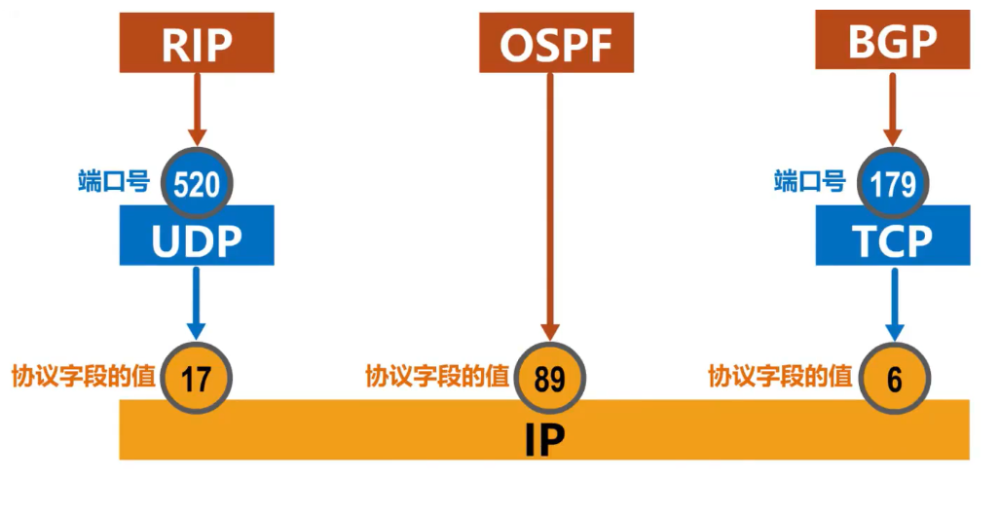

**网络层解决分组在多个网络上传输（路由）的问题**

# 4.1 网络层概述

网络层的主要任务是**实现网络互连**，进而**实现数据包在各网络之间的传输**

要实现网络层任务，需要解决以下主要问题：

- 网络层向运输层提供怎样的服务（“可靠传输”还是“不可靠传输”）

- 网络层寻址问题

- 路由选择问题

- 数据包封装和解封装

- 拥塞控制

路由器收到数据后，是依据什么来决定将数据包从自己的哪个接口转发出去？

**依据数据包的目的地址和路由器中的路由表**

**路由选择协议**：由路由器执行路由选择协议中所规定的路由选择算法，而自动得出路由表中的路由记录，这种方法更适合规模较大且网络拓扑经常改变的大型互联网

**网络层（网际层）**除了 **IP协议**外，还有之前介绍过的**地址解析协议ARP**，还有**网际控制报文协议ICMP**，**网际组管理协议IGMP**

由于TCP/IP协议栈的网络层使用网际协议IP 因此TCP/IP协议栈中网络层常称为网际层

在计算机网络领域，网络层应该向运输层提供怎样的服务（“**面向连接**”还是“**无连接**”）曾引起了长期的争论。

# 4.2 网络层提供服务

### **面向连接的虚电路服务**

**一种观点：让网络负责可靠交付**

- 这种观点认为，应借助于电信网的成功经验，让网络负责可靠交付，计算机网络应模仿电信网络，使用**面向连接**的通信方式。

- 通信之前先建立**虚电路** (Virtual Circuit)，以保证双方通信所需的一切网络资源。

- 如果再使用可靠传输的网络协议，就可使所发送的分组无差错按序到达终点，不丢失、不重复。

**发送方** 发送给 **接收方** 的所有分组都沿着同一条虚电路传送

- 虚电路表示这只是一条逻辑上的连接，分组都沿着这条逻辑连接按照存储转发方式传送，而并不是真正建立了一条物理连接。

- 请注意，电路交换的电话通信是先建立了一条真正的连接。

- 因此分组交换的虚连接和电路交换的连接只是类似，但并不完全一样

### 无连接的数据报服务

**另一种观点：网络提供数据报服务**

- 互联网的先驱者提出了一种崭新的网络设计思路。

- 网络层向上只提供简单灵活的、**无连接的**、**尽最大努力交付**的**数据报服务**。

- 网络在发送分组时不需要先建立连接。每一个分组（即 IP 数据报）独立发送，与其前后的分组无关（不进行编号）。

- **网络层不提供服务质量的承诺**。即所传送的分组可能出错、丢失、重复和失序（不按序到达终点），当然也不保证分组传送的时限。

**发送方** 发送给 **接收方** 的分组可能沿着不同路径传送

> **尽最大努力交付**

- 如果主机（即端系统）中的进程之间的通信需要是可靠的，那么就由网络的**主机中的运输层负责可靠交付（包括差错处理、流量控制等）** 。

- **采用这种设计思路的好处是**：网络的造价大大降低，运行方式灵活，能够适应多种应用。

|**对比的方面**|**虚电路服务**|**数据报服务**|
|-|-|-|
|**思路**|**可靠通信应当由网络来保证**|**可靠通信应当由用户主机来保证**|
|**连接的建立**|**必须有**|**不需要**|
|**终点地址**|**仅在连接建立阶段使用，每个分组使用短的虚电路号**|**每个分组都有终点的完整地址**|
|**分组的转发**|**属于同一条虚电路的分组均按照同一路由进行转发**|**每个分组独立选择路由进行转发**|
|**当结点出故障时**|**所有通过出故障的结点的虚电路均不能工作**|**出故障的结点可能会丢失分组，一些路由可能会发生变化**|
|**分组的顺序**|**总是按发送顺序到达终点**|**到达终点时不一定按发送顺序**|
|**端到端的差错处理和流量控制**|**可以由网络负责，也可以由用户主机负责**|**由用户主机负责**|

# 4.3 IPv4

**IPv4地址**就是给因特网(Internet)上的每一台主机(或路由器)的每一个接口分配一个在全世界范围内是唯一的32比特的标识符。

**IPv4地址表示**

点分十进制表示方法   将32比特每八位分为一组用十进制数表示

例如：10.240.15.170

## 1.分类编址

IP地址分类指将IP地址划分为若干个固定类，每一类地址都由两个固定长度的字段组成：

第一个字段是网络号（net-id），标志主机（或路由器）所链接的网络。网络号在整个互联网范围必须是唯一的。
第二个字段是主机号（host-id），标志该主机（或路由器）。一个主机号在它前面的网络号所指明的网络范围内必须是唯一的。

### A类地址

网络号8位（最高位固定为0），主机号24位

- 最小网络号0，保留不指派

- 第一个可指派的网络号为1，网络地址为1.0.0.0

- 最大网络号127，作为本地环回测试地址，不指派最小的本地环回测试地址为127.0.0.1

- 最大的本地环回测试地址为127.255.255.254

- 最后一个可指派的网络号为126，网络地址为126.0.0.0

- 每个网络中最大主机数16777214

### B类地址

网络号16位（最高位固定为10），主机号16位

- 最小网络号也是第一个可指派的网络号128.0

- 网络地址为128.0.0.0

- 最大网络号也是最后一个可指派的网络号191.255网络地址为191.255.0.0

- 每个网络中最大主机数65534

### C类地址

网络号24位（最高位固定为110），主机号8位

- 最小网络号也是第一个可指派的网络号192.0.0网络地址为192.0.0.0

- 最大网络号也是最后一个可指派的网络号223.255.255网络地址为223.255.255.0

- 每个网络中最大主机数254

### D类地址

多播地址（最高位固定为1110）

### E类地址

保留地址（最高位固定为1111）

### 特殊IP地址（一般不使用）

**IP 地址的一些重要特点**

(1) **IP 地址是一种分等级的地址结构**。分两个等级的好处是：

- **第一**，IP 地址管理机构在分配 IP 地址时只分配网络号，而剩下的主机号则由得到该网络号的单位自行分配。这样就方便了 IP 地址的管理。

- **第二**，路由器仅根据目的主机所连接的网络号来转发分组（而不考虑目的主机号），这样就可以使路由表中的项目数大幅度减少，从而减小了路由表所占的存储空间。

(2) **实际上 IP 地址是标志一个主机（或路由器）和一条链路的接口**。

- 当一个主机同时连接到两个网络上时，该主机就必须同时具有两个相应的 IP 地址，其网络号 net-id 必须是不同的。这种主机称为**多归属主机** (multihomed host)。

- 由于一个路由器至少应当连接到两个网络（这样它才能将 IP 数据报从一个网络转发到另一个网络），因此**一个路由器至少应当有两个不同的 IP 地址**。

(3) **用转发器或网桥连接起来的若干个局域网仍为一个网络**，因此这些局域网都具有同样的网络号 net-id。

(4) **所有分配到网络号 net-id 的网络，无论是范围很小的局域网，还是可能覆盖很大地理范围的广域网，都是平等的。**

## 2.划分子网

- IP 地址空间的利用率有时很低。

- 给每一个物理网络分配一个网络号会使路由表变得太大因而使网络性能变坏。

- 两级的 IP 地址不够灵活。

所以就有了划分子网的工具：**子网掩码**

- 从 1985 年起在 IP 地址中又增加了一个“**子网号字段**”，使两级的 IP 地址变成为**三级的 IP 地址**。

- 这种做法叫做**划分子网** (subnetting) 。

- 划分子网已成为互联网的正式标准协议。

### 如何划分

基本思路

- 划分子网纯属一个**单位内部的事情**。单位对外仍然表现为没有划分子网的网络。

- 从主机号**借用**若干个位作为**子网号** subnet-id，而主机号 host-id 也就相应减少了若干个位。

- 凡是从其他网络发送给本单位某个主机的 IP 数据报，仍然是根据 IP 数据报的**目的网络号** net-id，先找到连接在本单位网络上的路由器。

- 然后**此路由器**在收到 IP 数据报后，再按**目的网络号** net-id 和**子网号** subnet-id 找到目的子网。

- 最后就将 IP 数据报直接交付目的主机。

划分为三个子网后对外仍是一个网络

- **优点**

    1. 减少了 IP 地址的浪费

    2. 使网络的组织更加灵活

    3. 更便于维护和管理

- **划分子网纯属一个单位内部的事情，对外部网络透明**，对外仍然表现为没有划分子网的一个网络。

### 子网掩码

32比特的子网掩码可以表明分类IP地址的**主机号部分被借用**了几个比特作为子网号

子网掩码使用连续的**比特1**来对应**网络号和子网号**

子网掩码使用连续的**比特0**来对应**主机号**

将划分子网的IPv4地址与其相应的子网掩码进行**逻辑与运算**就可得到IPv4地址所在子网的网络地址

**(IP 地址) AND (子网掩码) = 网络地址**

        网络号       主机号

C类网络地址：218.75.230      .0

子网掩码： 255.255.255   .10000000

”.1“   一个比特1表示从主机号中借用一个比特作为子网

**默认子网掩码**

未划分子网的情况下的子网掩码

|**A类地址**|8位网络号|24位主机号|
|-|-|-|
|默认子网掩码|11111111|00000000 00000000 00000000|
||255.|0.0.0|
|**B类地址**|16位网络号|16位主机号|
|默认子网掩码|11111111  11111111|00000000 00000000|
||255.255.|0.0|
|**C类地址**|24位网络号|8位主机号|
|默认子网掩码|11111111  11111111  11111111|00000000|
||255.255.255|.0|

- 子网掩码是一个网络或一个子网的重要属性。

- 路由器在和相邻路由器交换路由信息时，必须把自己所在网络（或子网）的子网掩码告诉相邻路由器。

- 路由器的路由表中的每一个项目，除了要给出目的网络地址外，还必须同时给出该网络的子网掩码。

- 若一个路由器连接在两个子网上，就拥有两个网络地址和两个子网掩码。

## 3.无分类编址

**无分类域间路由选择 CIDR** (Classless Inter-Domain Routing)。

CIDR消除了传统的A类，B类和C类地址，以及划分子网的概念

CIDR可以更加有效地分配IPv4地址空间

**CIDR 最主要的特点**

- CIDR使用各种长度的“**网络前缀**”(network-prefix)来代替分类地址中的网络号和子网号。

- **IP 地址从三级编址（使用子网掩码）又回到了两级编址**。

- CIDR使用**斜线记法**，或称CIDR记法。即在IPv4地址后面加上斜线“/”，在斜线后面写上网络前缀所占的比特数量。
例如：128.14.35.7/20
网络前缀占用的比特数量:20
主机编号占用的比特数量:32-20=12

## 4.IPv4的应用规划

#### 定长的子网掩码FLSM

- 使用同一个子网掩码来划分子网

- 子网划分方式不灵活:只能划分出 $2^{n}$个子网(n是从主机号部分借用的用来作为子网号的比特数量)

- 每个子网所分配的IP地址数量相同，容易造成IP地址浪费。

划分子网的IPv4就是定长的子网掩码

### 变长的子网掩码VLSM

- 使用不同的子网掩码来划分子网

- 子网划分方式灵活:可以按需分配

- 每个子网所分配的IP地址数量可以不同，尽可能减少对IP地址的浪费

无分类编址的IPv4就是变长的子网掩码

# 4.4  IP数据报

IP数据报的发送和转发过程包含以下两部分：

- 主机发送IP数据报

- 路由器转发IP数据报

**源主机判断目的主机是否在同一个网络中：**

可以通过**目的地址IP**和**源地址的子网掩码**进行**逻辑与运算**得到**目的网络地址**

- 如果**目的网络地址**和**源网络地址** **相同**，就是**在同一个网络**中，属于**直接交付**

- 如果**目的网络地址**和**源网络地址** **不相同**，就**不在同一个网络**中，属于**间接交付**，传输给主机所在网络的**默认网关**（路由器）,由默认网关帮忙转发

**默认网关：**用户为了让本网络中的主机能和其他网络中的主机进行通信，就必须给其指定本网络的一个路由器的接口，由该路由器帮忙进行转发

路由器收到IP数据报后如何转发？

- 检查IP数据报首部是否出错：

    - 若出错，则直接丢弃该IP数据报并通告源主机

    - 若没有出错，则进行转发

- 根据IP数据报的目的地址在路由表中查找匹配的条目：

    - 若找到匹配的条目，则转发给条目中指示的下一跳

    - 若找不到，则丢弃该数据报并通告源主机

假设IP数据报首部没有出错，路由器取出IP数据报首部各地址字段的值

- 接下来路由器对该IP数据报进行查表转发

    - 逐条检查路由条目，将目的地址与路由条目中的地址掩码进行逻辑与运算得到目的网络地址，然后与路由条目中的目的网络进行比较，如果相同，则这条路由条目就是匹配的路由条目，按照它的下一条指示转发该IP数据报

> 中继器和集线器工作在物理层，既不隔离冲突域也不隔离广播域

> 网桥和交换机（多端口网桥）工作在数据链路层，可以隔离冲突域，不能隔离广播域

> 路由器工作在网络层，既隔离冲突域又隔离广播域

# 4.5 静态路由配置

**静态路由配置**是指用户或网络管理员使用路由器的相关命令给路由器人工配置路由表这种人工配置方式简单、开销小。但不能及时适应网络状态(流量、拓扑等)的变化。- 

- 一般只在小规模网络中采用。

使用静态路由配置可能出现以下导致产生路由环路的错误

- 配置错误

- 聚合了不存在的网络

- 网络故障

**默认路由**

可以被所有网络匹配，但路由匹配有优先级，**默认路由是优先级最低的**

**特定主机路由**

在所有的路由记录中，特定主机路由的网络前缀最长，默认路由最短，**当有多条路由可选时，最长前缀路由优先。**

**黑洞路由**

黑洞路由的下一跳为null0，这是路由器内部的虚拟接口，IP数据报进入它后就被丢弃

- 如果聚合了不存在的网络而导致路由环路，可以将不存在的路由地址配置为黑洞路由

- 网络故障而导致路由环路，添加故障的网络为黑洞路由

# 4.6 路由选择协议

## 概述

- 路由器通过路由选择协议自动获取路由信息

- 比较复杂，开销较大，能较好地适应网络状态的变化

- 适用于大规模网络

### **主要特点**

1. **自适应**：动态路由选择，能够更好地适应网络状态的变化

2. **分布式**：路由器之间交换路由信息

3. **分层次**：将整个因特网划分为许多较小的**自治系统AS**（Autonomous System）

**因特网采用分层次的路由选择协议**

- **自治系统 AS**：在单一的技术管理下的一组路由器，而这些路由器使用一种 AS 内部的路由选择协议和共同的度量以确定分组在该 AS 内的路由，同时还使用一种 AS 之间的路由选择协议用以确定分组在 AS之间的路由。

- 自治系统之间的路由选择简称为**域间路由选择**

    自治系统内部的路由选择简称为**域内路由选择**

- 域间路由选择使用外部网关协议EGP这个类别的路由选择协议，域内路由选择使用内部网关协议IGP这个类别的路由选择协议 。**网关协议**可称为**路由协议**

### **路由选择协议的分类**

- 内部网关协议IGP

    - **基于距离向量**

        - 路由信息协议RIP（因特网上最早使用）

        - 内部网关路由协议IGRP（思科早期私有协议）

    - **结合距离向量和链路状态**

        - 增强型内部网关路由协议EIGRP---思科私有（用于取代IGRP的混合路由协议）

    - **基于链路状态**

        - 开放式最短路径优先OSPF（在各种网络广泛使用）

        - 中间系统到中间系统IS-IS  （集成化IS-IS是ISP主干网最常用的IGP协议）

- 外部网关协议EGP

    - 边界网关协议BGP

### 路由器的基本结构

路由器结构可划分为分组转发和路由选择两大部分：

1、**分组转发部分**

由三部分构成

- 交换结构

- 一组输入端口

    信号从某个输入端口进入路由器

    物理层将信号转换成比特流，送交数据链路层处理

    数据链路层从比特流中识别出帧，去掉帧头和帧尾后，送交网络层处理

    如果送交网络层的分组是**普通待转发的数据分组**，则根据分组首部中的目的地址进行**查表转发**

    若找不到匹配的转发条目，则丢弃该分组，否则，按照匹配条目中所指示的端口进行转发

- 一组输出端口

    网络层更新数据分组首部中某些字段的值，例如将数据分组的生存时间减1，然后送交数据链路层进行封装

    数据链路层将数据分组封装成帧，交给物理层处理

    物理层将帧看成比特流将其变换成相应的电信号进行发送

路由器的各端口还会有输入缓冲区和输出缓冲区

- 输入缓冲区用来暂存新进入路由器但还来不及处理的分组

- 输出缓冲区用来暂存已经处理完毕但还来不及发送的分组

2、**路由选择部分**

- **路由选择部分的核心构件是路由选择处理机**，它的任务是根据所使用的路由选择协议，周期性地与其他路由器 进行路由信息的交互，来更新路由表

    如果送交给输入端口的网络层的分组是路由器之间交换路由信息的**路由报文**，则把这种分组**送交给路由选择处理机**

    路由选择处理机根据分组的内容来更新自己的**路由表**

    路由选择处理机还会周期性地给其他路由器发送自己所知道的路由信息

**路由表一般仅包含从目的网络到下一跳的映射**

路由表需要对网络拓扑变化计算最优化

## 路由信息协议RIP

**路由信息协议RIP**(Routing Information Protocol)是内部网关协议IGP中最先得到广泛使用的协议之一，其相关标准文档为RFC 1058。

RIP要求自治系统AS内的每一个路由器都要维护从它自己到AS内其他每一个网络的距离记录。这是一组距离，称为“**距离向量D-V**(Distance-Vector)”

RIP使用**跳数**(Hop Count)作为度量(Metric)来衡量到达目的网络的距离

路由器到直连网络的距离定义为1。

路由器到非直连网络的距离定义为所经过的路由器数加1

允许一条路径最多只能包含15个路由器。“**距离”等于16时相当于不可达**。因此，**RIP只适用于小型互联网。**

**RIP认为好的路由就是距离短的路由**，也就是通过路由器数量最少的路由

### **RIP三个要点**

- 和谁交换信息：仅和相邻路由器交换信息

- 交换什么信息：自己的路由表

- 何时交换信息：周期性交换（例如30s）

### **RIP基本工作过程**

- 路由器刚开始工作时，只知道自己到直连网络的距离为1

- 每个路由器仅和相邻路由器周期性地交换并更新路由信息

- 若干次交换和更新后，每个路由器都知道到达本AS内各网络地最短距离和下一跳地址，称为**收敛**

### **RIP导致”坏消息传播得慢“的问题**

“坏消息传播得慢”又称为**路由环路**或**距离无穷计数问题**，这是距离向量算法的一个**固有问题**,可以采取多种措施减少出现该问题的概率或减小该问题带来的危害。

- **限制最大路径距离**为15(16表示不可达)

- 当路由表发生变化时就立即发送更新报文(即“**触发更新**”)，而不仅是周期性发送

- 让路由器记录收到某特定路由信息的接口，而不让同一路由信息再通过此接口向反方向传送(即“**水平分割**”)

### **RIP 协议的优缺点**

    优点：

    1. 实现简单，开销较小。

    缺点：

    1. RIP 限制了网络的规模，它能使用的最大距离为 15（16 表示不可达）。

    2. 路由器之间交换的路由信息是路由器中的完整路由表，因而随着网络规模的扩大，开销也就增加。

    3. “坏消息传播得慢”，使更新过程的收敛时间过长。

## 开放最短路径优先OSPF

**开放最短路径优先 OSPF (Open Shortest Path First)**

- **注意**：OSPF 只是一个协议的名字，它并不表示其他的路由选择协议不是“最短路径优先”

- **开放**表明OSPF协议不是受某一家厂商控制，而是公开发表的。

- **最短路径优先**是因为使用了Dijkstra提出的最短路径算法SPF

OSPF是基于链路状态的，而不像RIP那样是基于距离向量的

OSPF采用SPF算法计算路由，从算法上保证了不会产生路由环路

OSPF不限制网络规模，更新效率高，收敛速度快

链路状态是指本路由器都和哪些路由器相邻，以及相应链路的“代价”(cost)
“代价”用来表示费用、距离、时延、带宽，等等。这些都由网络管理人员来决定。

### **问候分组（Hello）**

OSPF相邻路由器之间通过交互问候(Helo)分组，建立和维护邻居关系，

Hello分组封装在IP数据报中，发往组播地址224.0.0.5;

|源IP 
路由器接口IP|目的IP
224.0.0.5|协议号
89|OSPF
首部|OSPF分组载荷|
|-|-|-|-|-|

发送周期为10秒

40秒未收到来自邻居路由器的Helo分组，则认为该邻居路由器不可达。

IP数据报首部中**协议号字段**的取值应为**89**，来表明IP数据报的数据载荷为**OSPF分组**

### **链路状态通告LSA**

使用OSPF的每个路由器都会产生**链路状态通告LSA**(Link State Adverisement)。LSA中包含以下内容：

- 直连网络的链路状态信息

- 邻居路由器的链路状态信息

LSA被封装在**链路状态更新分组LSU**中，采用**洪泛法发送**。

### **链路状态数据库同步**

使用OSPF的每个路由器都有一个**链路状态数据库LSDB**,用于存储LSA

通过各路由器泛洪发送封装有自己的LSA的LSU分组，各路由器的LSDB最终达到一致

### 最短路径

使用OSPF的各路由器基于LSDB进行**最短路径优先SPF**计算，构建出各自到达其他各路由器的最短路径，即构建各自的路由表。

### **OSPF五种分组类型**

1. 类型1，**问候(Hello)分组**用来发现和维护邻居路由器的可达性。

2. 类型2，**数据库描述**(Database Description)分组向邻居路由器给出自己的链路状态数据库中的所有链路状态项目的摘要信息

3. 类型3，**链路状态请求**(Link State Request)分组向邻居路由器请求发送某些链路状态项目的详细信息。

4. 类型4，**链路状态更新**(Link State Update)分组路由器使用这种分组将其链路状态进行洪泛发送，即用洪泛法对全网更新链路状态。类型5，链路状态确认(LinkState Acknowledgment)分组这是对链路状态更新分组的确认分组。

### **邻居关系建立**

OSPF在多点接入网络中路由器邻居关系的建立，如果不采用其他机制，将会产生大量的多播分组

- 选举指定路由器DR(designated router)和备用的指定路由器BDR(backup designated router)

- 所有的非DR/BDR只与DR/BDR建立邻居关系

- 非DR/BDR之间通过DR/BDR交换信息

若DR出现问题，则由BDR顶替DR

### **区域（Area）**

**为了使OSPF能够用于规模很大的网络，OSPF把一个自治系统再划分为若干个更小的范围，叫做区域（Area）**

- 在该自治系统内，所有路由器都使用OSPF协议，OSPF将该自治系统再划分成多个更小的区域

- 每个区域都有一个32比特的区域标识符

- 主干区域的区域标识符必须为0，主干区域用于连通其他区域

- 其他区域的区域标识符不能为0且不相同

- 每个区域一般不应包含路由器超过200个

- 划分区域的好处就是，利用**洪泛法交换链路状态信息局限于每一个区域**而不是自治系统，这样减少整个网络上的通信量

## 边界网关协议BGP

**BGP**（Border Gateway Protocol） 是**不同自治系统的路由器之间**交换路由信息的协议

在不同自治系统内度量路由的代价可能不同，因此，对于自治系统之间的路由选择，使用代价作为度量来寻找最佳路由是不行的

- 自治系统之间的路由选择必须考虑相关策略(政治，经济，安全等)

- BGP只能是**力求寻找一条能够到达目的网络且比较好的路由**(不能兜圈子)，
而并非要寻找一条最佳路由

在配置BGP时，每个自治系统的管理员要选择至少一个路由器作为该自治系统的**BGP发言人**

不同自治系统的BGP发言人要交换路由信息，**首先必须建立TCP连接**，端口号为179

- 在此TCP连接上交换BGP报文以**建立BGP会话**

- 利用BGP会话**交换路由信息**(例如，增加新的路由，或撤销过时的路由，以及报告出错的情况等)

- 使用TCP连接交换路由信息的两个BGP发言人，彼此称为对方的**邻站(neighbor)**或**对等站(peer)**

- BGP发言人除了运行BGP外，还必须运行自己所在自治系统所使用的内部网关协议IGP，例如OSPF或RIP

BGP发言人**交换网络可达性的信息**(要到达某个网络所要经过的一系列自治系统)

当BGP发言人互相交换了网络可达性的信息后，各BGP发言人就根据所采用的策略从收到的路由信息中**找出到达各自治系统的较好的路由**。也就是构造出树形结构、**不存在回路的自治系统连通图**

### BGP-4四种报文

- **OPEN(打开)报文**:用来与相邻的另一个BGP发言人建立关系，使通信初始化。

- **UPDATE(更新)报文**:用来通告某一路由的信息，以及列出要撤销的多条路由。

- **KEEPALIVE(保活)报文**:用来周期性地证实邻站的连通性。

- **NOTIFICATION(通知)报文**:用来发送检测到的差错。

### 直接封装RIP、OSPF和BGP报文的协议

# 4.7 IPv4数据报的首部格式

## 各字段的作用

- 一个 IP 数据报由**首部**和**数据**两部分组成。

- **首部的前一部分是固定长度，共 20 字节，是所有 IP 数据报必须具有的。**

- 在首部的固定部分的后面是一些可选字段，其长度是可变的。

每一行都由32个比特（也就是4个字节）构成，每个小格子称为字段或者域，每个字段或某些字段的组合用来表达IP协议的相关功能

### 版本

占4比特，表示IP协议的版本

通信双方使用的IP协议的版本必须一致。目前广泛使用的IP协议版本号为4(即IPv4)。

### 首部长度

占4比特，表示IP数据报首部的长度。该字段的取值以4字节为单位。

- 最小十进制取值为5，表示IP数据报首部只有20字节固定部分;一个单位为4字节比如这4*5=20字节

- 最大十进制取值为15，表示IP数据报首部包含20字节固定部分和最大40字节可变部分。

### 可选字段

长度从1个字节到40个字节不等。用来支持排错、测量及安全等措施。可选字段增加了IP数据报的功能，但这同时也使得IP数据报的首部长度成为可变的。这就增加了每一个路由器处理IP数据报的开销。实际上可选字段很少被使用。

### 填充字段

确保首部长度为4字节的整数倍。**使用全0进行填充。**

**IP数据报的首部长度一定是4字节的整数倍**

### 区分服务

**占8比特，**用于获得更好的服务

利用该字段能够提供不同等级的服务质量  一般不适用

### 总长度

占16比特，表示IP数据报的总长度(首部+数据载荷)

最大取值为十进制的**65535**，以字节为单位。

首部长度=$(0101)_{2}$ x4=5x4=20(字节)

总长度=$(0000001111111100)_{2}$=1020(字节)

数据载荷长度=总长度-首部长度=1020-20=1000(字节)

### 标识  标志  片偏移

共同用于IP数据报的分片（当IPv4数据报长度超过MTU，无法封装，则进行分片）

- **标识**

    - 占16比特，属于同一个数据报的各分片数据报应该具有相同的标识。

    - IP软件维持一个计数器，每产生一个数据报，计数器值加1，并将此值赋给标识字段。

- **标志**
占3比特，各比特含义如下:

    - **DF位**:    1表示**不允许分片**    ;   0表示**允许分片**

    - **MF位**:   1表示“**后面还有分片**”;     0表示“这是**最后一个分片**”

    - **保留位**: **必须为0**

- **片偏移**

    - 占13比特，指出分片数据报的数据载荷部分偏移其在原数据报的位置有多少个单位。

    - 片偏移以8个字节为单位。

### 生存时间

占8比特   防止IP数据报在网络中兜圈

现在以跳数为单位，路由器转发IP数据报时，将IP数据报首部中的该字段的值减1，若不为0就转发，否则丢弃

### 协议

占8比特，指明IPv4数据报的数据部分是何种协议数据单元。
常用的一些协议和相应的协议字段值如下：

|协议名称|ICMP|IGMP|TCP|UDP|IPv6|OSPF|
|-|-|-|-|-|-|-|
|协议字段值|1|2|6|17|41|89|

### 首部检验和

占16比特，用来检测首部在传输过程中是否出现差错。比CRC检验码简单，称为**因特网检验和**。IP数据报每经过一个路由器，路由器都要重新计算首部检验和，因为某些字段(生存时间、标志片偏移等)的取值可能发生变化。
由于IP层本身并不提供可靠传输的服务，并且计算首部校验和是一项耗时的操作，因此在IPv6中路由器不再计算首部校验和，从而更快转发IP数据报。

### 源IP地址和目的IP地址

各占32比特，用来填写发送该IP数据报的源主机IP地址和接收的目的主机IP地址

# 4.8 网际控制报文协议ICMP

ICMP的主要功能包括：

- 确认IP包是否成功送达目标地址

- 通知在发送过程当中IP包被废弃的具体原因

- 改善网络设置等

为了更有效地转发IP数据报和提高交付成功的机会，在网际层使用了**网际控制报文协议ICMP**(Internet Control Message Protocol)。

主机或路由器使用ICMP来发送**差错报告报文**和**询问报文**

ICMP报文被**封装在IP数据报中**发送。

**ICMP差错报告报文共有以下五种**

终点不可达，源点抑制，时间超过，参数问题，改变路由（重定向）

**常用的ICMP询问报文有以下两种:**
回送请求和回答
ICMP回送请求报文是由主机或路由器向一个特定的目的主机发出的询问。收到此报文的主机必须给源主机或路由器发送ICMP回送回答报文。这种询问报文用来**测试目的站是否可达**及了解其有关状态
时间戳请求和回答
ICMP时间戳请求报文是请某个主机或路由器回答当前的日期和时间。在ICMP时间戳回答报文中有一个32位的字段

其中写入的整数代表从1900年1月1日起到当前时刻一共有多少秒。
这种询问报文用来**进行时钟同步和测量时间**

**ICMP 不是高层协议（看起来好像是高层协议，因为 ICMP 报文是装在 IP 数据报中，作为其中的数据部分），而是 IP 层的协议**

### ICMP报文类型

1. **终点不可达报文 :** 路由器 / 主机 不能交付数据报时 , 就会向源点 发送 终点不可达报文 ;

2.  **源点抑制报文 :** 路由器 / 主机 拥塞 , 丢弃 IP 数据报 , 向源点发送源点抑制报文 , 让源点降低发送速率 ;

3.  **时间超过报文 :**

    - 生存周期为0 : 路由器 生存周期 TTL = 0时 , 丢弃该报文 , 同时向源点发送 时间超过报文 ;

    - 分组丢失 : 终点 在预定时间内 没有收到 数据报的全部数据分组时 , 就会将已收到的数据分组全部丢弃 , 向源点发送时间超过报文 ;

1.  **参数问题报文 :** 路由器 / 主机 收到的 数据报 首部 字段由错误值 , 丢弃该数据报 , 向源点发送 参数问题报文 ;

2. **改变路由报文 :** 路由器 将 改变路由报文 发送给主机 , 让主机下次将数据报发送给另外的路由器 ，又称为 “重定向报文”

### ICMP 报文形成

① 取出 IP 数据报内容 : 取出 IP 数据报 首部 , 以及 数据部分的 前 8字节 ;

② ICMP 差错报文 组成 : ICMP 前 8个字节 + IP 数据报 首部 + IP 数据报数据部分前 8 字节 ;

③ 组装 IP 数据报 : 将 ICMP 数据报 装入 IP 数据报 数据部分 ;

### ICMP报文不发送情形

- 对ICMP差错报告报文不再发送ICMP差错报告报文

- 对第一个分片的数据报片的所有后续数据报片都不发送ICMP差错报告报文

- 对具有多播地址的数据报都不发送ICMP差错报告报文

- 对具有特殊地址(如127.0.0.0或0.0.0.0)的数据报不发送ICMP差错报告报文

### **ICMP 应用**

**① PING :** 测试连通性 , 使用 ICMP 回送请求 和 回答报文

- 应用层直接使用网际层的ICMP，不适用运输层的TCP或者UDP

**② Tracert :** 追踪 分组 从原点 到 终点 路径 ,仅使用 ICMP 时间超过差错报告报文

- 在运输层使用UDP协议

# 4.9 虚拟专用网VPN

## 虚拟专用网VPN

利用公用的因特网作为本机构各专用网之间的通信载体，这样的专用网又称为**虚拟专用网（Virtual Private Network）**。由于IPv4地址的紧缺，一个机构能够申请到的IPv4地址数量往往小于本机构所拥有的主机数量。因此虚拟专用网中的各个主机所分配到的地址应该是本机构可自由分配的专用地址，而不是需要申请的、在因特网上使用的公有地址。

**专用（私有）地址**

10.0.0.0~10.255.255.255(10/8地址块)

172.16.0.0~172.31.255.255（176.16/12地址块）

192.168.0.0~192.168.255.255（192.168/16地址块）

私有地址只能用于一个机构的内部通信，而不能用于和因特网上的主机通信

私有地址只能用作本地地址而不能用作全球地址

因特网中所有**路由器对目的地址是私有地址的IP数据报一律不进行转发**

### **本地地址与全球地址**

- **本地地址**——仅在机构内部使用的 IP 地址，可以由本机构自行分配，而不需要向互联网的管理机构申请。

- **全球地址**——全球唯一的 IP 地址，必须向互联网的管理机构申请。

- **问题**：在内部使用的本地地址就有可能和互联网中某个 IP 地址重合，这样就会出现地址的二义性问题。

### **IP隧道技术**

两个专用网内的主机间发送的数据报是通过了公用的因特网，但在效果上就好像是在本机构的专用网上传送一样

数据报在因特网中可能要经过多个网络和路由器，但从逻辑上看，R1和R2之间好像是一条直通的点对点链路

### 虚拟专用网分类

- **内联虚拟专用网**

    同一个机构内的不同部门的内部网络所构成的虚拟专用网络VPN称为。

- **外联虚拟专用网**

    有时一个机构的VPN需要某些外部机构参加进来。

- **远程接入虚拟专用网**

    而在外地工作的员工需要访问公司内部的专用网络时，只要在任何地点接入因特网，运行驻留在员工PC中的VPN软件，在员工的PC和主机之间建立VPN隧道，即可访问专用网络中的资源。

## 网络地址转换NAT

 IPv4地址的紧缺仍然没有被缓解，因此提出了一种网络地址转化NAT方法来缓解IPv4地址即将耗尽的问题。NAT能使大量**使用内部专用地址的专用网络用户共享少量外部全球访问地址**。

### **NAT路由器**

安装了NAT软件的路由器称为**NAT路由器**

- 当主机要和因特网上的服务器通信时，发送IP数据报到达路由器后，会修改源地址从专用地址成NAT路由器中的全球IP地址，并且记录对应关系，再转发到因特网上。

- 而当服务器发送报文给该主机时，根据目的地址中的全球IP地址，查阅路由器中的对应关系，找到主机的专用IP地址，进行转发。

### 网络地址与端口转换NAPT

但NAT存在一个问题，如果NAT路由器具有n个全球IP地址，那么至多只能维持n个内网主机能够同时和因特网上的主机通信。而绝大多数的网络应用都是使用运输层协议TCP和UDP来传送数据，因此可以利用运输层的端口号和IP地址一起进行转换，这样，用一个全球IP地址就可以使多个拥有本地地址的主机同时和因特网上的主机通信，这种技术叫做网络地址与端口转换NAPT。

# 4.10 IPv6

**IPv6 :** 从根本上解决了上述问题 , **使用了 128 位 地址** , 改进了首部格式 , 可以快速处理/转发 IP 数据报 , 支持 Qos 

## IPv6数据报格式

IPv6 数据报分为两部分 ：

**基本首部 :** 40字节 ;
**有效载荷 :** 由 选项 ( 若干扩展首部 ) 和 数据部分 组成 ; 有效载荷 最长不超过 65535 字节

- **版本** : IP 协议的版本号 就是 6 ;  [0 , 4] 位 ;

- **优先级** : 数据报 类别 , 优先级 ;

- **流标签** : 流 指的是 从源点到终点的数据报 , 同一个流的数据报都有相同的流标签

- **有效载荷长度** : 占 2字节 , 取值范围[0 , 65535 ] ;

- **下一个首部** : 标识下一个扩展首部 ; 每个扩展首部都有下一个首部标识 , 基本首部中标识了扩展首部 1, 扩展首部 1 中标识了扩展首部 2 ;

- **跳数限制** : 相当于 TTL 生存时间 , 经过指定路由器条数后 , 丢弃数据报 ;

- **源地址 / 目的地址** : 128位用于标识源地址和目的地址

## IPv6 和 IPv4 对比 

① 地址空间 : 从 4 (32 位 ) 字节 扩展到了 16字节 (128 位 ) ;

② 校验和 : IPv6 中移除了校验和字段 , 每一跳的路由器中不再校验数据 , 减少了每一跳的时间 ;

③ 首部精简 : IPv6 将可选字段移出首部字段 , 放在有效载荷的扩展首部中 , 路由器不对扩展首部进行检查 , 提高了处理效率 ;

④ 即插即用 : **IPv6 设备只要接入网络就直接分配 IP 地址** , 不需要 DHCP 协议 ;

⑤ 数据分片 : **IPv6 只能在源主机处进行数据分片** , 不能在路由器分片 , IPv4 可以在主机和路由器进行分片 

⑥ IPv6 首部长度 : **IPv6 首部长度 必须是 8字节整数倍** ; IPv4 首部是 4 字节整数倍

## IPv6 地址表示

IPv6 地址表示 :

① **冒号十六进制记法** : 2B2B : 0000 : 0000 : 0000 : 002B : 2B2B :2B2B : 2B2B    ,使用 7个冒号 , 将 8个 short 短整型数字 使用 十六进制数表示出来 ;

② 压缩形式 : 如果每个 short 短整型数字 前面若干位为 0 , 可以省略 , 如果四位全是 0, 那么可以使用 一个 0代替 ;

上述 IPv6 地址 使用压缩形式 可以表示成2B2B : 0: 0 : 0 : 2B : 2B2B :2B2B : 2B2B ;

③ **零压缩** : 连续的 0使用一对冒号表示 , 但是一个 IPv6 地址中只能使用一次 ;

零压缩表示上述 IPv6 地址  2B2B : : 2B : 2B2B :2B2B : 2B2B

## IPv4 向 IPv6 过渡策略 

① **双栈协议** : 同一台设备上 同时启用 IPv4 和 IPv6 协议栈 , 该设备既能使用 IPv4 通信 , 又能与 IPv6 网络进行通信 ;

- 路由器 : 不同的接口 分别 配置 IPv4 地址 和 IPv6 地址 ;

- 计算机 : 计算机同时拥有 IPv4 地址 和 IPv6 地址 , 可同时处理两种协议 ;

② **隧道技术** : 隧道技术 是 使用 互联网 基础设施 , 在网络之间传递数据的方式 ; 使用 隧道 传递不同协议的数据 , 将其它协议的数据重新封装然后通过隧道传输

