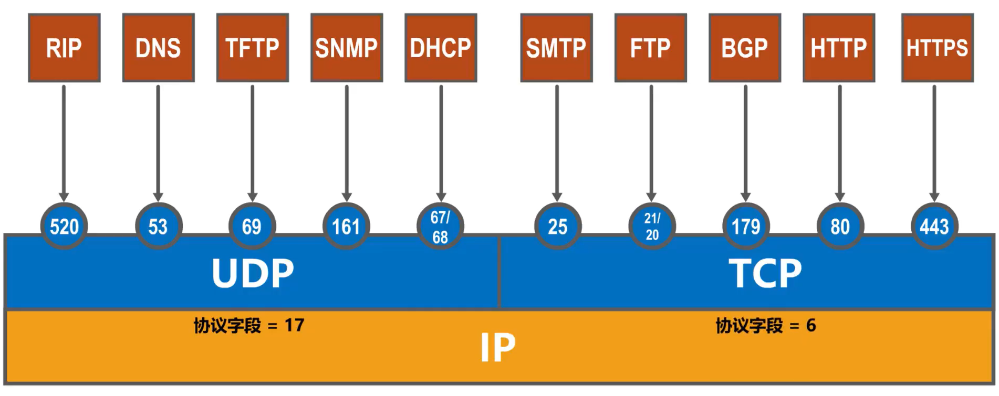
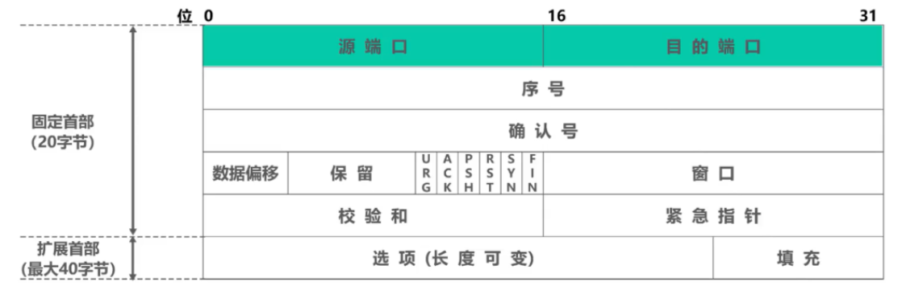
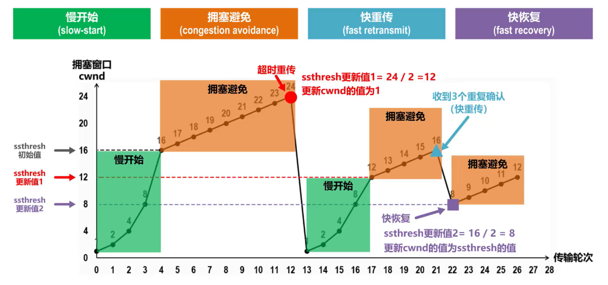

**运输层解决进程之间基于网络的通信问题**

# 5.1 概述

**进程之间的通信**

- 从通信和信息处理的角度看，运输层向它上面的应用层提供通信服务，**它属于面向通信部分的最高层，同时也是用户功能中的最低层**。

- 当网络的边缘部分中的两个主机使用网络的核心部分的功能进行端到端的通信时，**只有位于网络边缘部分的主机的协议栈才有运输层**，而网络核心部分中的路由器在转发分组时都只用到三层（到网络层）的功能。

    **设备层级 :**

    ① 传输层 : 主机才有传输层 ;

    ② 网络层 : 网络层设备 , 如 : 路由器 , 最高只到 网络层 ;

    ③ 数据链路层 : 数据链路层设备 , 如 : 网桥 、交换机 , 最高只到 数据链路层 ;

    ④ 物理层 : 物理层设备 , 如 : 中继器 、集线器 , 最高只到 物理层

- 物理层，数据链路层，网络层实现了主机到主机的通信

- 实际上在计算机网络中进行通信的**真正实体**是位于**通信主机中的进程**

    如何为运行在不同主机上的应用进程提供直接的通信服务是运输层的任务 运输层协议又称为**端到端协议**

**进程之通信流程**

运输层直接为应用进程间的逻辑通信提供服务

“逻辑通信”是指运输层之间的通信好像是沿水平方向传送数据，但事实上，这两条数据并没有一条水平方向的物理连接，要传送的数据是沿着向下各层依次传送的

在运输层使用不同的端口，来对应不同的应用进程

然后通过网络层及其下层来传输应用层报文接收方的运输层通过不同的端口，将收到的应用层报文，交付给应用层中相应的应用进

# 5.2 端口号、复用和分用

运行在计算机上的进程使用**进程标识符PID**来标志。

为了使运行不同操作系统的计算机的应用进程之间能够进行网络通信，就必须**使用统一的方法对TCP/IP体系的应用进程进行标识**

TCP/IP体系的运输层使用 **端口号** 来区分应用层的不同应用进程。

## 端口号

端口号使用**16比特表示**，取值范围**0~65535**

- **熟知端口号:0~1023**，IANA把这些端口号指派给了TCP/IP体系中最重要的一些应用协议，例如:FTP使用21/20，HTTP使用80，DNS使用53。

- **登记端口号**:**1024~49151**，为没有熟知端口号的应用程序使用。使用这类端口号必须在IANA按照规定的手续登记，以防止重复。例如:Microsoft RDP微软远程桌面使用的端口是3389。

- **短暂端口号**:**49152~65535**，留给客户进程选择暂时使用。当服务器进程收到客户进程的报文时，就知道了客户进程所使用的动态端口号。通信结束后，这个端口号可供其他客户进程以后使用。
**端口号只具有本地意义**，即端口号只是为了**标识本计算机应用层中的各进程**，在因特网中不同计算机中的相同端口号是没有联系的。

## 复用与分用

**发送方复用**

**多个进程（这里一个端口表示一个进程）** 利用一个运输层协议（或者称为运输层接口）**发送**数据称为 **复用**

**接收方分用**

**多个进程（这里一个端口表示一个进程）** 利用一个运输层协议（或者称为运输层接口）**接收**时叫做 **分用**

## 常用协议端口号

TCP/IP体系的应用层常用协议所使用的运输层熟知端口号

## 运输层传输流程

在浏览器输入域名，回车浏览

1. 用户PC中的DNS客户端进程会发送一个DNS查询请求报文

    - DNS查询请求报文需要使用运输层的UDP协议

    - 首部中的源端口字段的值，在短暂端口号49151~65535中挑选一个未被占用的，用来表示DNS客户端进程

    - 首部中的目的端口字段的值：53，是DNS服务器端进程所使用的熟知端口号

1. 之后，将UDP用户数据报封装在IP数据报中，通过以太网发送给DNS服务器

2. DNS服务器收到该IP数据报后，从中解封出UDP用户数据报

    - UDP首部中的目的端口号为53，这表明应将该UDP用户数据报的数据载荷部分，也就是DNS查询请求报文，交付给本服务器中的DNS服务器端进程

1. DNS服务器端进程解析DNS查询请求报文的内容，然后按其要求查找对应的IP地址

2. 之后，会给用户PC发送DNS响应报文，DNS响应报文需要使用运输层的UDP协议封装成UDP用户数据报

    - 其首部中的源端口字段的值设置为熟知端口号53，表明这是DNS服务器端进程所发送的UDP用户数据报，目的端口的值设置为49152，这是之前用户PC中发送DNS查询请求报文的DNS客户端进程所使用的短暂端口号

1. 将UDP用户数据报封装在IP数据报中，通过以太网发送给用户PC

2. 现在用户PC中的HTTP客户端进程可以向Web服务器发送HTTP请求报文（和DNS发送和接收流程差不多）

# 5.3 UDP和TCP对比

两个对等运输实体在通信时传送的数据单位叫作**运输协议数据单元** TPDU (Transport Protocol Data Unit)。

**套接字 :**

**① 作用 :** 网络中 发送方 和 接收方 使用套接字 组合 **识别 进程端点** ;

**② 对应关系 :** 套接字 唯一标识 网络中的主机 , 和 主机上运行的 一个进程 ;

**③ 套接字内容 :** 套接字 由 主机 IP 地址 , 与 端口号 组成

## **UDP 协议** 

**无连接 用户数据报协议(User Datagram Protocol)**

无连接 无确认 : 数据传输前 , 不建立连接 , 接收端收到 UDP 报文后 , 不需要给出确认 
特点 : 不可靠 , 无连接 , 延迟小 , 适用于少量数据传输 

- 当运输层采用无连接的 **UDP** 协议时，这种逻辑通信信道是一条**不可靠信道**

- UDP 传送的数据单位协议是 **UDP 报文**或**用户数据报**

- UDP的通信是无连接的，**不需要套接字**（Socket）

- UDP**可以发送广播，多播，单播**（一对一，一对多，以及一对全的通信）

- UDP是**面向应用报文**的

    - UDP对应用进程交下来的报文既不合并也不拆分，而是保留这些报文的边界

- UDP向上层提供**无连接不可靠传输**服务

    - 使用于IP电话、视频会议等**实时应用**

    - 不使用流量控制和拥塞控制

- UDP用户数据报**首部仅占8字节**

## TCP  协议

 **面向连接 传输控制协议(Transmission Control Protocol)**

面向连接 : 传输数据前 , 建立连接 , 数据传输后 , 释放连接 

**三报文握手建立连接     四报文挥手释放连接**

额外开销 : TCP 提供可靠的 , 面向连接的 传输服务 , 需要额外开销 , 如 : 收据接收确认 , 流量控制 , 计时器 , 连接管理 ;
协议特点 : 可靠 , 面向连接 , 时延大 , 适用于大数据量传输 ;

- 当运输层采用面向连接的 **TCP** 协议时，尽管下面的网络是不可靠的（只提供**尽最大努力服务**），但这种逻辑通信信道就相当于一条**全双工的可靠信道**。

- TCP 传送的数据单位协议是 **TCP 报文段**(segment)

- TCP是面向连接的，TCP之间的通信**必须要在两个套接字（Socket）之间**建立连接

- TCP**仅支持单播** （一对一的通信）

- TCP是**面向字节流**的

- TCP向上层提供**面向连接的可靠传输**服务

    - 适用于文件传输等**可靠传输应用**

    - 使用流量控制和拥塞控制

- TCP报文**首部最小20字节，最大60字节**

# 5.4 TCP协议

## 1.TCP报文段首部格式

**TCP 报文段组成**

由 **TCP 首部 和 TCP 数据部分** 组成

**TCP 首部格式** 

由 20字节固定首部 + 可变的选项 + 填充部分 组成 ; 其中 可变选项 + 填充部分 是 4字节整数倍 , 填充部分的意义就是为了让整个 TCP 首部大小是 4字节整数倍

1. **源端口 / 目的端口** 

    进程端口号 , 每个 2字节 , 取值范围 0~ 65535

    - **源端口**：占16比特，**标识发送该TCP报文段的应用进程**

    - **目的端口**：占16比特，**标识接收该TCP报文段的应用进程**

1. **序号、确认号、确认标志位**

    - **序号**

        **指出本TCP报文段数据载荷的第一个字节的序号**

        占32比特，取值范围[0，$2^{32} -1$]，序号增加到最后一个后，下一个序号就又回到0

    - **确认号**

        **指出期望收到对方下一个TCP报文段的数据载荷的第一个字节的序号，同时也是对之前收到的所有数据的确认。**
若确认号=n，则表明到序号n-1为止的所有数据都已正确接收，期望接收序号为n的数据。

        占32比特，取值范围[0，$2^{32} -1$]，确认号增加到最后一个后，下一个确认号就又回到0

    - **确认标志位ACK**

        **取值为1时确认号字段才有效**  ;  取值为0时确认号字段无效

        TCP规定，在连接建立后所有传送的TCP报文段都必须把ACK置1

1. **数据偏移**

    占4比特，并以4字节为单位

    用来指出TCP报文段的数据载荷部分的起始处距离TCP报文段的起始处有多远

    **实际上是指出了TCP报文段的首部长度**

    首部固定长度为20字节，因此数据偏移字段的最小值为$(0101)_{2}$

    首部最大长度为60字节，因此数据偏移字段的最大值为$(1111)_{2}$

1. **保留**

    占6比特，保留为今后使用，目前置为0

1. **窗口**

    占16比特，以字节为单位。

    **指出发送本报文段的一方的接收窗口**
窗口值作为接收方让发送方设置其发送窗口的依据

    **以接收方的接收能力来控制发送方的发送能力**，称为流量控制

    发送本报文段一方的 接收窗口 ( 发送方 ) , 即允许对方发送的数据量 ( 接收方 ) ;

1. **检验和**

    占16比特，检查范围包括TCP报文段的首部和数据载荷部分

    检验首部 + 数据，检验时 加上 12字节伪首部

1. **首部6位控制位**

    - **URG ( 紧急标志位)**

        URG = 1时 , 紧急指针字段有效

        **紧急指针**:占16比特，以字节为单位，**用来指明紧急数据的长度**

            当发送方有紧急数据时，可将紧急数据插队到发送缓存的最前面，并立刻封装到一个TCP报文段中进行发送。紧急指针会指出本报文段数据载荷部分包含了多长的紧急数据，紧急数据之后是普通数据。

    - **PSH ( 推送标志位)**

        PSH = 1时 , 接收方 要 **尽快交付接收应用进程** , 不用等到接收缓存满后再交付 

    - **RST ( 复位标志位)**

        RST = 1 时 , TCP 连接中出现错误 , 必须**释放当前连接 , 重新建立连接**

        RST = 1，还用来拒绝一个非法的报文段或拒绝打开一个TCP连接

    - **SYN ( 同步标志位 )** 

        SYN = 1时 , 表明该报文是一个连接请求 / 连接接收 报文，用来同步序号

    - **FIN ( 终止标志位 )**

        FIN = 1时 , 释放TCP连接

1. **填充**

    由于选项的长度可变，因此使用填充来确保报文段首部能被4整除(因为数据偏移字段，也就是首部长度字段，是以4字节为单位的)

## 2. TCP流量控制

### **TCP流量控制机制**

 ① **流量控制** : **控制 发送方 降低发送速率** , 避免 接收方 来不及接收 , 丢弃数据 , 导致重传 

 ② **滑动窗口机制** : TCP 通过 该 **滑动窗口机制 实现 流量控制** 

③ **滑动窗口调整** : 接收方 根据 接收缓存大小 , **动态调整** 发送方 发送窗口 大小 

④ **接收方窗口 rwnd** : 接收方 设置 确认报文段 中含有 窗口字段 , 将 rwnd 通知给发送方 

⑤ **发送窗口** : 发送方 发送窗口 **取 接收窗口 rwnd , 与 拥塞窗口 cwnd 中较小的值** 

### **持续计时器机制** 

 ① **开始计时** : TCP 连接中 , 有一个 持续计时器 , 发送方收到接收方的零窗口通知 , 即 rwnd = 0 , 启动该持续计时器 ;

② **零窗口探测报文** : 如果 持续计时器 到期， 发送方发送零窗口探测报文给接收方 , 接收方 收到上述报文 , 返回 当前窗口值 ;

③ **重新计时** : 如果 接收方的 接收窗口 rwnd 仍然为 0 , 发送方收到该 0 窗口值 , 重置 持续计时器 , 重新开始计时

## 3. TCP拥塞控制

### 网络拥塞

**TCP 拥塞控制** :

① 拥塞出现表现 : **资源需求总和大于可用资源** 

② 拥塞问题发展 : 网络中 资源 供应不足 -> 网络性能降低 -> **网络吞吐量随着负荷增加而降低**

③ **拥塞控制** : 防止数据大量注入到网络中 , **降低整体网络**中主机的发送速率

 流量控制 是 **降低一台主机**的发送速率 ;

④ 流量控制 与 拥塞控制 : **流量控制** 是 **点到点** 的问题 , **拥塞控制** 是 **全局性** 问题

**拥塞原因**

网络拥塞往往是由许多因素引起的。例如：

1. 点缓存的容量太小；

2. 链路的容量不足；

3. 处理机处理的速率太慢；

4. 拥塞本身会进一步加剧拥塞

**拥塞控制的一般原理**

- 拥塞控制的**前提**：**网络能够承受现有的网络负荷**。

- 实践证明，拥塞控制是很难设计的，因为它是一个**动态问题**。

- 分组的丢失是网络发生拥塞的**征兆**而不是原因。

- 在许多情况下，甚至正是**拥塞控制本身**成为引起网络性能恶化、甚至发生死锁的原因

**监测网络的拥塞**

主要指标有：

1. 由于缺少缓存空间而被丢弃的分组的百分数；

2. 平均队列长度；

3. 超时重传的分组数；

4. 平均分组时延；

5. 分组时延的标准差，等等。

上述这些指标的上升都标志着拥塞的增长。

### 拥塞控制算法

**TCP 拥塞控制相关术语** 

① **单向传输** : 拥塞控制假定单向传输数据 , 发送方 向 接收方 发送 数据 , 接收方 向 发送方 回送 确认信息 ;

② **发送窗口(swnd)** : 接收方 缓存空间 足够大 , 发送窗口大小 取决于 网络拥塞程度 ; **发送窗口大小 是 接收窗口 rwnd 和 拥塞窗口 cwnd 中的 较小的值 ;**

③ **接收窗口(rwnd)** : 接收方根据接收缓存设置接收窗口大小值 , 同时将该大小告知发送方 , 可以反映接 收方容量 ;

④ **拥塞窗口(cwnd)** : 发送方 估算 网络拥塞程度 , 设置合适的拥塞窗口值 , 反映当前 网络容量 ;

**传输轮次**

- 发送方给接收方发送数据报文段后，接收方给发送方发发回相应的确认报文段

- 一个传输轮次所经历的时间其实就是往返时间，往返时间并非是恒定的数值

- 使用传输轮次是为了强调把拥塞窗口所允许发送的报文段都连续发送出去，并受到了对已发送的最后一个报文段的确认

#### 慢开始（slow-start）

- **目的**：用来确定网络的负载能力或拥塞程度。

- 算法的思路：**由小到大逐渐增大拥塞窗口数值**。

- 两个变量：

    - **拥塞窗口（cwnd）**：初始拥塞窗口值：2 种设置方法。窗口值逐渐增大。

        - 1 至 2 个最大报文段 （旧标准）

        - 2 至 4 个最大报文段 （RFC 5681）

    - **慢开始门限（ssthresh）**：防止拥塞窗口增长过大引起网络拥塞

**每经过一个传输轮次，拥塞窗口就加倍**

窗口大小按**指数增加**，2的n-1次方

#### 拥塞避免(congestion avoidance)

- 思路：让拥塞窗口 cwnd **缓慢地增大**，避免出现拥塞。

- 每经过一个传输轮次，拥塞窗口 **cwnd = cwnd + 1**。

- **使拥塞窗口 cwnd 按线性规律缓慢增长**

- 在拥塞避免阶段，具有 “**加法增大**” (Additive Increase) 的特点。

重传计时器超时

判断网络很可能出现拥塞，则进行

- 将ssthresh值更新为发生拥塞时cwnd值的一半

- 将cwnd值减为1，并重新开始执行慢开始算法

#### 快重传（fast retransmit）

有时，个别报文段会在网络中丢失，但实际上网络并未发生拥塞。

- 这将导致发送方超时重传，并误认为网络发生了拥塞;

- 发送方把拥塞窗口cwnd又设置为最小值1，并错误地启动慢开始算法，因而降低了传输效率

采用快重传算法可以**让发送方尽早知道发生了个别报文段的丢失**

所谓**快重传**，就是**使发送方尽快进行重传**，而不是等超时重传计时器超时再重传

- 要求接收方不要等待自己发送数据时才进行捎带确认，而是要**立即发送确认**;

- 即使收到了失序的报文段也要立即发出对已收到的报文段的**重复确认**。

- 发送方**一旦收到3个连续的重复确认**，就将相应的报文段**立即重传**，而不是等该报文段的超时重传计时器超时再重传。

#### 快恢复（fast recovery）

发送方**一旦收到3个重复确认**，就知道现在只是丢失了个别的报文段。于是不启动慢开始算法，而**执行快恢复算法**

- 发送方将**慢开始门限ssthresh值**和**拥塞窗口cwnd值**调整为**当前窗口的一半**;开始执行拥塞避免算法。

- 也有的快恢复实现是把快恢复开始时的拥塞窗口cwnd值再增大一些，即等于新的ssthresh+3.

    - 既然发送方收到3个重复的确认，就表明有3个数据报文段已经离开了网络;

    - 这3个报文段不再消耗网络资源而是停留在接收方的接收缓存中;

    - 可见现在网中不是堆积了报文段而是减少了3个报文段。因此可以适当把拥塞窗口扩大些

#### 拥塞控制整体过程

## 4. TCP超时重传时间选择

- 针对**出现超时重传时**无法测准往返时间RTT的问题，Karn提出了一个算法:在计算加权平均往返时间RTTS时，只要报文段重传了，就不采用其往返时间RTT样本

- 对Karn算法进行修正 : **报文段每重传一次，就把超时重传时间RTO增大一些**。

    - 典型的做法是将新RTO的值取为IRTO值的2倍。

**RFC6298建议使用下式计算超时重传时间RTO**

$RTO = RTT_{S} + 4 \times RTT_{D} $

- **加权平均往返时间$RTT_{S}$**

$RTT_{S1} = RTT_{1} 
$

$新的RTT_{S} = （1-\alpha）\times   旧的RTT_{1} +   \alpha  \times   新的RTT样本$

$0 \preceq \alpha \prec  1$

已成为建议标准的RFC6298推荐的   $\alpha$ 值为  0.125

- **RTT偏差的加权平均**$RTT_{D}$

$RTT_{D1} = RTT_{1}   \div   2
$

$新的RTT_{D} = （1-\beta）\times   旧的RTT_{D} +   \beta  \times   \mid    RTT_{S}  - 新的RTT样本   \mid$

$0 \preceq \beta \prec  1$

已成为建议标准的RFC6298推荐的   $\beta$ 值为  0.25

**出现超时重传时，新的RTO = 2 * RTO**

## 5.TCP可靠传输实现 

**可靠性 :** 保证接收方进程从 TCP 缓冲区 中读取的数据与发送方进程发送的数据**完全一致** 

**① 网络层 可靠性 :** 只负责提供最大努力交付 , 是 不可靠传输 

**② 传输层 可靠性 :** 传输层使用TCP协议实现,  可靠传输

- TCP基于**以字节为单位的滑动窗口**来实现可靠传输

    - 发送方在未收到接收方的确认时，可将发送窗口内还未发送的数据全部发送出去

    - 接收方只接收序号落入发送窗口内的数据

- 虽然发送方的发送窗口是根据接收方的接收窗口设置的，但在**同一时刻，发送方的发送窗口并不总是和接收方的接收窗口一样大**。

    - 网络传送窗口值需要经历一定的时间滞后，并且这个时间还是不确定的

    - 发送方还可能根据网络当时的拥塞情况适当减小自己的发送窗口尺寸

- 对于**不按序到达的数据应如何处理**，TCP并无明确规定。

    - 如果接收方把不按序到达的数据一律丢弃，那么接收窗口的管理将会比较简单，但这样做对网络资源的利用不利，因为发送方会重复传送较多的数据。

    - TCP通常对不按序到达的数据是**先临时存放在接收窗口中**，等到字节流中所缺少的字节收到后，**再按序交付上层的应用进程**

- TCP要求接收方**必须有累积确认和捎带确认机制**，这样可以减小传输开销。接收方可以在合适的时候发送确认，也可以在

    - **接收方不应过分推迟发送确认**，否则会导致发送方不必要的超时重传，这反而浪费了网络的资源。

    - TCP标准规定，确认推迟的时间不应超过0.5秒。若收到一连串具有最大长度的报文段，则必须每隔一个报文段就发送一个确认
IRFC 11221。

    - 捎带确认实际上并不经常发生，因为大多数应用程序很少同时在两个方向上发送数据。

- **TCP的通信是全双工通信**。通信中的每一方都在发送和接收报文段。因此，每一方都有自己的发送窗口和接收窗口。

**TCP 实现可靠传输机制**

① 校验 : 使用 伪首部 进行校验 ;

② 序号 : 每个字节编一个序号 ; 序号 字段 的值是 报文段 第一个字节的序号 ;

③ 确认 : 累计确认 ;

④ 重传 : 重传 与 确认机制 结合使用 , 发送方 如果 在 规定时间内 , 没有收到 接收端的确认 , 就要重发报文段 ;

- **连续收到 3 个相同确认号的冗余 ACK** , 此时认为该确认号 报文丢失 , **重传**该报文; 如 本次的 2 号报文丢失 , 一直发 1 号确认信息 ;

- 重传时间 : TCP 使用 自适应 算法 , 动态改变重传时间 RTTs , 该时间成为 加权平均往返时间 

## 6. TCP运输连接管理

TCP是面向连接的协议，它**基于运输连接**来传送TCP报文段。

TCP运输连接的建立和释放是每一次面向连接的通信中必不可少的过程。

TCP运输连接有以下三个阶段:

- 建立TCP连接

- 数据传送

- 释放TCP连接

TCP的运输连接管理就是使运输连接的建立和释放都能正常地进行

### 三报文握手—建立连接

- TCP 建立连接的过程叫做**握手**。

- 握手需要在客户和服务器之间交换三个 TCP 报文段，称之为**三报文握手**。

- 采用**三报文握手**主要是为了防止已失效的连接请求报文段突然又传送到了，因而产生错误。

- TCP 连接的建立**采用客户服务器方式**。

- **主动发起**连接建立的应用进程叫做**TCP客户** (client)。

- **被动等待**连接建立的应用进程叫做**TCP服务器** (server)。

**握手过程**

TCP服务器进程就进入监听状态，等待TCP客户端进程的连接请求
TCP客户进程也是首先创建传输控制块

请注意：TCP规定SYN被设置为1的报文段不能携带数据，但要消耗掉一个序号

1. **客户端** 发送 连接请求报文段 , 该报文段 没有应用层数据

    - **SYN = 1 , 同步位** , 如果为 1 , 说明该位是连接请求 / 连接接收 报文，连接请求

    - **seq = x ( 随机 ) , 序号位** , 随机产生一个字节 , 确认号此时是无效的 , 客户端没有收到服务器发送的报文段 , 不知道期待获取什么序号的数据

    - **ACK = 0 , 确认位** , 连接还没有建立成功 , 此时是 0, 之后连接建立成功后置位 1

1. **服务器端** 收到 连接请求报文段 , 为 TCP 连接分配缓存和变量 , 向客户端**返回 确认报文段** , 允许客户端连接 , 此时该报文段 也没有应用层数据

    - **SYN = 1 , 同步位** , 如果为 1 , 说明该位是连接请求 / 连接接收 报文 ; 连接接收

    - **seq = y ( 随机 ) , 序号位** , 随机产生一个字节 , 确认号此时是无效的 , 客户端没有收到服务器发送的报文段 , 不知道期待获取什么序号的数据

    - **ACK = 1 , 确认位 ,** 连接建立成功后置位 1**ack = x + 1 , 确认号** , 该 ack 与上面的 ACK 是配套使用的 ; 只有 ACK = 1 确认位为 1 时 , 确认号 ack 才生效

1. **客户端** 收到 服务器端 返回的 确认报文段 , 客户端为 TCP 连接分配缓存和变量 , 同时向 服务器端 返回 确认报文段 的 确认 , 并**可以 携带实际传输的数据**

    - **SYN = 0 , 同步位** , 说明该位 不是 连接请求 / 连接接收 报文

    - **seq =x+1 , 序号位** , 表明本次发送的数据的第一个字节的序号 ;

    - **ACK = 1 , 确认位** , 连接建立成功后置位 1 ;**ack = y + 1 , 确认号** , 期望收到 服务器端 下一次 发送的序号 ; 该 ack 与上面的 ACK 是配套使用的 ; 只有 ACK = 1 确认位为 1 时 , 确认号 ack 才生效

### 四报文挥手—释放连接

1. **客户端** : 客户端 发送 连 接释放报文段 , 停止发送数据 , 发起 TCP 连接关闭流程 ; 连接释放报文段 关键字段如下 :

    - FIN = 1 : 表明该报文发送完毕 , 释放连接 

    - seq = u : 序号位设置成 u

1. **服务器端** : 返回 确认报文段 , 客户端收到该报文段后 ; 确认报文段 关键字段 如下 :

    - ACK = 1

    - seq = v : 服务器端生成的发送序号 ;

    - ack = u + 1 : 期待收到 客户端 发送的 u 之后的报文段 u + 1 ;

1. **服务器端** : 发送完毕 上面的 确认报文段后 , **发送 连接释放报文段 , 关闭 TCP 连接 ( 该链接 客户端 -> 服务器端 方向的连接 )** ; 连接释放报文段 关键字段如下 :

    - FIN = 1

    - ACK = 1

    - seq = w : 服务器端 生成的序号 ;

    - ack = u + 1 : 该步骤 与 步骤 ② 中 , 没有收到客户端的报文 , 因此 ack 仍然保持 u + 1 不变 ;

1. **客户端** : 收到 服务器端 连接释放报文段 , 回复 确认报文段 , **等待 2MSL ( 最长报文寿命 ) 后 , 关闭 TCP 连接 ( 服务器 -> 客户端 方向连接 )** ; 确认报文段 格式 :

    - ACK = 1

    - seq = u + 1 : 第一次挥手时是 u , 第四次挥手 时 , 是 u + 1 ;

    - ack = w + 1 : 服务器端发送的数据序号是 w , 本次期待收到下一次 w + 1

