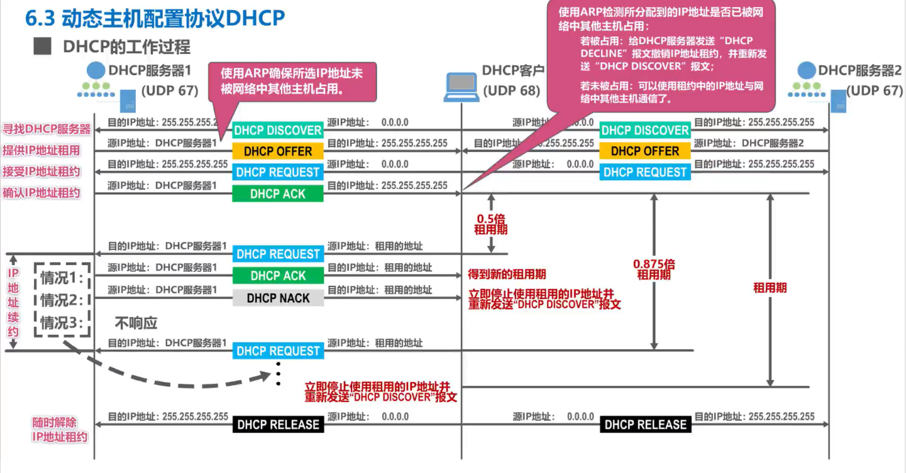
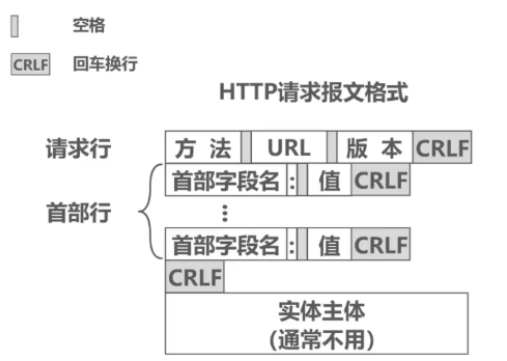
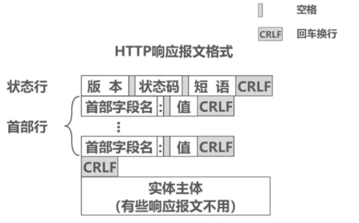

**应用层解决通过应用进程的交互来实现特定网络应用的问题**

- 应用层是计算机网络体系结构的**最顶层**，时**设计和建立计算机网络的最终目的**，也是计算机网络中发展最快的部分

# 6.1 网络应用组织方式

网络应用程序运行在处于网络边缘的不同的端系统上，通过彼此间的通信来共同完成某项任务。

开发一种新的网络应用首先要考虑的问题就是网络应用程序在各种端系统上的组织方式和它们之间的关系,目前流行的主要有以下两种:
**客户/服务器**(Client/Server，C/S)方式
**对等**(Peer-to-Peer，P2P)方式

## 客户/服务器方式（C/S方式）

客户和服务器是指通信中所涉及的两个应用进程。

客户/服务器方式所描述的是进程之间服务和被服务的关系。

**客户是服务请求方，服务器是服务提供方**

服务器总是处于运行状态，并等待客户的服务请求。**服务器具有固定端口号**(例如HTTP服务器的默认端口号为80)，而**运行服务器的主机也具有固定的IP地址**

- C/S方式是因特网上传统的、同时也是最成熟的方式，很多我们熟悉的网络应用采用的都是C/S方式包括万维网WWW、电子邮件、文件传输FTP等。

- 基于C/S方式的应用服务通常是**服务集中型**的，即应用服务集中在网络中比客户计算机少得多的服务器计算机上。

- 由于一台服务器计算机要为多个客户机提供服务，在C/S应用中，常会出现服务器计算机跟不上众多客户机请求的情况。

- 为此，在C/S应用中，常用**计算机群集**(或服务器场)构建一个强大的**虚拟服务器**

## 对等方式（P2P方式）

在P2P方式中，**没有固定的服务请求者和服务提供者**，分布在网络边缘各端系统中的应用进程是对等的，被称为**对等方**。**对等方相互之间直接通信**，每个对等方既是服务的请求者，又是服务的提供者。

目前，在因特网上流行的P2P应用主要包括P2P文件共享、即时通信、P2P流媒体、分布式存储等。

- 基于P2P的应用是**服务分散型**的，因为服务不是集中在少数几个服务器计算机中，而是分散在大量对等计算机中，这些计算机并不为服务提供商所有，而是为个人控制的桌面计算机和笔记本电脑，它们通常位于住宅、校园和办公室中。

- P2P方式的最突出特性之一就是它的**可扩展性**。因为系统每增加一个对等方，不仅增加的是服务的请求者，同时也增加了服务的提供者，**系统性能不会因规模的增大而降低。**

- P2P方式**具有成本上的优势**，因为它通常不需要庞大的服务器设施和服务器带宽。为了降低成本，服务提供商对于将P2P方式用于应用的兴趣越来越大。

# 6.2 动态主机配置协议DHCP

- 互联网广泛使用的**动态主机配置协议 DHCP** (Dynamic Host Configuration Protocol) 提供了**即插即用连网** (plug-and-play networking) 的机制。

- 这种机制允许一台计算机加入新的网络和获取 IP 地址，而不用手工配置。

## DHCP工作方式

**DHCP 使用客户 - 服务器方式**

- 需要 IP 地址的主机在启动时就向 DHCP 服务器广播发送发现报文（DHCP DISCOVER），这时该主机就成为 DHCP 客户。

- 本地网络上所有主机都能收到此广播报文，但只有 DHCP 服务器才回答此广播报文。

- DHCP 服务器先在其数据库中查找该计算机的配置信息。若找到，则返回找到的信息。若找不到，则从服务器的 IP 地址池 (address pool) 中取一个地址分配给该计算机。DHCP服务器的回答报文叫做提供报文（DHCP OFFER）。

**DHCP 工作方式**

- DHCP 使用**客户-服务器方式**，采用**请求/应答方式工作**。

- DHCP 基于 **UDP 工作**（DHCP报文在运输层会被封装成为UDP用户数据报），DHCP 服务器运行在 67 号端口， DHCP客户运行在 68 号端口

## **DHCP交互过程**

1. **DHCP客户端将广播发送DHCP发现报文**（**DHCP DISCOVER**），包含：

- 事务ID

- DHCP客户端的MAC地址

    - **封装该报文的IP数据报的源IP地址为0.0.0.0，这是因为主机目前还未分配到IP地址**，因此使用该地址代替

    - **目的IP地址为广播地址255.255.255.255，之所以广播发送，是因为主机现在并不知道网络中有哪几个DHCP服务器，**它们的IP地址各是什么

1. **DHCP服务器收到DHCP发现报文后，根据其中封装的DHCP客户端的MAC地址来查找自己的数据库**，如果查到匹配信息，则使用这些配置信息来构建并发送DHCP提供报文，如果没有则采用默认配置信息来构建报文并发送

2. **DHCP服务端将广播发送DHCP提供报文（DHCP OFFER）**

    - 事务ID：DHCP客户端会与之前DHCP发现报文的事务ID做对比，来判断该DHCP提供报文是否是自己的

    - 配置信息：

        - IP地址：DHCP服务器从自己的IP地址池中挑选待租用给主机的IP地址（使用ARP来确保所选IP地址未被网络中其他主机占用）

        - 子网掩码

        - 地址租期

        - 默认网关

        - DNS服务器

源IP地址：发送DHCP提供报文的DHCP服务器的IP

目的地址：因为目的主机还没分配到IP，所以使用广播地址

在本例中，DHCP客户会收到两个DHCP服务器发来的DHCP提供报文，DHCP客户从中选择一个，一般选择先到的，并向所选择的DHCP服务器发送DHCP请求报文

1. **DHCP客户端将广播发送DHCP请求报文（DHCP REQUEST）**

    - 事务ID

    - DHCP客户端的MAC地址

    - 接收的租约中的IP地址

    - 提供此租约的DHCP服务器端的IP地址

源地址：0.0.0.0，因为此时DHCP客户才从多个DHCP服务器中挑选一个作为自己的DHCP服务器。它首先要征得该服务器的同意，之后才能正式使用向该DHCP服务器租用的IP地址

目的地址：广播地址，这样可以一次性向所有DHCP服务器发送DHCP请求报文，来告知它们是否请求它们作为自己的DHCP服务器

假设DHCP客户端选择DHCP服务器1作为自己的DHCP服务器，DHCP服务器1接受该请求，于是DHCP服务器1给DHCP客户端发送DHCP确认报文

源地址：DHCP服务器1的IP地址

目的地址：广播地址

**DHCP客户收到该报文后就可以使用租用的IP地址**

**在使用前还会进行ARP检测**

检测匹配的IP地址是否已经被网络中其他主机占用；若占用，则给DHCP服务器发送"DHCP DECLINE"报文撤销IP地址租约，并重新发送“DHCP DISCOVER”报文



**DHCP中继代理**

使用DHCP中继代理是因为我们不用给每一个网络上都设置一个DHCP服务器，这样会使DHCP服务器的数量太多

使每一个网络中至少有一个DHCP中继代理（通常是一台路由器），配置了DHCP服务器的IP地址信息，作为各网络十中计算机与DHCP服务器的桥梁

# 6.3域名系统DNS

- DNS报文使用运输层的UDP协议进行封装，运输层**端口号为53**

- 域名相比IP地址更容易记忆，**DNS则是提供了主机名到IP地址映射服务**

### 域名结构

- 因特网采用**层次树状结构的域名结构**

- 域名的结构由若干个分量组成，各分量之间用“点”隔开，分别代表不同级别的域名

             ···  . 三级域名 . 二级域名 . 顶级域名

    - 每一级的域名都由英文字母和数字组成，不超过63个字符，不区分大小写字母

    - 级别最低的域名写在最左边，而级别最高的顶级域名写在最右边

    - 完整的域名不超过255个字符

    - 域名系统既不规定一个域名需要包含多少个下级域名，也不规定每一级的域名代表什么意思

    - 各级域名由其上一级的域名管理机构管理，而**最高的顶级域名**则由**因特网名称与数字地址分配机构ICANN**进行管理。

### 域名类别

**顶级域名TLD(Top Level Domain)**

分为以下三类:

- **国家顶级域名nTLD**    

    采用ISO 3166的规定    如cn表示中国，us表示美国，uk表示英国、等等

- **通用顶级域名gTLD**

    最常见的通用顶级域名有七个，即:com(公司企业)  net(网络服务机)  org(非营利性组织)、int(国际组织)    edu(美国教育结构)，gov(美国政府部门)、mil(美国军事部门)

- **反向域arpa**

    用于反向域名解析，即IP地址反向解析为域名。

**二级域名**

在国家顶级域名下注册的二级域名均由该国家自行确定。例如，顶级域名为jp的日本，将其教育和企业机构的二级域名定为ac和co，而不用edu和com。

我国则将二级域名划分为以下两类:

- **类别域名**
共七个:ac(科研机构)com(工、商、金融等企业)、edu(教育机构)   gov(政府部门)、net(提供网络服务的机构)、mil(军事机构)和   org(非营利性组织)。

- **行政区域名**
共34个，适用于我国的各省、自治区、直辖市。例如:bj为北京市、sh为上海市
js为江苏省，等等。

这种按照等级管理的命名方法便于维护名字的唯一性，并且也容易设计出一种高效的域名查询机制

### **域名服务器类型**

**根域名服务器**

因特网共有**13个**不同IP地址的根域名服务器，实际上每台服务器都是由分布在世界各地的计算机构成的**服务器集群**。

根域名服务器通常不直接对域名进行解析，而是**返回该域名所属顶级域名的顶级域名服务器的IP地址**

**顶级域名服务器**

负责管理在该顶级域名服务器注册的所有二级域名

**权限域名服务器**

负责管理某个区的域名，知道其管辖区域与IP地址的映射关系和下级域名服务器的地址

**本地域名服务器**

本地域名服务器起着代理的作用，会将DNS请求报文转发到上述的域名服务器的等级结构中。有时也称为**默认域名服务器**

### 域名解析过程

**递归查询**

从主机出发按照本地域名服务器 → 根域名服务器 → 顶级域名服务器 →权限域名服务器 逐级请求查询再反方向返回IP地址。

**迭代查询**

主机向各级域名服务器查询并返回下一级域名服务器IP地址列表，进而继续访问下一级域名服务器

由于递归查询对于被查询的域名服务器负担太大，通常采用：从请求主机到本地域名服务器的查询是递归查询，而其余的查询是迭代查询

- 为了提高DNS的查询效率，并减轻根域名服务器的负荷和减少因特网上的DNS查询报文数量，在域名服务器中广泛地使用了**高速缓存**。高速缓存用来存放最近查询过的域名以及从何处获得域名映射信息的记录。

- 由于域名到IP地址的映射关系并不是永久不变，为保持高速缓存中的内容正确，域名服务器应为每项内容设置计时器并删除超过合理时间的项(例如，每个项目只存放两天)

- 不但在本地域名服务器中需要高速缓存，在用户主机中也很需要。许多用户主机在启动时从本地域名服务器下载域名和IP地址的全部数据库，维护存放自己最近使用的域名的高速缓存，并且只在从缓存中找不到域名时才向域名服务器查询。同理，主机也需要保持高速缓存中内容的正确性。

# 6.4 文件传送协议FTP

**文件传送协议 FTP** ( File Transfer Protocol ) 

提供不同硬件/软件类型主机之间的文件传输服务 ，实现文件在不同主机上的拷贝功能 , 即上传 、下载 
简单文件传送协议 TFTP ( Trivial File Transfer Protocol )

文件传送协议FTP(File Transfer Protocol)是因特网上使用得最广泛的文件传送协议。

- FTP提供交互式的访问，允许客户指明文件的类型与格式(如指明是否使用ASCI码)，并允许文件具有存取权限(如访问文件的用户必须经过授权，并输入有效的口令)

- FTP屏蔽了各计算机系统的细节，因而适合于在异构网络中任意计算机之间传送文件

## **FTP 客户端和服务器** 

① FTP 通信方式 : **FTP 通信方式是 客户端 / 服务器 方式 ( C/S )** ; 用户通过客户端应用程序 , 连接远程主机上的服务器程序 

② FTP客户计算机可将各种类型的文件上传到FTP服务器计算机

③ FTP客户计算机也可以从FTP服务器计算机下载文件

## FTP基本工作原理

FTP服务器**监听熟知端口（端口号为 21）**，使客户进程能够连接上。

FTP客户随机选择一个临时端口号与其建立TCP连接，这条TCP连接用于FTP客户与服务器之间传送FTP的相关控制命令（这条连接是FTP客户与服务器之间的**命令通道**）

FTP服务器使用自己的**熟知端口号20**与其建立TCP连接，这条TCP连接用于FTP客户与服务器之间**传送文件**

### 主动模式

- FTP客户发起用于传送控制命令的TCP连接

- **FTP服务器**发起的用于传送数据的TCP连接（服务器主动连接客户）

### 被动模式

- FTP客户发起用于传送控制命令的TCP连接

- **FTP客户**发起的用于传送数据的TCP连接（服务器被动等待客户连接）

注意两种模式都是

控制连接在整个会话期间保持打开状态

数据连接传输完毕后就关闭

# 6.5 电子邮件

电子邮件(E-mail)是因特网上最早流行的一种应用，并且仍然是当今因特网上最重要、最实用的应用之一

电子邮件与邮政系统的寄信相似

- 发件人将邮件发送到自己使用的邮件服务器

- 发件人的邮件服务器将收到的邮件按目的地址转发到收件人邮件服务器中的收件人邮箱

- 收件人在方便的时候访问收件人邮件服务器中自己的邮箱，获取收到的电子邮件。

**电子邮件系统采用** **客户/服务器方式**

## 电子邮件系统构成

电子邮件系统的三个主要组成构件:**用户代理，邮件服务器，电子邮件所需的协议**。

- **用户代理**是用户与电子邮件系统的接口，又称为**电子邮件客户端软件**。

- **邮件服务器**是电子邮件系统的基础设施。因特网上所有的ISP都有邮件服务器，其功能是**发送和接收邮件**，同时还要负责维护用户的邮箱。

- **协议**包括邮件**发送协议**(例如SMTP)和邮件**读取协议**(例如POP3，IMAP)

## 电子邮件信息格式

**信封**：

表明接收方地址

**内容**：

首部信息：表明发送方，接收方，主题，发送日期

主题信息：内容主题

## 邮件收发过程

- **发送方用户代理**（SMTP客户）建立TCP连接，使用SMTP发送邮件到**发送方邮件服务系统**（SMTP服务器）

- **发送方邮件服务系统**（SMTP客户）建立TCP连接，使用SMTP发送邮件到**接收方邮件服务系统**（SMTP服务器）

- **接收方用户代理**（POP3客户）建立TCP连接，使用POP3读取邮件从**接收方邮件服务系统**（POP3服务器）

## 邮件发送协议

### SMTP 简单邮件传送协议

简单邮件传送协议SMTP（Simple Mail Transfer Protocol）

**SMTP只能传送ASCII码文本数据**

① **协议内容** : 规定 相互通信的 SMTP 进程 交换信息的方式 ; SMTP 协议中规定了 14 条命令 , 21 种应答信息 

**命令** : 字母组成
**应答信息** : 3 位 数字代码 和 简单文字说明 ;
**底层协议** : **TCP 协议** ;
**端口号 : 25**
**通信方式** : **客户端 / 服务器 方式**
② **SMTP 服务器 : 接收邮件**的 SMTP 进程 是 SMTP 服务器 ;

③ **SMTP 客户端 : 发送邮件**的 SMTP 进程 是 SMTP 客户端 ;

④ SMTP 通信三阶段 : **建立连接 -> 邮件传送 -> 释放连接**

#### 连接建立流程 

① 发送方 -> 发送方邮件服务器 : 发送方编写邮件 , 并将 邮件 发送给 发送方邮件服务器 ;

② 申请建立连接 : 发送方邮件服务器 , 定期扫描服务器中的邮件 , 扫描到新邮件 , 就会与 接收方邮件服务器 , 建立 TCP 连接 ;

③ 接收方告知连接建立 : 连接建立完成后 , 接收方邮件服务器 向 发送方邮件服务器 发送 " 220 Service ready" 信息 , 告知连接就绪 ; 

④ 发送方试探状态 : 发送方邮件服务器 发送 “HELLO 命令” 给 接收方邮件服务器 ;

⑤ 接收方回送状态 : 如果 接收方邮件服务器 有能力接收邮件 , 回复 “250 OK” 信息 ; 如果没有能力接收邮件 , 回复 “421 Service not available” 信息 ;

#### 邮件发送 流程

SMTP 协议 邮件发送 流程 :

① 发送方表明发送者 : 发送方邮件服务器 发送 “MAIL FROM : [xxx@163.com](mailto:xxx@163.com)”

② 接收方表明准备完毕 : 接收方邮件服务器 , 如果准备好接收邮件 回送 “250 OK” , 如果没有准备好了 , 那么发送 “451 / 452 / 500” 等信息 ;

③ 发送方表明接收者 : 发送方邮件服务器 发送 “RCPT : [xxx@163.com](mailto:xxx@163.com)” , 该命令可以有多个 , 即群发 ;

④ 接收方确认接收者 : 接收方邮件服务器 验证是否有该用户 , 如果有回送 “250 OK” , 如果没有回送 “550 No such user here” ;

发送方邮件服务器 开始传输邮件数据 ;

⑤ 发送方申请开始传输数据 : 发送方邮件服务器 发送 “DATA” 命令 , 表示要开始传输数据 ;

⑥ 接收方检查状态 : 接收方 邮件服务器 回送 “354…” 即同意 发送方邮件服务器 传输数据 ;

⑦ 传输邮件 : 发送方邮件服务器 开始正式传输邮件内容 ;

⑧ 传输完毕 : 接收方邮件服务器 收到全部数据 , 返回 “250OK”

至此 , 邮件发送完毕 ;

#### 断开连接 流程

SMTP 协议 断开连接 流程 :

① 发送方申请断开连接 : 邮件发送完毕后 , 发送方邮件服务器 发送 “QUIT” 命令 ;

② 接收方同意断开连接 : 接收方邮件服务器 回送 “221” , 同意释放 TCP 连接 ;

### MIME 协议

**SMTP 协议 弊端** 

① **格式限制** : 只能传送文本 , 不能传送 图片 , 视频等 ;

② **文字限制** : **只能传送 7 位 ASCII 码** , 不能传输非英文文字 ;

③ **长度限制** : 不能传输长度很长的邮件 ;

**MIME 协议** 

通用因特网邮件扩充协议（Multipurpose Internet Mail Externsions） , 对 SMTP 协议进行了拓展 ;

**MIME 协议传输过程** : 

**将用户的非 ASCII 码 数据转换为ASCII数据**

- 发送时 通过 MIME 协议转为 ASCII 码数据 , 然后通过 SMTP 协议传输 ;

- 接收时 通过 MIME 协议将 ASCII 码数据 , 转为不同类型的数据 , 如 音频 , 视频 , 图片等 ;

## 邮件接收协议

### POP3 邮局协议

邮局协议POP（Post Office Protocol）,POP3是其第三个版本，是因特网的正式标准

**底层协议** : TCP 协议 ;
**端口号 : 110**
**通信方式** : 客户端 / 服务器 方式
**工作方式** : 

① 电子邮件下载并保留在服务器 ,

② 下载并删除电子邮件 ;

不允许用户再邮件服务器上管理自己的邮件

### IMAP 因特网邮件访问协议

因特网邮件访问协议IMAP（Internet Message Access Protocol）,IMAP4是其第四个版本，还只是因特网建议标准

看到邮件首部 : 该协议 比 POP3 协议复杂 , 用户的 IMAP 客户端程序打开 IMAP 服务器的邮箱时 , 可以看到邮箱首部 , 如果需要打开邮件 , 才将邮件下载到用户的电脑上 ;

部分下载 : IMAP 协议 可以让**用户在自己的计算机上操控处理邮件服务器的邮件 ,** 还允许用户只下载部分邮件    IMAP是一个联机协议

# 基于万维网的电子邮件

基于万维网的电子邮件 :

① **SMTP 协议 : 邮件服务器之间仍然使用 SMTP 协议进行通信** ;

② **HTTP 协议 : 用户与邮件服务器之间 , 使用 HTTP 服务器通信** ;

发送方 使用 HTTP 协议 , 将邮件发送到 发送方邮件服务器中 ;
接收方 使用 HTTP 协议 , 从接收方邮件服务器中 读取 邮件 ;

用户通过**浏览器**登陆**邮件服务器万维网网站**就可以撰写  收发  阅读  管理 电子邮件

# 6.6 万维网WWW

## **概述**

- **万维网** WWW (World Wide Web) 并非某种特殊的计算机网络。

- 万维网是一个大规模的、联机式的**信息储藏所，**是运行在因特网上的一个**分布式应用**。

- 万维网用**超链接**的方法能非常方便地从互联网上的一个站点访问另一个站点，从而主动地按需获取丰富的信息。

- 这种访问方式称为“**链接**”。

## **万维网的工作方式**

- 万维网以**客户 - 服务器**方式工作。

- **浏览器**就是在用户计算机上的万维网**客户程序**。万维网文档所驻留的计算机则运行**服务器程序**，因此这个计算机也称为**万维网服务器**。

- 客户程序向服务器程序发出请求，服务器程序向客户程序送回客户所要的**万维网文档**。

- 在一个客户程序主窗口上显示出的万维网文档称为**页面** (page)。

浏览器最重要的部分是**渲染引擎**，也就是**浏览器内核**，负责对网页内容进行解析和显示

## 文档定位方式

**定位资源** : 使用 **统一资源定位符 URL** 可以唯一标识一个资源 , 这个资源可以是 文本 , 视频 , 音频 , 图片 ;

 **URL 形式** : 

 **<协议>://<主机地址>:<端口号>/<路径>**

**协议** : http , ftp

**主机地址** : IP 地址 , 域名

**端口号** : 16 位端口号 , 0 ~ 65535
URL 不区分大小写字母 

 **获取资源** : 用户点击超链接获取资源 , 服务器通过 HTTP 协议 ( 超文本传输协议 ) 将资源传输给用户 ;

## 万维网的文档

- **超文本标记语言HTML（**HyperText Markup Language**）** : 使用多种**标签**来描述网页的结构和内容

- **层叠样式表CSS**(Cascading Style Sheets)：从审美角度来描述网页的样式

- **脚本语言JavaScript**：控制网页的行为

## 超文本传输协议HTTP

- 在万维网客户程序与万维网服务器程序之间进行交互所使用的协议，是**超文本传送协议** **HTTP** (HyperText Transfer Protocol)。

- HTTP 是一个应用层协议，它使用 **TCP 连接**进行**可靠**的传送。

- HTTP定义了浏览器（万维网客户进程）怎样向万维网服务器**请求**万维网文档，以及万维网服务器怎样把万维网文档**传送**给浏览器

### HTTP 协议特点

① **无状态** : **HTTP 协议是无状态的** , 两次 HTTP 访问是没有任何关联的 ;

② **Cookie** : **存储在用户主机中的文本文件** , 记录一段时间内的用户访问记录 , 以便网站方面可以提供个性化服务 ;

③ **无连接** : 应用层的 HTTP 协议使用 传输层的 TCP 协议 , 但是 **HTTP 协议本身是无连接的** , 通信双方事先不需要建立 HTTP 连接

### HTTP 连接方式

HTTP 连接分为 持久连接 ( Keep-alive ) 和 非持久连接 ( Close ) ; 

持久连接又分为 流水线 , 非流水线 ****两种连接方式 ;

- **持久连接** : TCP 连接建立后持续很长时间 ;

    - **非流水线** 类似于 GBN , SR 协议 , 可以连续发出多条数据 ; 可以提高网络效率 ;

    - **流水线** : 类似于停止-等待协议 , 发出一条数据 , 必须等待确认后 , 才能发出第二条数据 ;

- **非持久连接** : 每次数据发送都要重新连接 TCP 连接 ;

### HTTP传输过程

- 每个万维网网点都有一个服务器进程，它不断地**监听 TCP 的端口 80**，以便发现是否有浏览器向它发出连接建立请求。

- 一旦监听到连接建立请求并建立了 TCP 连接之后，浏览器就向万维网服务器发出浏览某个页面的请求，服务器接着就返回所请求的页面作为响应。

- 最后，TCP 连接就被释放了

①用户操作 : 用户 在浏览器上 输入 URL , 或 点击超链接 ;

② 分析 URL : 浏览器 分析 URL 链接 ;

③ 请求 IP 地址 : 浏览器 向 DNS 服务器请求 域名 对应的 IP 地址 ;

④ 解析 IP 地址 : DNS 服务器将域名解析成 IP 地址 ;

⑤ 建立 TCP 链接 : 客户端 与 服务器端建立 TCP 链接 ;

⑥ 浏览器申请资源 : 浏览器 向 服务器 发出 申请资源 命令 ;

⑦ 服务器响应 : 服务器响应浏览器的资源申请 ;

⑧ 释放 TCP 链接 : 客户端 服务器 双方 释放 TCP 链接 ;

⑨ 浏览器显示资源 : 浏览器 显示从服务器中获取到的 文本 , 图片 , 视频等资源

### HTTP报文格式

**HTTP 协议报文结构 :** HTTP 报文分为 请求报文 和 响应报文 , HTTP 报文是面向文本的 , 报文中每个字段都是 ASCII 码字符串

#### HTTP请求报文



**① 请求行** :

**方法** : 是 **命令** , 表明执行的操作 , 获取 , 删除 等 ;

|方法|描述|
|-|-|
|GET|请求URL标志的文档|
|HEAD|请求URL标志的文档的首部|
|POSIT|向服务器发送数据|
|PUT|在指明的URL下存储一个文档|
|DELETE|删除URL标志的文档|
|CONNECT|用于代理服务器|
|OPTIONS|请求一些选项信息|
|TRACE|用来进行环回测试|
|PATCH|对PUT方法的补充，用来对已知资源进行局部更新|

**URL** : 资源地址 ;
**版本** : HTTP 协议版本 ;
**CRLF** : 回车换行 , 请求行结束必备 ;
**② 首部行** : 说明 浏览器 , 服务器 , 报文主体 的信息 ;

- 首部字段名 : 空格 + 首部字段值 + CRLF ( 回车换行 ) ;

- 上述结构有若干个 ;

**③ 实体主体** : 首部行 后面 是 CRLF 回车换行 , 在后面就是 实体主体 , 请求报文中 , 实体主体 , 通常不使用 

```HTML
GET /index.html HTTP/1.1
Host: www.baidu.com
Connection: Close
Cookie: 666
```

第一行 `GET /index.html HTTP/1.1` 是 请求行 , GET 指的是获取资源 , `/index.html` 表示获取的资源 URL 地址 , `HTTP/1.1` 说明当前的 HTTP 协议版本是 1.1 版本 ; 注意 上面 三项之间有两个空格 ; 首部行后面有一个 CRLF 回车换行 ;

第二行 是首部行 , Host 是首部字段名 , [www.baidu.com](http://www.baidu.com) 是首部字段值 ; 注意 冒号后面有一个空格 ; 末尾有一个 CRLF 回车换行 ;

第三行 和 第四行 也是首部行 ,

#### HTTP 响应报文 



**① 状态行 :**

**版本** : HTTP 协议版本 ;
**状态码** : 五种类型 , 33 种状态码 ;
**CRLF** : 回车换行 , 请求行结束必备 ;
**② 首部行** : 说明 浏览器 , 服务器 , 报文主体 的信息 ;

**首部字段名 : 空格 + 首部字段值 + CRLF ( 回车换行 )** ;
上述结构有若干个 ;

**③ 实体主体** : 首部行 后面 是 CRLF 回车换行 , 在后面就是 实体主体 ;

**状态码类型** :

|状态码|描述|
|-|-|
|1xx|表示 **通知信息**, 如 收到请求 , 正在处理请求 |
|2xx |表示 **成功** , 如 202 Accepted |
|3xx |表示 **重定向**, 如 完成请求还需要进一步操作 |
|4xx|表示 **客户差错**, 请求无法完成 , 如 404 Not Found|
|5xx |表示 **服务器差错**, 如 服务器失效 , 无法完成请求|

## Cookie

使用Cookie在服务器上记录用户信息

- 早期的万维网应用非常简单，仅仅是用户查看存放在不同服务器上的各种静态的文档。因此**HTTP被设计为一种无状态的协议**。这样可以简化服务器的设计

- 现在，用户可以通过万维网实现各种复杂的应用，如网上购物、电子商务等。这些应用往往需要万维网服务器能够识别用户。

- Cookie提供了一种机制使得万维网服务器能够“记住”用户，而无需用户主动提供用户标识信息。也就是说，**Cookie是一种对无状态的HTTP进行状态化的技术**

## 缓存与代理服务器

万维网缓存与代理服务器

- 万维网中还可以使用**缓存机制**以提高万维网的效率。

- 万维网缓存又称为**Web缓存**(WebCache)，可位于客户机，也可位于中间系统上，位于中间系统上的Web缓存又称为代理服务器(Proxy Server)。

- Web缓存把最近的一些请求和响应暂存在本地磁盘中。当新请求到达时，若发现这个请求与暂时存放的请求相同，就返回暂存的响应，而不需要按URL的地址再次去因特网访问该资源。

- 若Web缓存的命中率比较高

    则会大大减小了该链路上的通信量，因而减少了访问因特网的时延

- 假设原始服务器的文档被更改，这样代理服务器的文档就不是最新的所以原始服务器通常会为每个响应的对象设定一个**修改时间字段**和一个**有效日期字段**

    - 若过期并且代理服务器的文档和原始服务器的**文档一致**，原始服务器则给代理服务器发送不包含实体主体的响应

    - 若过期并且代理服务器的文档和原始服务器的**文档不一致**，原始服务器则给代理服务器发送封装有该文档的响应报文


